# Zhvillimi i një Modeli parashikues të smogut në Kosovë (Prishtinë, Prizren, Pejë)


<table>
  <tr>
    <td width="150" align="center" valign="center">
      
    </td>
    <td valign="top">
      <p><strong>Universiteti i Prishtinës</strong></p>
      <p>Fakulteti i Inxhinierisë Elektrike dhe Kompjuterike</p>
      <p>Inxhinieri Kompjuterike dhe Softuerike - Programi Master </p>
      <p><strong>Profesorët:</strong> Prof. Dr. Lule Ahmedi, PhD Mergim Hoti </p>
      <p><strong>Lënda:</strong> “Machine Learning”</p>
      <p><strong>Grupi 5:</strong></p>
      <ul>
        <li>Endrita Vllasaliu</li>
        <li>Fleta Mujaj</li>
        <li>Rajmondë Shllaku</li>
      </ul>
    </td>
  </tr>
</table>

---

## Përmbajtja

- [Pasqyra e Projektit](#pasqyra-e-projektit)
- [Struktura e Repozitorit](#struktura-e-repozitorit)
- [Përshkrimi i Datasetit](#përshkrimi-i-datasetit)
- [FAZA 1 : Përgatitja e modelit](#faza-1--përgatitja-e-modelit)
- [FAZA 2 : Trajnimi i Modeleve (Machine Learning)](#faza-2--trajnimi-i-modeleve-machine-learning)
- [FAZA 3 : Analiza dhe Vlerësimi [Në Zhvillim]](#faza-3--analiza-dhe-vlerësimi-në-zhvillim)
- [Teknologjitë e Përdorura](#teknologjitë-e-përdorura)
- [Instalimi & Konfigurimi](#instalimi--konfigurimi)
- [Profilet e kontribuesve](#profilet-e-kontribuesve)
---
## Pasqyra e Projektit

Ky repozitor implementon një tubacion (pipeline) gjithëpërfshirës të Machine Learning për parashikimin e **Cilësisë së Ajrit (nivelet e PM2.5 dhe PM10) në Kosovë**, me fokus në analizën krahasuese mes tri qyteteve kryesore: **Prishtinë, Prizren dhe Pejë**. 
Projekti demonstron një cikël të plotë jetësor (end-to-end) të shkencës së të dhënave, duke u shtrirë në tri faza kryesore:

1. **Faza 1 (Përgatitja e të Dhënave):** Mbledhja e të dhënave historike përmes API-ve për të tria qytetet, pastrimi inteligjent i anomalive (Metoda Hibride e bazuar në Njohuritë e Domenit), integrimi i serive kohore, inxhinieria e veçorive dhe krijimi i një **Dataseti Global** të unifikuar.
2. **Faza 2 (Trajnimi i Modelit):** Aplikimi dhe optimizimi i algoritmeve të Machine Learning (si Random Forest, XGBoost, ose Regression) për të gjetur lidhjet e fshehura mes kushteve meteorologjike, lokacionit gjeografik dhe ndotjes së ajrit.
3. **Faza 3 (Analiza dhe Vlerësimi):** Testimi i saktësisë së modeleve, nxjerrja e metrikave dhe krijimi i raporteve vizuale për të kuptuar se cilët faktorë ndikojnë më shumë në smog-un sipas rajoneve.

### Qëllimet e Projektit

* **Ndërtimi i një Arkitekture Hibride (Supervised & Unsupervised):** Krijimi i një sistemi të aftë jo vetëm të parashikojë sasinë e ndotjes (PM2.5) bazuar në kushtet meteorologjike, por edhe të zbulojë automatikisht "profilet klimatike" të fshehura (si Inversioni Termik) për 6 vitet e fundit në Kosovë.
* **Paraprocesimi dhe Detektimi Inteligjent i Anomalive:** Aplikimi i teknikave të avancuara për të pastruar dështimet e sensorëve, duke u mbështetur në algoritme të dedikuara për të dalluar gabimet teknike nga vlerat reale të ndotjes ekstreme dimërore.
* **Inxhinieria e Veçorive (Feature Engineering):** Transformimi i të dhënave të papërpunuara në inpute inteligjente: nga kodimi i qyteteve dhe nxjerrja e cikleve kohore, tek krijimi i variablave specifike të domenit (si `sezoni_i_ngrohjes`) për të kapur "Efektin e Prishtinës".
* **Krahasimi dhe Shpjegueshmëria e Algoritmeve (Explainable AI):** Trajnimi dhe krahasimi i një spektri të gjerë modelesh (nga Modelet Lineare te Random Forest dhe XGBoost) për të gjetur ekuilibrin perfekt mes saktësisë së lartë dhe aftësisë për të shpjeguar *pse* po ndodh ndotja.
* **Gatishmëria për Prodhim (Inference):** Paketimi i modelit kampion dhe tubacionit të të dhënave (Scaler) në një format të transportueshëm, të gatshëm për t'u integruar në Fazën 3 për të bërë parashikime në kohë reale (Live).
---


## Struktura e Projektit

```text
MachineLearning_25-26_GR-5/
│
├── .idea/                           # Konfigurimet e ambientit të punës (PyCharm/VSCode)
├── Data_Gathering/                  
│   └── data_gathering.py            # Skripta për marrjen e të dhënave nga API (Open-Meteo & WAQI)
│
├── Datasetet/                       
│   ├── unprocessed_datasets/        # Të dhënat origjinale (CSV)
│   ├── processed_dataset/           # Të dhënat e bashkuara (raw merge)
│   ├── cleaned_dataset/             # Të dhënat pas trajtimit të vlerave null dhe outliers
│   └── ml_ready_dataset/            # Datasetet finale numerike
│       ├── prishtine_ml_data.csv
│       ├── prizren_ml_data.csv
│       ├── peje_ml_data.csv
│       └── kosova_global_ml_data.csv # DATASETI KRYESOR (Gjithëpërfshirës)
│
├── FAZA-1_Pergatitja_e_modelit/     
│   ├── data_assessment.py           # Analiza fillestare e kualitetit të të dhënave
│   ├── data_cleaning.py             # Pastrimi dhe trajtimi i anomalive
│   ├── data_integration.py          # Integrimi i API-ve të ndryshme
│   ├── data_merging.py              # Bashkimi i qyteteve në një dataset global
│   ├── eda_analysis.py              # Analiza Eksplorative (Korreleacionet, Trendet)
│   └── feature_engineering.py       # Krijimi i variablave të reja (Lag features, Sezoni)
│
├── FAZA-2_Trajnimi_i_modelit/       
│   ├── supervised/                  # Mësimi i mbikëqyrur (Parashikimi i PM2.5)
│   │   ├── train_xgboost.py         
│   │   ├── random_forest_regressor.py
│   │   └── ridge_linear_baseline.py 
│   │
│   ├── unsupervised/                # Mësimi i pambikëqyrur (Analiza e profileve)
│   │   ├── kmeans_clustering.py     # Grupimi i profileve të ndotjes (me Scaler ne JSON)
│   │   ├── isolation_forest.py      # Identifikimi i anomalive ekstreme
│   │   └── pca_reduction.py         # Reduktimi i dimensioneve për vizualizim
│   │
│   └── model_evaluation.py          # Skripta për krahasimin e performancës së modeleve
│
├── FAZA-3_Analiza_dhe_Evaluimi/     # Analiza përfundimtare dhe konkluzionet [Në Zhvillim]
│
├── Modelet/                         # Skedarët JSON dhe te modeleve të trajnuara
│
├── images/                          # Grafikët e gjeneruar (EDA, Clusters, SHAP plots)
├── .gitattributes
├── .gitignore
├── LICENSE                          # MIT LICENSE
└── README.md                        # Dokumentimi kryesor i projektit
````

-----

## Përshkrimi i Datasetit

Projekti përdor burime të të dhënave që mbulojnë periudhën nga **2020 deri më sot**. Të dhënat e ndara fillimisht janë bashkuar në një skedar master: **`kosova_global_ml_data.csv`**.

### Atributet Kryesore (Dataseti Global)

| Atributi                   | Kolona | Tipi | Përshkrimi |
|----------------------------|--------|------|-------------|
| **Targeti (Ajri)**         | `pm2_5` | Float | Përqendrimi i grimcave \< 2.5 µm (µg/m³) |
| **Cilesia e Ajrit (Ajri)** | `pm10` | Float | Përqendrimi i grimcave \< 10 µm (µg/m³) |
| **Meteorologjike**         | `temperature_2m` | Float | Temperatura e ajrit në 2 metra lartësi (°C) |
| **Meteorologjike**         | `relative_humidity_2m`| Float | Lagështia relative (%) |
| **Meteorologjike**         | `wind_speed_10m` | Float | Shpejtësia e erës në 10 metra lartësi (km/h) |
| **Kohore (E derivuar)**    | `month` | Integer | Muaji i vitit (1-12) për të kapur sezonalitetin |
| **Kohore (E derivuar)**    | `hour` | Integer | Ora e ditës (0-23) për të kapur ciklet e trafikut |
| **Domeni (E derivuar)**    | `sezoni_i_ngrohjes` | Integer | Indikator i smogut (1=Dimër në Prishtinë, 0=Tjera) |
| **Gjeografike**            | `qyteti` | Integer | Kodi i lokacionit (**1**=Prishtinë, **2**=Prizren, **3**=Pejë) |

-----

## Modulet

### FAZA 1 : Përgatitja e modelit

Kjo fazë zbaton një rrjedhë të fuqishme të paraprocesimit të të dhënave përmes disa skriptave kryesore:

0. **`data_gathering.py`** (Mbledhja e te Dhenave)

      * **Çfarë bën:** Ky skript automatizon mbledhjen e të dhënave historike të papërpunuara (raw) për cilësinë e ajrit dhe kushtet meteorologjike për qytetet kryesore të Kosovës (Prishtinë, Pejë, Prizren), duke filluar nga viti 2020 e deri në ditën aktuale të ekzekutimit.
      * **Logjika:** * **Konfigurimi Gjeo-Hapësinor dhe Kohor**: Skripta përdor një strukturë fjalori (`CITIES`) për të ruajtur koordinatat e sakta (gjerësi/gjatësi gjeografike) të qyteteve të synuara. Periudha e tërheqjes së të dhënave është dinamike, duke u gjeneruar automatikisht deri në datën e sotme (`datetime.today()`), gjë që e bën modelin të lehtë për t'u përditësuar në të ardhmen. 
         * **Integrimi me API (Open-Meteo)**: Kryen kërkesa të veçanta (HTTP GET requests) në dy endpoint-e të ndryshme: 
            1. *Air Quality API* për marrjen e ndotësve ororë (PM10 dhe PM2.5). 
            2. *Historical Weather Archive API* për të dhënat klimatike orore (temperatura, lagështia relative, presioni atmosferik dhe shpejtësia e erës).
         * **Strukturimi dhe Eksportimi Fillestar**: Menaxhon automatikisht krijimin e direktorive nëse nuk ekzistojnë (`os.makedirs`). Të dhënat JSON të kthyera nga API kthehen menjëherë në `pandas DataFrame`. Më pas, bëhet një standardizim fillestar i emërtimit (ndryshimi i kolonës "time" në "date") dhe eksportimi i tyre në formatin `.csv` pa humbur asnjë rresht, duke i bërë gati për skriptën e integrimit.
         * **Trajtimi i Gabimee (Error Handling)**: Përdor blloqe `try-except` për çdo thirrje API. Kjo garanton që nëse ka një ndërprerje rrjeti ose API kthen një përgjigje të papritur për njërin qytet, skripta nuk "thyhet" (crash), por printon gabimin dhe vazhdon me qytetin ose setin tjetër të të dhënave.
      
1.  **`data_integration.py`** (Integrimi i te Dhenave)

      * **Çfarë bën:** Lexon datasetet e papërpunuara të motit dhe cilësisë së ajrit për secilin qytet dhe i bashkon ato në një skedar analitik të vetëm.
      * **Logjika:**  
         * **Sinkronizimi Kohor**: Për të garantuar përputhjen e saktë mes API-ve të ndryshme, skripta konverton formatet e datave, rrumbullakos kohën në orën më të afërt (round('h')) dhe standardizon zonat kohore. 
         * **Pivotimi i të Dhënave**: Shumë burime të ajrit (si OpenAQ) vijnë në format të gjatë (parametrat janë rreshta). Skripta filtron vlerat e korruptuara si -999.0, fshin matjet e dyfishta për të njëjtën orë, dhe përdor funksionin pivot për t'i kthyer ndotësit (PM2.5, PM10) në kolona të rregullta. Nëse detekton format satelitor, e përshtat automatikisht pa pivot. 
         * Në fund, kryhet bashkimi inner në kolonën time, duke ruajtur vetëm rreshtat ku plotësohen të dyja kushtet (moti dhe ajri).


2.  **`data_cleaning.py`** (Pastrimi i te Dhenave)

      * **Çfarë bën:** Së pari, siguron që çdo vlerë tekstuale e gabuar (si 'None') të konvertohet në NaN dhe fshin plotësisht rreshtat që kanë vlera të munguara. Më pas, bën një skanim statistikor për të detektuar anomali (Outliers) në çdo qytet.
      * **Logjika "Hands Off" (Mos-ndërhyrje):** Për të zbuluar vlerat jashtë normales, skripta përdor metodën e rreptë statistikore IQR (Interquartile Range). Megjithatë, ajo vetëm i raporton (numëron) këto vlera dhe nuk i fshin. Kjo është një zgjedhje inxhinierike e qëllimshme: fshirja e rreshtave me PM2.5 ose PM10 shumë të lartë do të "fshinte" ditët me smog ekstrem gjatë dimrit në Kosovë, duke e lënë modelin të verbër ndaj kulmeve të vërteta të ndotjes.

3.  **`feature_engineering.py` (Inxhinieria e Veçorive)**

    * **Çfarë bën:** Merr të dhënat e pastruara dhe i shndërron ato në formate thjesht numerike, të gatshme për t'u ushqyer në modelet e Machine Learning.
    * **Logjika:** 
         
      * **Ekstraktimi Kohor:** Nga kolona e datës (time), nxjerr kolonat month (për sezonalitetin), hour (për ciklet e ditës/natës) dhe day_of_week. 
      * **Njohuritë e Domenit (Domain Knowledge)**: Shton kolonën is_weekend (1 për fundjavë, 0 për ditë pune) për të kapur ndryshimet në fluksin e trafikut të makinave. Gjithashtu, zbaton një rregull specifik gjeografik: shton kolonën sezoni_i_ngrohjes (muajt e ftohtë 10-3) vetëm për qytetin e Prishtinës, pasi aty ndikimi i djegies së thëngjillit është më agresiv. 
      * **Gati për ML:** Në fund, skripta fshin përfundimisht kolonën tekstuale/datetime time, duke lënë pas vetëm atribute numerike (int dhe float) që kërkohen nga algoritme si Random Forest dhe XGBoost.
4.  **`data_merging.py` (Krijimi i Datasetit Global)**

    * **Çfarë bën:** Merr datasetet e gatshme të të tria qyteteve dhe i shton njëra mbi tjetrën (bashkim vertikal) për të krijuar një *Master Dataset* (`kosova_global_ml_data.csv`).
    * **Logjika:** Shton kolonën e re `qyteti` (Kodet 1, 2, 3) për t'i mundësuar modelit të dallojë lokacionin. Gjithashtu, i jep vlerën `0` sezonit të ngrohjes për Prizrenin dhe Pejën, duke e lënë vlerën `1` vetëm për Prishtinën, për të kapur "Efektin e bllokimit të tymit" tipik të kryeqytetit.
5.  **`data_assesment.py` (Vlerësimi dhe Sigurimi i Cilësisë)**

    * **Çfarë bën:** Kryen një "Sanity Check" (kontroll të cilësisë) mbi datasetin master `kosova_global_ml_data.csv` para se të fillojë procesi i trajnimit.
    * **Logjika:** Verifikon nëse dimensionet janë të sakta, konfirmon eliminimin e vlerave `Null`, dhe garanton që të gjitha tiparet janë në format numerik (të gatshme për algoritmet). Gjeneron një raport përmbledhës për shpërndarjen e matjeve sipas qyteteve, balancimin e "sezonit të ngrohjes" dhe ruan formatin e vlerave ekstreme (outliers) për ndotësit kryesorë.
6. **`eda_analysis.py` (Analiza dhe Vizualizimi)**

      * **Çfarë bën:** Skripta finale automatike që lexon datasetet dhe gjeneron një set grafikësh shkencorë për të analizuar sjelljen e të dhënave, duke i ruajtur ato në folderin `images/`.

-----

## Analiza Vizuale (EDA)

Përmes skriptës `eda_analysis.py`, ne analizuam sjelljen e ndotësve si në nivel lokal (qytet) ashtu edhe atë rajonal.

### 1. Analiza Lokale

Këtu vëzhgojmë korrelacionin (lidhjen mes motit dhe ndotjes) si dhe trendin mesatar të ndotjes gjatë një dite (00:00 - 23:00) për çdo qytet.

#### Prishtina
| Matrica e Korrelacionit |                 Cikli Ditor (Trendi )                 |
|:---:|:-----------------------------------------------------:|
|  |  |

#### Prizreni
| Matrica e Korrelacionit |               Cikli Ditor (Trendi )               |
|:---:|:-------------------------------------------------:|
|  |  |


#### Peja
| Matrica e Korrelacionit | Cikli Ditor (Trendi ) |
|:---:|:---:|
|  |  |

**Gjetje nga Analiza Lokale:** \* Të tria qytetet shfaqin formën karakteristike "U" gjatë ditës (ndotje më e ulët gjatë drekës, rritje në mbrëmje).

  * Era (Wind Speed) është pastruesi kryesor natyral, pasi shfaq korrelacion negativ në të tria matricat.
  * Ndërsa Prishtina kapërcen lehtësisht vlerat 20-30 µg/m³ gjatë mbrëmjeve, Prizreni dhe Peja mbajnë një balancë dukshëm më të ulët, falë mungesës së centraleve të mëdha industriale dhe relievit më të favorshëm të ajrimit.

-----

### 2\. Analiza E Pergjithshme

Duke përdorur Datasetin Master të unifikuar, ne krijuam një hartëvizuale se si diferencojnë qytetet nga njëri-tjetri.

#### Matrica e Korrelacionit Global

*Figura 1.**Matrica e Korrelacionit (Pearson)** për datasetin e unifikuar (`kosova_global_ml_data.csv`).*

#### Krahasimi i Qyteteve (Boxplot)

*Figura 2: Analiza e variancës së PM2.5 mes Prishtinës, Prizrenit dhe Pejës.*

  * **Ndotja Ekstreme:** Prishtina shfaq një shpërndarje (box) më të gjerë dhe vlera ekstreme (outliers) dukshëm më të larta, duke vërtetuar se smogu i rëndë është kryesisht problem i kryeqytetit.

#### Cikli Ditor i Ndotjes - Krahasim

*Figura 3: Trendi mesatar orar (24h) për PM2.5.*

  * **Dinamika Dite-Natë:** Të tria qytetet ndjekin një model të ngjashëm gjatë ditës, por linja e Prishtinës (e kuqe) shkëputet drastikisht pas orës 17:00, duke krijuar atë që quhet "Peak i Mbrëmjes".

### 3. Zbulimi i Modeleve të Fshehura (Pattern Discovery)

Për të kuptuar thellësisht shkaktarët e smogut, krijuam vizualizime të avancuara që provojnë hipotezat tona mbi motin dhe zakonet urbane:

#### Harta e Nxehtësisë: Cikli Sezonal dhe Ditor

* **Gjetja:** Ndotja nuk është e shpërndarë rastësisht. Heatmap-i dëshmon qartë se smogu i rëndë (ngjyrat e errëta) është i përqendruar ekskluzivisht në muajt e dimrit (Nëntor - Shkurt) dhe kryesisht pas orës 17:00, duke vërtetuar se djegia e thëngjillit/biomasës për ngrohje është ndotësi primar.

#### Efekti i Inversionit Termik

* **Gjetja:** Ky *Scatter Plot* demonstron natyrën jo-lineare të të dhënave. Sapo temperatura zbret nën 0°C, vlerat e PM2.5 shpërthejnë lart. Kjo ndodh për shkak të "inversionit termik", ku ajri i ftohtë e bllokon tymin pranë sipërfaqes së tokës, veçanërisht në zonat me formë luginash si Prishtina.

#### Ndikimi i Trafikut (Ditë Pune vs. Fundjavë)

* **Gjetja:** Diferenca mes ditëve të punës dhe fundjavave është e papërfillshme në lidhje me kulmet e ndotjes. Kjo hedh poshtë mitin se trafiku i makinave është fajtori kryesor i smogut të rëndë dimëror në Kosovë; fajtori i vërtetë mbetet ngrohja shtëpiake dhe industria, të cilat nuk pushojnë në fundjavë.

### 4. Konkluzione të Avancuara nga EDA (Gjetje Shkencore)

Nga vizualizimet e mësipërme, kemi nxjerrë disa përfundime thelbësore që ndikojnë drejtpërdrejt në qasjen tonë të Machine Learning:

* **Inversioni Termik dhe Meteorologjia:** Matrica e korrelacionit tregon një lidhje të fortë negative mes temperaturës dhe ndotjes. Kjo vërteton se smogu në Kosovë nuk është një problem konstant industrial, por një problem sezonal. Temperaturat e ulëta të kombinuara me lagështinë e lartë krijojnë "inversionin termik", duke e mbajtur ndotjen të bllokuar afër sipërfaqes së tokës.
* **Burimi i "Peak-ut" të Mbrëmjes:** Rritja e ndotjes pas orës 17:00 nuk i atribuohet vetëm trafikut. Fakti që nivelet e PM2.5/PM10 vazhdojnë të rriten në mënyrë agresive deri në mesnatë (kur makinat ndalojnë së lëvizuri) tregon se burimi kryesor është **ngrohja shtëpiake** (djegia e biomasës dhe thëngjillit gjatë natës).
* **Ndikimi Topografik (Pse Prishtina vuan më shumë):** *Boxplot*-et tregojnë anomali ekstreme për Prishtinën. Kryeqyteti ka një reliev që favorizon bllokimin e tymrave, ndërsa Peja dhe Prizreni, të pozicionuara pranë masiveve malore (Bjeshkët e Nemuna, Malet e Sharrit), përfitojnë nga rrymat ajrore që ndihmojnë në ventilimin natyror gjatë natës.
* **Justifikimi i Algoritmeve (Natyra Jo-Lineare):** Lidhjet mes motit, lokacionit dhe ndotjes janë thellësisht jo-lineare. Për të kapur këtë kompleksitet, modelet e thjeshta si *Linear Regression* janë të pamjaftueshme. Kjo është arsyeja pse në Fazën 2 përdorim **modele të bazuara në pemë** (*Random Forest*, *XGBoost*), të cilat janë të afta të zbulojnë rregulla komplekse logjike nga të dhënat:
  > *Shembull se si "mendon" modeli:* **NËSE** Ora > 18:00 **DHE** Temperatura < 0°C **DHE** Shpejtësia e Erës < 5 km/h **ATËHERË** Parashiko Ndotje Ekstreme (PM2.5 > 150).

Projekti tani posedon një **Master Dataset** të pastruar nga anomalitë, me mungesa të trajtuara logjikisht, dhe të pasuruar me Features numerike.

### 5. Sfidat e të Dhënave dhe "Paradoksi i Mesatares"
Gjatë analizës vizuale, u vu re se trendi mesatar ditor (Line Chart) për Prishtinën dhe Prizrenin duket i ngjashëm (rreth 25-30 µg/m³). Megjithatë, kjo fsheh realitetin e smogut ekstrem në Prishtinë për shkak të dy faktorëve:
* **Efekti i Hollimit (Dilution Effect):** Dataseti përmban ~43,000 orë matje. Kulmet ekstreme të ndotjes në Prishtinë (deri në 250 µg/m³) ndodhin gjatë netëve të ftohta të dimrit, por ato "hollohen" matematikisht në mesatare nga mijëra orë me ajër të pastër gjatë pranverës/verës.
* **Rezolucioni i API-t Satelitor:** Të dhënat historike bazohen në modele satelitore (CAMS) të cilat masin ndotjen në blloqe të mëdha regjionale (10x10 km), duke e pasur të vështirë të izolojnë "mikro-ndotjen" (smogun e bllokuar në luginën e Prishtinës) në krahasim me sensorët tokësorë. 
*Kjo justifikon edhe më shumë përdorimin e algoritmeve Tree-Based në Fazën 2, pasi ato mësojnë nga rreshtat individualë dhe vlerat ekstreme (outliers), duke mos u mashtruar nga mesatarja.*
---
## FAZA 2 : Trajnimi i Modeleve (Machine Learning)

Në këtë fazë, kalojmë nga analiza historike në modelimin parashikues dhe zbulimin e strukturave të fshehura. Kemi ndërtuar një arkitekturë gjithëpërfshirëse duke testuar algoritme të ndryshme (Supervised dhe Unsupervised) për të adresuar kompleksitetin e ndotjes së ajrit.

### 1. Supervised Learning: Parashikimi i Ndotjes (PM2.5)
Për të gjetur modelin më të saktë, kemi filluar me modele të thjeshta lineare dhe kemi kaluar në algoritme të avancuara të bazuara në pemë (Tree-Based).

* **Modelet Bazë (Linear & Ridge Regression):** U përdorën si "Baseline" për të testuar hipotezën e lidhjeve lineare. Saktësia e tyre bazike vërtetoi nevojën për algoritme që mund të menaxhojnë marrëdhënie komplekse jo-lineare.
* **Parandalimi i "Data Leakage" (Modeli A vs Model B):** Për të garantuar parashikime reale (p.sh. parashikimi i të nesërmes), ndërtuam qëllimisht dy versione: një me PM10 (që shkakton data leakage) dhe një pa PM10 (Modeli i Vërtetë), i trajnuar vetëm mbi motin dhe kohën.
* **Modelet e Avancuara (Random Forest & XGBoost):** Këto modele kapën me sukses "Inversionin Termik" dhe vlerat ekstreme dimërore. Në *Random Forest*, u aplikua `TimeSeriesSplit` për vlerësim për të respektuar rendin kronologjik. Në *XGBoost*, u integrua Inteligjenca e Shpjegueshme (SHAP) për të zbërthyer saktësisht ndikimin e çdo parametri (p.sh. temperatura, era).

### 2. Unsupervised Learning: Profilizimi, Anomalitë dhe Reduktimi i Dimensioneve
Për të kuptuar ngjarjet ekstreme, për të thjeshtuar të dhënat dhe për të grupuar ditët me karakteristika të ngjashme, përdorëm tre algoritme të fuqishme pa mbikëqyrje:

* **Reduktimi i Dimensioneve (PCA):** Analiza e Komponentëve Kryesorë u përdor për të menaxhuar korrelacionin e lartë mes variablave meteorologjike. Duke mbajtur 95% të variancës, transformuam të dhënat komplekse në komponentë kryesorë (PC1, PC2), duke thjeshtuar vizualizimin dhe duke llogaritur gabimin e rindërtimit (Reconstruction Error).
* **Zbulimi i Anomalive (Isolation Forest):** U implementua për të izoluar ditët me ndotje jonormale. Për të shmangur gabimet e një qasjeje "një masë për të gjithë" (Global), ne zhvilluam një **Model Per-City** me pragje të adaptuara. Gjithashtu u krijua një sistem i shkallëzimit të ashpërsisë (*Severity Scoring*: Low, Medium, High) për t'i dhënë kuptim praktik anomalive.
* **Zbulimi i Profileve (K-Means Clustering):** Modeli grupon vetvetiu ditët e vitit bazuar në ngjashmëritë e motit dhe ndotjes. Përmes Metodës së Bërrylit (Elbow Method), algoritmi arriti të izolojë vizualisht (në 3D) ditët e pastra me erë, nga ditët e rënda të bllokuara nga smogu dimëror.

#### Pasqyra e Modeleve të Implementuara
| Kategoria | Algoritmi | Roli në Projekt |
| :--- | :--- | :--- |
| **Supervised** | Linear / Ridge Regression | Gjetja e korrelacioneve bazë (Baseline) |
| **Supervised** | Random Forest Regressor | Menaxhimi i lidhjeve jo-lineare dhe CV Kohor |
| **Supervised** | XGBoost Regressor | Performanca maksimale parashikuese dhe SHAP |
| **Unsupervised**| PCA | Reduktimi i variablave të motit në Komponentë Kryesorë |
| **Unsupervised**| Isolation Forest | Gjetja e anomalive (Model gjeografik adaptiv) |
| **Unsupervised**| K-Means Clustering | Krijimi i profileve 3D të klimës dhe smogut |

---

### Modulet e Implementuara (Faza 2)
1.  **`ridge-linear-baseline_models.py`**: Trajnon `Linear Regression` dhe `Ridge Regression`, ruan metrikat ne `Modelet/` dhe gjeneron grafiqet krahasuese te baseline-it.
2.  **`random_forest_regressor.py`**: Nderton `lag features` dhe `interaction features`, krahason modelin me `PM10` kundrejt modelit pa `PM10`, ruan modelin `.joblib` dhe vizualizimet e performances.
3.  **`train_xgboost.py`**: Trajnimi i modelit global `XGBoost`, me `temporal split`, `StandardScaler`, grafike performance dhe analize `SHAP`.
4.  **`pca_reduction.py`**: Reduktimi i dimensioneve mbi veçorite meteorologjike dhe ruajtja e rezultateve te PCA ne format `JSON`.
5.  **`isolation_forest.py`**: Zbulimi i anomalive me dy qasje (`Global` dhe `Per-City`), `severity scoring` dhe eksport i rasteve anormale.
6.  **`kmeans-clustering.py`**: Klasterizimi i profileve te ajrit me `K=4`, gjenerimi i grafikut `Elbow` dhe i profileve 3D/mesatare.
7.  **`model_evaluation.py`**: Lexon artefaktet `JSON` nga `Modelet/` dhe krijon krahasimin final te modeleve supervised dhe raportin permbledhes per unsupervised.


## Vizualizimet
### 1. Supervised Learning: Parashikimi i Ndotjes (PM2.5)
#### 1. Modelet Lineare (Linear & Ridge Regression - Baseline)

**Cfare ben algoritmi?** Modelon lidhje lineare mes vecorive hyrese dhe `PM2.5`, pa kapur drejtperdrejt nderveprime komplekse jo-lineare.

**Si e perdorem ne?** E perdorem si baseline per ta krahasuar me pas me modelet `tree-based`. Ne implementimin aktual, `pm10` hiqet nga input-et, `month` trajtohet si vecori kategorike dhe `Ridge Regression` optimizohet me `GridSearchCV`.

**A. Performanca dhe krahasimi i baseline-it**

| Krahasimi i Saktesise (Scatter Plot) | Metrikat Vleresuese (Bar Chart) |
|:---:|:---:|
|  |  |

* **Gjetja:** Dy grafiqet tregojne se `Linear Regression` dhe `Ridge Regression` kane sjellje pothuajse identike ne baseline. Sipas artefakteve te tyre individuale, te dy modelet japin rreth `MAE ≈ 6.74`, `RMSE ≈ 10.21` dhe `R² ≈ 0.376`, prandaj sherbejne si pike reference dhe jo si modele finale.

**B. Pesha e faktoreve (Feature Importance)**

| Rendesia e Vecorive (Ridge Regression) |
|:---:|
|  |

* **Gjetja:** Ky grafik paraqet madhesine absolute te koeficienteve te `Ridge Regression` pas preprocessing-ut. Ne output-in aktual, peshe me te larte marrin grupet sezonale dhe kohore, bashke me faktore si `surface_pressure`, `wind_speed_10m`, `qyteti` dhe `sezoni_i_ngrohjes`.

#### 2. Random Forest Regressor (Menaxhimi i Data Leakage dhe Serive Kohore)

**Cfare ben algoritmi?** Nderton shume peme vendimi dhe kombinon parashikimet e tyre per te kapur marredhenie jo-lineare dhe nderveprime mes vecorive.

**Si e perdorem ne?** Ne skripten aktuale ndertohen dy versione: `Model A` me `PM10` dhe `pm2_5_lag_1h`, dhe `Model B` pa `PM10`, pa `pm2_5_lag_1h`, por me `pm2_5_rolling_6h` dhe `pm2_5_lag_24h`. Per te dyja perdoret ndarje kohore `80/20`, ndersa per `Model B` shtohet edhe `TimeSeriesSplit` per validim.

**A. Krahasimi i Modelit A vs Modelit B**

| Metrikat: Me PM10 vs Pa PM10 | Actual vs Predicted (Krahasimi) |
|:---:|:---:|
| 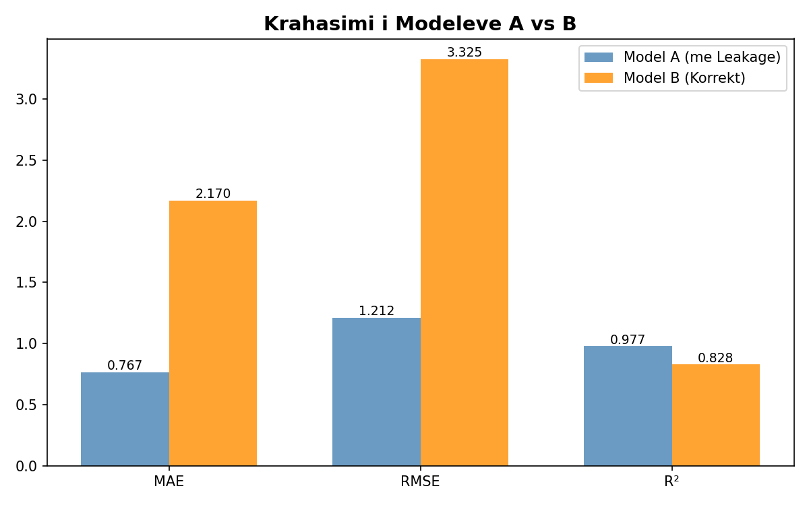 | 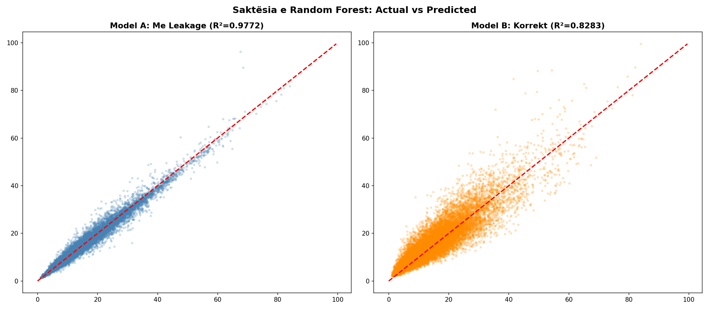 |

* **Gjetja:** Grafiku i majte krahason `MAE`, `RMSE` dhe `R²` per dy versionet e modelit. Ne artefaktet aktuale, `Model A` arrin `MAE = 0.767`, `RMSE = 1.212` dhe `R² = 0.9772`, por kjo konsiderohet `data leakage` sepse perdor informacion shume afer target-it. `Model B`, qe eshte varianti real i parashikimit, jep `R² = 0.8283`, `MAE = 2.1695` dhe `RMSE = 3.3254`, pra nje permiresim shume i madh ndaj versionit te meparshem te Random Forest.

**B. Analiza e faktoreve dhe gabimeve (Modeli B)**

| Pesha e Vecorive (Feature Importance) | Shperndarja e Gabimeve (Residuals) |
|:---:|:---:|
| 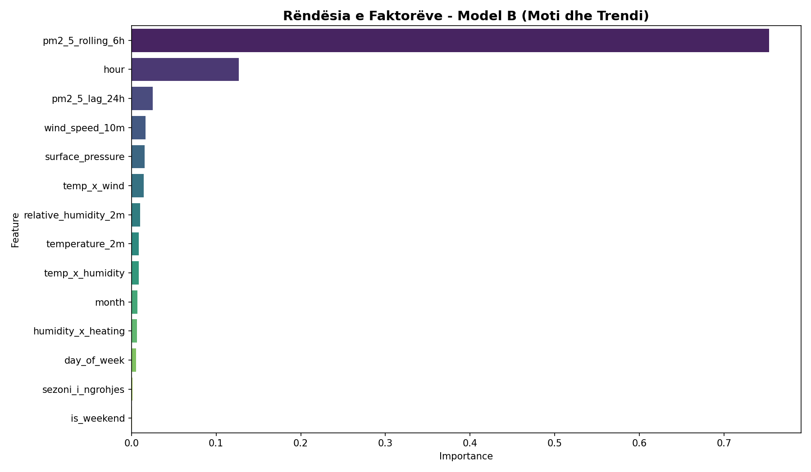 | 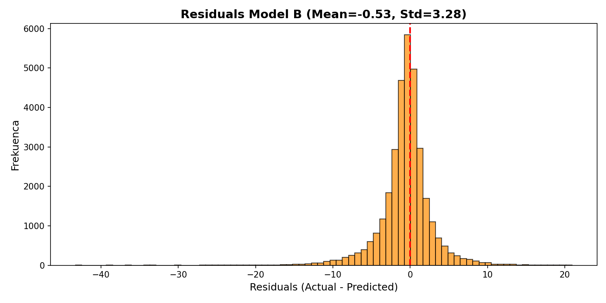 |

* **Gjetja:** Grafiku i rendesise tregon se ne modelin aktual ndikimi me i madh vjen qarte nga `pm2_5_rolling_6h`, pasuar nga `hour` dhe `pm2_5_lag_24h`; pas tyre vijne `wind_speed_10m`, `surface_pressure` dhe `temp_x_wind`. Histograma e residualeve tregon se gabimet e `Model B` jane te perqendruara rreth zeros, me `Mean = -0.53` dhe `Std = 3.28`, por me bisht me te gjate ne anen negative, qe tregon disa nenvleresime ne rastet me te renda.

#### 3. XGBoost Regressor (Modeli Kryesor dhe Explainable AI)

**Cfare ben algoritmi?** Nderton peme vendimi ne menyre sekuenciale, ku cdo iteracion korrigjon gabimet e atij paraprak, prandaj arrin te kap marredhenie shume me komplekse se modelet lineare.

**Si e perdorem ne?** Skripta e perditesuar fillimisht e kthen kolonen `time` ne `datetime`, i rendit te dhenat sipas `qyteti` dhe `time`, krijon `pm2_5_rolling_6h_avg`, `pm2_5_lag_24h` dhe `interaction features`, mban ne input edhe `sezoni_i_ngrohjes`, aplikon `StandardScaler` dhe trajnon modelin me `temporal split` (`80%` e kaluara per trajnim, `20%` e ardhmja per testim).

**A. Performanca dhe saktesia e parashikimit**

| Tabela e Metrikave Perfundimtare | Vlerat Reale vs Parashikimet |
|:---:|:---:|
| 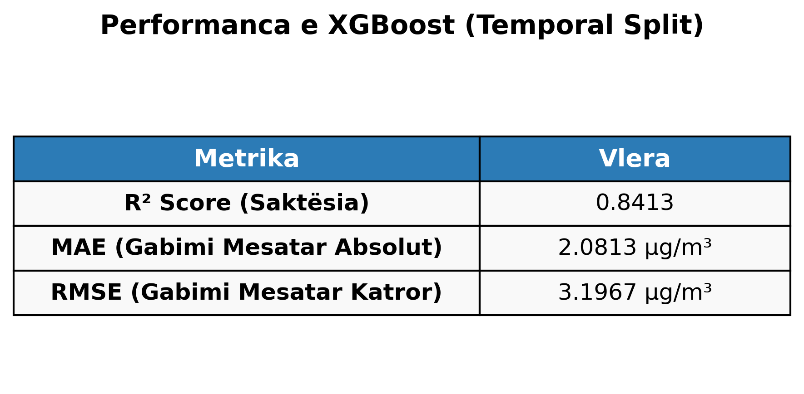 | 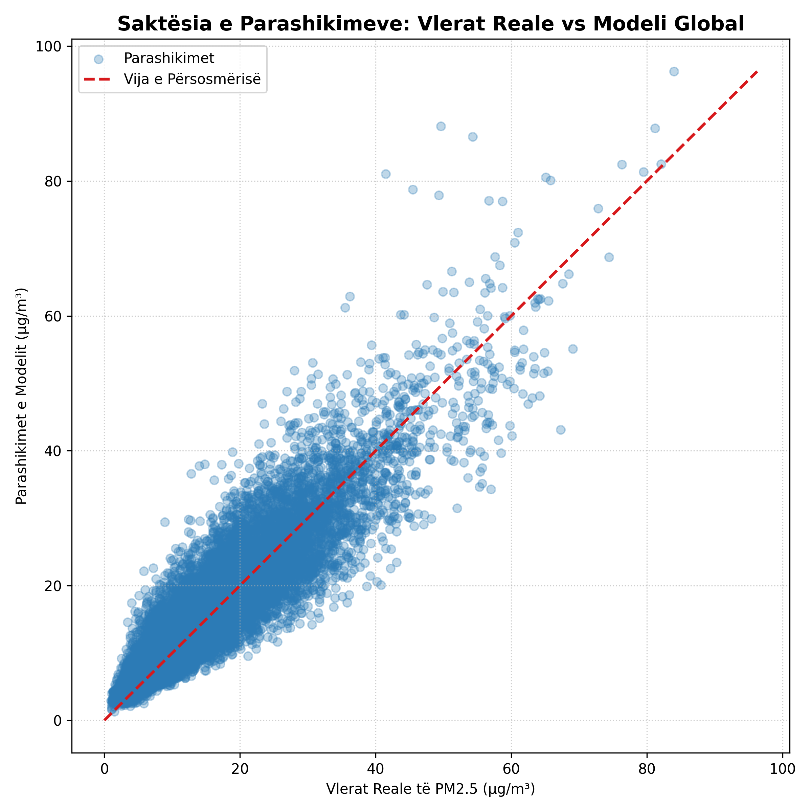 |

* **Gjetja:** Sipas figurave dhe metrikave te reja, `XGBoost Regressor` arrin `R² = 0.8413`, `MAE = 2.0813 µg/m³` dhe `RMSE = 3.1967 µg/m³`. Scatter-i ne te djathte tregon se modeli vazhdon ta ndjeke mire trendin e vlerave reale, por me nje shperndarje me te madhe te pikave sesa versioni paraprak, sidomos te vlerat me te larta te `PM2.5`.

**B. Analiza e gabimit dhe procesi i te mesuarit**

| Kurba e te Mesuarit (Learning Curve) | Shperndarja e Gabimeve (Residuals) |
|:---:|:---:|
| 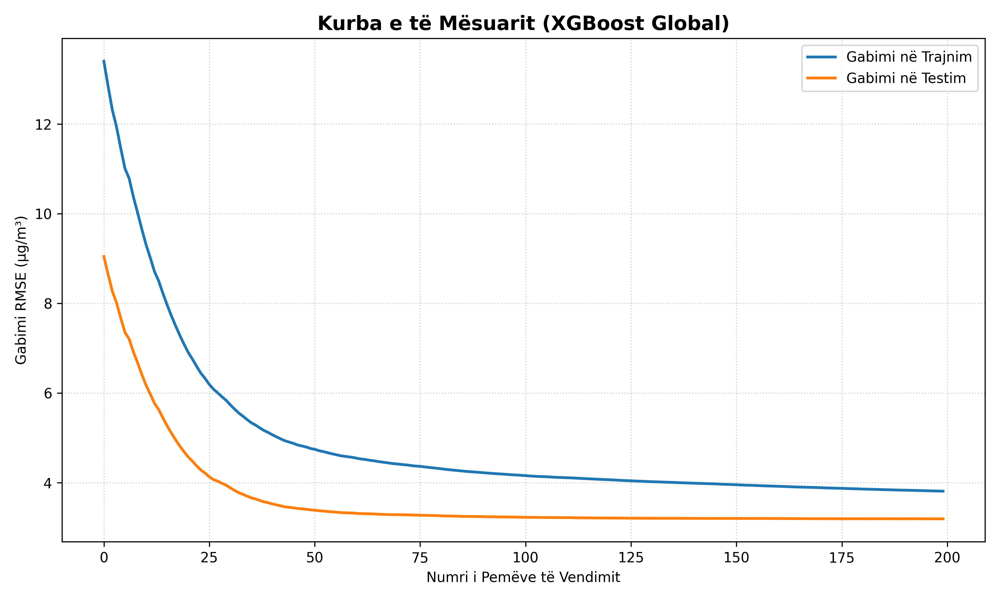 | 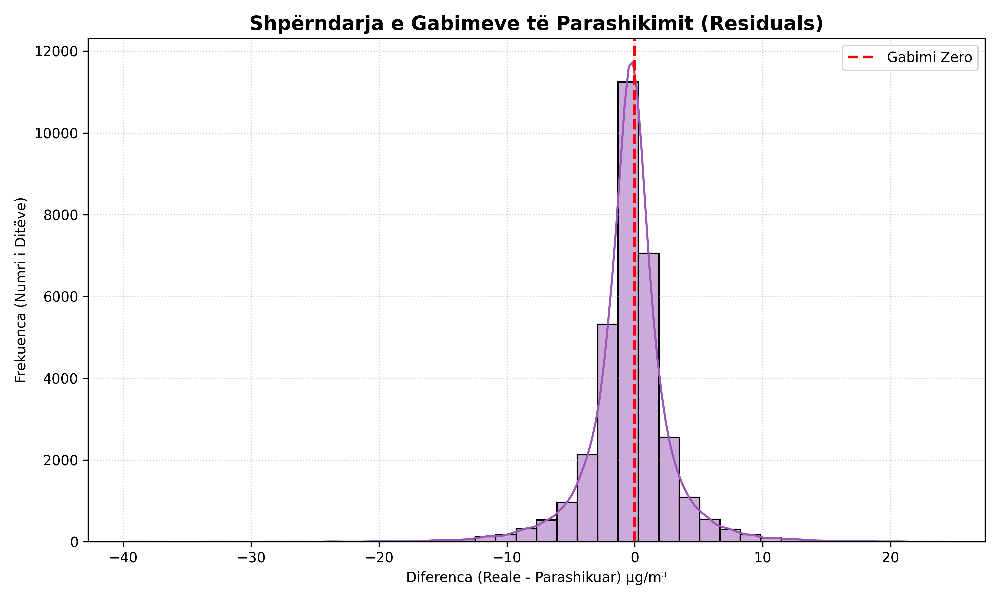 |

* **Gjetja:** `Learning Curve` tregon se gabimi bie shpejt ne iteracionet e para dhe me pas stabilizohet, ku kurba e testimit afrohet rreth `RMSE ≈ 3.2`. Histograma e residualeve mbetet e perqendruar rreth zeros, por eshte me e gjere se me pare dhe ka bishta me te dukshem ne te dy anet, qe tregon se modeli ende ben disa devijime me te medha ne rastet me te veshtira.

**C. Hapja e "Kutise se Zeze" (Explainable AI)**

| Si ndikojne faktoret (SHAP Summary Plot) | Pesha e Vecorive (Feature Importance) |
|:---:|:---:|
| 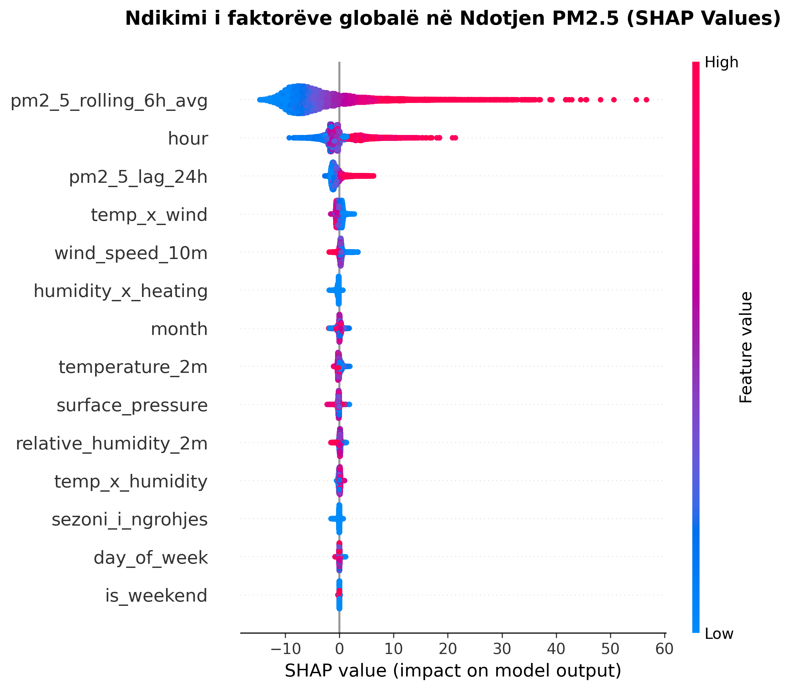 | 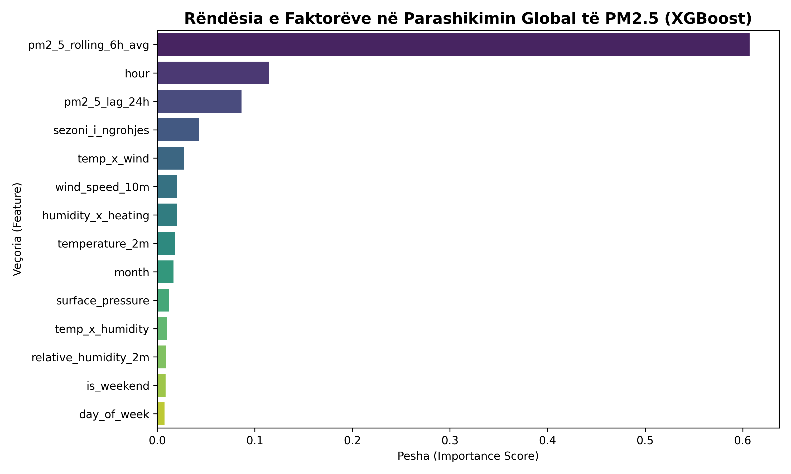 |

* **Gjetja:** Te dy figurat tregojne qarte se `pm2_5_rolling_6h_avg` eshte faktori dominues ne modelin e ri. Ne `Feature Importance`, kjo vecori ka peshen me te larte, larg mbi te tjerat; pas saj vijne `hour`, `pm2_5_lag_24h`, `sezoni_i_ngrohjes` dhe `temp_x_wind`. Ne `SHAP Summary Plot`, vlerat e larta te `pm2_5_rolling_6h_avg` shtyjne fort parashikimin drejt vlerave me te larta te `PM2.5`, ndersa `hour` dhe `pm2_5_lag_24h` japin ndikim dytësor por te dukshem ne nje pjese te observimeve.

| Logjika Ilustruese e Pemes se Vendimit |
|:---:|
|  |

* **Gjetja:** Kjo figure ilustron logjiken baze te nje peme vendimi, duke ndihmuar ne interpretimin intuitiv te menyres si funksionojne modelet `tree-based` ne kete faze.

### 2. Unsupervised Learning: Zbulimi i Strukturave dhe Anomalive

#### 1. PCA (Reduktimi i Dimensioneve)

**Cfare ben algoritmi?** Kompreson nje grup vecorish numerike ne komponente kryesore qe ruajne sa me shume variance nga te dhenat origjinale.

**Si e perdorem ne?** Ne skripten aktuale, PCA aplikohet vetem mbi `temperature_2m`, `relative_humidity_2m`, `surface_pressure` dhe `wind_speed_10m`, pas standardizimit me `StandardScaler`.

| Perqindja e Variances se Shpjeguar | Diferencimi Gjeografik ne 2D (Scatter Plot) |
|:---:|:---:|
|  |  |

* **Gjetja:** Grafiku i majte tregon sa variance shpjegon secili komponent dhe variancen kumulative. Ne artefaktet aktuale ruhen `4` komponente, sepse me 3 komponente varianca kumulative arrin rreth `91%`, ndersa me 4 arrin praktikisht `100%`. Scatter-i i djathte paraqet `PC1` kundrejt `PC2`, te ngjyrosura sipas kolones `qyteti`.

#### 2. Isolation Forest (Zbulimi i Anomalive dhe Rreziqeve Ekstreme)

**Cfare ben algoritmi?** Izolon pikat qe dallojne nga shperndarja normale e te dhenave dhe u atribuon nje `anomaly score`.

**Si e perdorem ne?** Skripta aktuale trajnon nje model `Global` dhe nje model `Per-City`, me contamination te pershtatur per secilin qytet (`7%` per Prishtinen, `5%` per Prizren dhe `3%` per Pejen), pastaj eksporton anomalite ne `Datasetet/ml_ready_dataset/anomalies_detected.csv`.

**A. Krahasimi sipas qytetit dhe shperndarja e score-ve**

| Anomalite sipas Qyteteve | Shperndarja e Rezultatit te Anomalise |
|:---:|:---:|
|  |  |

* **Gjetja:** Grafiku i majte tregon ndarjen `normal/anomali` per secilin qytet me pragun e tij `Per-City`, ndersa histogramat e djathta tregojne shperndarjen e `score_percity`. Ne rezultatet aktuale, modeli `Per-City` gjen gjithsej `8224` anomali, rreth `5.0%` te dataset-it.

**B. Severity scoring dhe shperndarja kohore**

| Nivelet e Rrezikshmerise (PM2.5 vs PM10) | Harta Kohore e Rreziqeve te Larta |
|:---:|:---:|
|  |  |

* **Gjetja:** Scatter-i i majte ngjyros anomalite sipas kategorive te `severity` qe perdor implementimi aktual. Heatmap-i i djathte grumbullon anomalite me te renda sipas muajit dhe ores, duke treguar kur perqendrohen rastet me rrezik me te larte.

**C. Krahasimi mujor i dy qasjeve**

| Global vs Per-City sipas Muajit |
|:---:|
| 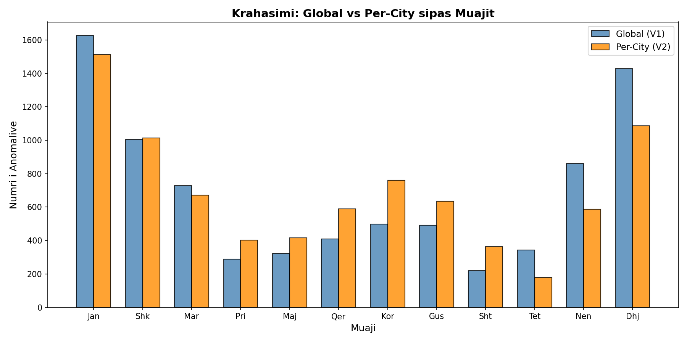 | 

* **Gjetja:** Ky grafik krahason numrin e anomalive mujore qe gjenden nga modeli `Global` kundrejt modelit `Per-City`, duke e bere me te dukshme se ku ndryshojne dy strategjite e detektimit.

#### 3. K-Means Clustering (Zbulimi i Profileve Klimatike te Ndotjes)

**Cfare ben algoritmi?** Ndan te dhenat ne klastera sipas ngjashmerise se tyre ne hapesiren e vecorive.

**Si e perdorem ne?** Skripta aktuale perdor `temperature_2m`, `relative_humidity_2m`, `wind_speed_10m` dhe `pm2_5`, i standardizon me `StandardScaler`, llogarit `Elbow Method`, teston `Silhouette Score` ne console dhe trajnon modelin final me `K=4`.

**A. Optimizimi i numrit te grupeve**

| Metoda e Berrylit (Elbow Method) | Silhouette Score |
|:---:|:---:|
| 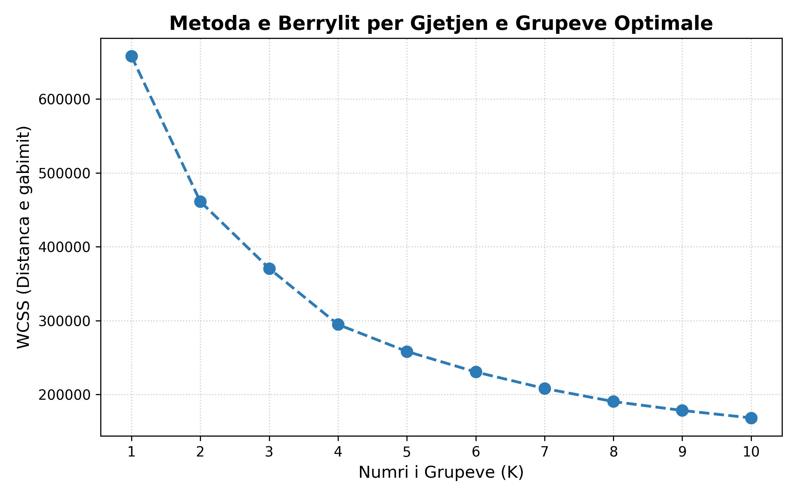  |  |

* **Gjetja:** Figura e majte tregon piken ku permiresimi fillon te ngadalesohet me rritjen e `K`, ndersa figura e djathte ilustron cilesine e ndarjes se klasterave sipas `Silhouette Score`. Ne implementimin aktual vlera finale e perdorur per trajnim mbetet `K=4`.

**B. Ndarja hapesinore dhe karakteristikat e profileve**

| Shperndarja 3D e Profileve | Scatter: Temperatura vs PM2.5 |
|:---:|:---:|
| 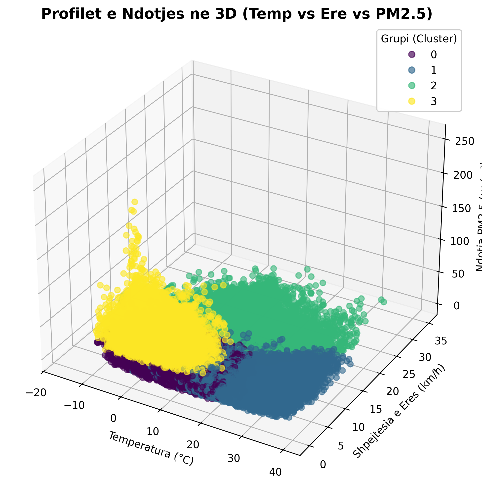 | 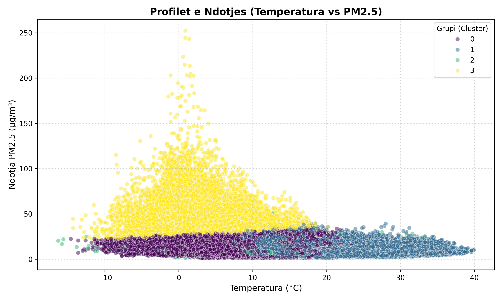 |

* **Gjetja:** Grafiku 3D jep pamjen hapesinore te klasterave, ndersa scatter-i `temperature` kundrejt `PM2.5` tregon qarte profilin me ndotje me te larte.

| Karakteristikat Mesatare (Bar Plots) | Shperndarja brenda Grupeve (Boxplots) |
|:---:|:---:|
| 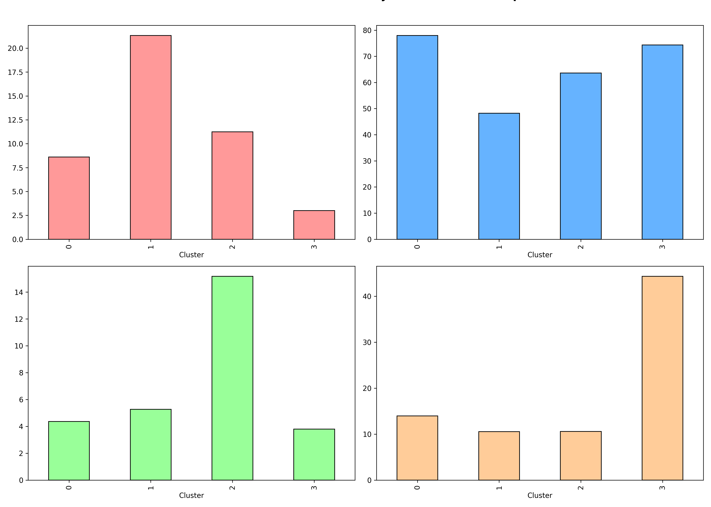 |  |

* **Gjetja:** Bar plot-et permbledhin mesataret per secilin klaster, ndersa boxplot-et tregojne variacionin dhe ekstremet brenda secilit grup per te kater vecorite.

* **Analiza e Profileve te Zbuluara:**
1.  **Ditet e Nxehta dhe te Pastra (Vera):** Temperatura te larta, lageshti e ulet, ajer me i paster.
2.  **Ditet e Ftohta dhe me Ere (Dimer i Pastruar):** Ndonese ben ftohte, shpejtesia e larte e eres e ka shperndare ndotjen.
3.  **Ditet e Ftohta, te Lageshta dhe te Qeta (Smogu Ekstrem):** Profili me kritik, ku ndotja bllokohet prane siperfaqes.
4.  **Ditet Tranzitore (Pranvere/Vjeshte):** Kushte mesatare klimatike me nivele mesatare ose me te ulta te ndotjes.
  
### 3. Krahasimi i Modeleve dhe Vleresimi Perfundimtar
### A. Supervised Learning (Parashikimi)
Per te parashikuar nivelet e `PM2.5`, skripta `model_evaluation.py` lexon artefaktet `JSON` ne `Modelet/` dhe krijon dy grafiqe krahasuese per modelet supervised:

| Krahasimi i Saktesise ($R^2$ Score) | Krahasimi i Gabimeve (MAE & RMSE) |
|:---:|:---:|
| 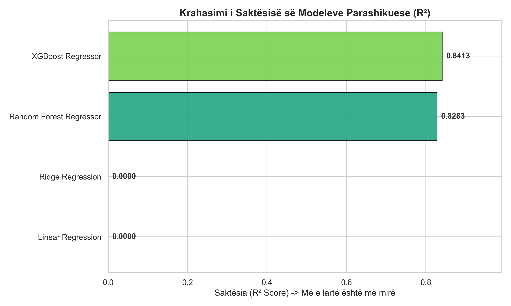 | 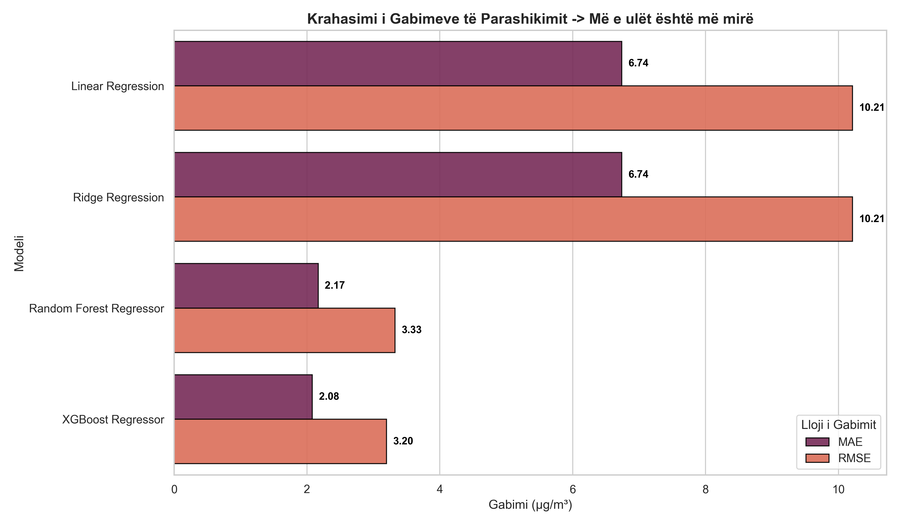 |

* **Gjetja:** Sipas output-it aktual te `model_evaluation.py`, `XGBoost Regressor` mbetet modeli me i mire supervised me `R² = 0.8413`, `MAE = 2.08` dhe `RMSE = 3.20`. `Random Forest Regressor` tashme eshte shume afer me `R² = 0.8283`, `MAE = 2.17` dhe `RMSE = 3.33`, ndersa `Linear Regression` dhe `Ridge Regression` paraqiten ne grafikun final me `R² = 0.0000` dhe me gabime dukshem me te larta. Pra, fotot e reja tregojne nje gare shume me te ngushte mes `XGBoost` dhe `Random Forest` sesa me pare.

#### B. Sinergjia mes Parashikimit dhe Zbulimit (Supervised + Unsupervised)
1.  **Parashikimi:** `XGBoost` dhe `Random Forest` perdoren per parashikimin e `PM2.5`.
2.  **Anomalite:** `Isolation Forest` identifikon rastet jo-tipike dhe i eksporton per analize te metejshme.
3.  **Profilizimi:** `K-Means` ndan observimet ne profile te ndryshme klimatike ose te ndotjes.
4.  **Kompresimi i vecorive:** `PCA` perdoret per te permbledhur sjelljen e kolonave meteorologjike ne komponente kryesore.

#### C. Matrica Perfundimtare e Perzgjedhjes

| Algoritmi | Roli Perfundimtar | Pse ky algoritëm? |
| :--- | :--- | :--- |
| **XGBoost** | **Modeli Kryesor (Production)** | Performanca me e larte supervised ne output-in e ri dhe shpjegueshmeri permes `SHAP`. |
| **Random Forest** | **Modeli Krahasues Kryesor / Alternative e Forte** | Tani ka performance pothuajse ne nivelin e `XGBoost`, dhe njekohesisht demonstron qarte efektin e `data leakage`. |
| **Isolation Forest** | **Sistemi i Alarmit** | Zbulon anomali me qasje `Per-City` dhe gjeneron `severity scoring`. |
| **K-Means** | **Profilizimi Klimatik** | Ndan te dhenat ne `4` profile te ndryshme te ajrit dhe motit. |
| **PCA** | **Optimizimi i te Dhenave** | Redukton dimensionet meteorologjike dhe lehteson vizualizimin ne `PC1/PC2`. |

### Strategjia e Trajnimit dhe Validimit
* **Baseline Linear/Ridge:** Perdor `train_test_split`, `ColumnTransformer` dhe `GridSearchCV` per `Ridge`.
* **Random Forest:** Perdor `temporal split` per testim dhe `TimeSeriesSplit` per validim te modelit kryesor.
* **XGBoost:** Perdor renditje kronologjike sipas `time`, `temporal split`, `StandardScaler` dhe ruan metrikat, `scaler`-in dhe modelin final.
* **Parandalimi i Data Leakage:** Krahasimi `me PM10` kundrejt `pa PM10` eshte i ndertuar qellimisht ne `random_forest_regressor.py`.

### Ruajtja e Modeleve dhe Portabiliteti
* **Linear & Ridge Regression:** Metrikat dhe koeficientet ruhen si skedare `JSON` ne `Modelet/`.
* **Random Forest:** Modeli final ruhet si `random_forest_pm25.joblib`, ndersa metrikat dhe rendesia e vecorive ruhen ne `random_forest_regressor.json`.
* **XGBoost:** Modeli ruhet ne `xgboost_global_model.json`, ndersa metrikat dhe parametrat e `scaler`-it ne `xgboost_global_metrics.json`.
* **PCA / K-Means / Isolation Forest:** Rezultatet permbledhese ruhen ne `JSON`, ndersa `Isolation Forest` eksporton edhe `anomalies_detected.csv`.
* **Gatishmeria per Fazen 3:** Keto artefakte jane baza per inference, krahasim dhe raportim ne fazat pasuese.
---
## FAZA 3 : Analiza dhe Vlerësimi [Në Zhvillim]

-----

## Teknologjitë e Përdorura

  - **Python 3.x** - Gjuha kryesore e programimit
  - **pandas / numpy** - Manipulimi i të dhënave dhe integrimi i serive kohore
  - **matplotlib / seaborn** - Vizualizimi shkencor i të dhënave (EDA)
  - **requests** - Për marrjen e të dhënave përmes API

-----
## Instalimi & Konfigurimi

**1. Klononi repozitorin:**

```bash
git clone https://github.com/rajmondashllaku/MachineLearning_25-26_GR-5.git
cd MachineLearning_25-26_GR-5
```

**2. Krijoni dhe aktivizoni një ambient virtual:**

```bash
python -m venv .venv
# Aktivizimi (Windows)
.venv\Scripts\activate
# Aktivizimi (macOS/Linux)
source .venv/bin/activate
```

**3. Instaloni libraritë e nevojshme:**

```bash
pip install pandas numpy matplotlib seaborn requests xgboost shap scikit-learn
```

### Udhëzuesi i Ekzekutimit

Pasi të keni përfunduar instalimin e librarive, ndiqni këtë radhë ekzekutimi për të riprodhuar tubacionin e plotë të të dhënave dhe modeleve. Sigurohuni që terminali juaj ndodhet në dosjen kryesore të projektit (`MachineLearning_25-26_GR-5`).

#### Hapi 1: Mbledhja e të Dhënave (Data Gathering)
Ky skript tërheq të dhënat e papërpunuara për motin dhe cilësinë e ajrit nga API-të dhe i ruan ato në dosjen `Datasetet`.
```bash
cd Data_Gathering
python data_gathering.py
cd ..
```

#### Hapi 2: Paraprocesimi dhe Integrimi (Faza 1)
Në këtë fazë, të dhënat pastrohen, bashkohen dhe bëhen gati për modelim. Ekzekutoni skriptat sipas kësaj radhe logjike:
```bash
cd FAZA-1_Pergatitja_e_modelit

# 1. Integrimi i API-ve të motit dhe ajrit
python data_integration.py

# 2. Pastrimi i vlerave null dhe anomalive
python data_cleaning.py

# 3. Krijimi i variablave të reja (Lag features, Sezoni)
python feature_engineering.py

# 4. Krijimi i Datasetit Global përfundimtar
python data_merging.py

# 5. Gjenerimi i grafikëve eksplorues (EDA)
python eda_analysis.py

cd ..
```

#### Hapi 3: Trajnimi i Modeleve (Faza 2)
Me datasetin e pastruar, mund të trajnoni modelet. Modelet finale dhe metrikat e tyre do të ruhen automatikisht në format `.json`.

**Për modelet parashikuese (Supervised):**
```bash
cd FAZA-2_Trajnimi_i_modelit/supervised
python ridge-linear-baseline-models.py
python random_forest_regressor.py
python train_xgboost.py
cd ../..
```

**Për analizën e grupeve dhe anomalive (Unsupervised):**
```bash
cd FAZA-2_Trajnimi_i_modelit/unsupervised
python pca_reduction.py
python isolation_forest.py
python kmeans-clustering.py
cd ../..
```

**Vlerësimi dhe krahasimi i modeleve:**
```bash
cd FAZA-2_Trajnimi_i_modelit
python model_evaluation.py
cd ..
```

*Shënim: Faza 3 është aktualisht në zhvillim dhe do të bazohet në modelet e ruajtura gjatë këtij procesi.*

## Licenca

Ky projekt është i licencuar nën kushtet e **MIT License**. Për më shumë detaje, shikoni skedarin [LICENSE](https://github.com/rajmondashllaku/MachineLearning_25-26_GR-5/tree/master?tab=MIT-1-ov-file) në këtë repozitor.

## Profilet e kontribuesve

Ky projekt është zhvilluar bashkërisht nga ekipi i mëposhtëm:

<table>
  <tr>
    <td align="center">
      <a href="https://github.com/rajmondashllaku">
        <br />
        <sub><b>Rajmondë Shllaku</b></sub>
      </a>
    </td>
    <td align="center">
      <a href="https://github.com/endritavllasaliu16">
        <br />
        <sub><b>Endrita Vllasaliu</b></sub>
      </a>
    </td>
    <td align="center">
      <a href="https://github.com/fletamujaj">
        <br />
        <sub><b>Fleta Mujaj</b></sub>
      </a>
    </td>
  </tr>
</table>