# Zhvillimi i një Modeli parashikues të smogut në Kosovë (Prishtinë, Prizren, Pejë)


<table>
  <tr>
    <td width="150" align="center" valign="center">
      
    </td>
    <td valign="top">
      <p><strong>Universiteti i Prishtinës</strong></p>
      <p>Fakulteti i Inxhinierisë Elektrike dhe Kompjuterike</p>
      <p>Inxhinieri Kompjuterike dhe Softuerike - Programi Master </p>
      <p><strong>Profesorët:</strong> Prof. Dr. Lule Ahmedi, PhD Mergim Hoti </p>
      <p><strong>Lënda:</strong> “Machine Learning”</p>
      <p><strong>Grupi 5:</strong></p>
      <ul>
        <li>Endrita Vllasaliu</li>
        <li>Fleta Mujaj</li>
        <li>Rajmondë Shllaku</li>
      </ul>
    </td>
  </tr>
</table>

---

## Përmbajtja

- [Pasqyra e Projektit](#pasqyra-e-projektit)
- [Struktura e Repozitorit](#struktura-e-repozitorit)
- [Përshkrimi i Datasetit](#përshkrimi-i-datasetit)
- [Modulet dhe Skriptat e Implementuara](#modulet-dhe-skriptat-e-implementuara)
- [Analiza Vizuale (EDA)](#analiza-vizuale-eda)
- [Teknologjitë e Përdorura](#teknologjitë-e-përdorura)
- [Instalimi & Konfigurimi](#instalimi--konfigurimi)

---
## Pasqyra e Projektit

Ky repozitor implementon një tubacion (pipeline) gjithëpërfshirës të Machine Learning për parashikimin e **Cilësisë së Ajrit (nivelet e PM2.5 dhe PM10) në Kosovë**, me fokus në analizën krahasuese mes tri qyteteve kryesore: **Prishtinë, Prizren dhe Pejë**. 
Projekti demonstron një cikël të plotë jetësor (end-to-end) të shkencës së të dhënave, duke u shtrirë në tri faza kryesore:

1. **Faza 1 (Përgatitja e të Dhënave):** Mbledhja e të dhënave historike përmes API-ve për të tria qytetet, pastrimi inteligjent i anomalive (Metoda Hibride e bazuar në Njohuritë e Domenit), integrimi i serive kohore, inxhinieria e veçorive dhe krijimi i një **Dataseti Global** të unifikuar.
2. **Faza 2 (Trajnimi i Modelit):** Aplikimi dhe optimizimi i algoritmeve të Machine Learning (si Random Forest, XGBoost, ose Regression) për të gjetur lidhjet e fshehura mes kushteve meteorologjike, lokacionit gjeografik dhe ndotjes së ajrit.
3. **Faza 3 (Analiza dhe Vlerësimi):** Testimi i saktësisë së modeleve, nxjerrja e metrikave dhe krijimi i raporteve vizuale për të kuptuar se cilët faktorë ndikojnë më shumë në smog-un sipas rajoneve.

### Qëllimet e Projektit
- **Ndërtimi i një Modeli Parashikues Rajonal:** Krijimi i një algoritmi të aftë të parashikojë ndotjen bazuar në motin dhe lokacionin (qytetin) për 6 vitet e fundit.
- **Paraprocesimi Inovativ:** Aplikimi i teknikave të avancuara të pastrimit për të menaxhuar dështimet e sensorëve, duke ruajtur vlerat reale të ndotjes ekstreme dimërore.
- **Inxhinieria e Veçorive Globale:** Transformimi i të dhënave në inpute parashikuese numerike (kodimi i qyteteve, nxjerrja e orës/muajit) dhe krijimi i veçorive të domenit si `sezoni_i_ngrohjes` për të kapur "Efektin e Prishtinës".
- **Krahasimi i Algoritmeve:** Trajnimi i modeleve për të gjetur performancën më të lartë dhe gabimin më të vogël.

---


## Struktura e Projektit

```text
MachineLearning_25-26_GR-5/
│
├── .idea/                           # Konfigurimet e ambientit të punës (PyCharm/VSCode)
├── Data_Gathering/                  
│   └── data_gathering.py            # Skripta për marrjen e të dhënave nga API (Open-Meteo & WAQI)
│
├── Datasetet/                       
│   ├── unprocessed_datasets/        # Të dhënat origjinale (CSV)
│   ├── processed_dataset/           # Të dhënat e bashkuara (raw merge)
│   ├── cleaned_dataset/             # Të dhënat pas trajtimit të vlerave null dhe outliers
│   └── ml_ready_dataset/            # Datasetet finale numerike
│       ├── prishtine_ml_data.csv
│       ├── prizren_ml_data.csv
│       ├── peje_ml_data.csv
│       └── kosova_global_ml_data.csv # DATASETI KRYESOR (Gjithëpërfshirës)
│
├── FAZA-1_Pergatitja_e_modelit/     
│   ├── data_assessment.py           # Analiza fillestare e kualitetit të të dhënave
│   ├── data_cleaning.py             # Pastrimi dhe trajtimi i anomalive
│   ├── data_integration.py          # Integrimi i API-ve të ndryshme
│   ├── data_merging.py              # Bashkimi i qyteteve në një dataset global
│   ├── eda_analysis.py              # Analiza Eksplorative (Korreleacionet, Trendet)
│   └── feature_engineering.py       # Krijimi i variablave të reja (Lag features, Sezoni)
│
├── FAZA-2_Trajnimi_i_modelit/       
│   ├── supervised/                  # Mësimi i mbikëqyrur (Parashikimi i PM2.5)
│   │   ├── train_xgboost.py         
│   │   ├── random_forest_regressor.py
│   │   └── ridge_linear_baseline.py 
│   │
│   ├── unsupervised/                # Mësimi i pambikëqyrur (Analiza e profileve)
│   │   ├── kmeans_clustering.py     # Grupimi i profileve të ndotjes (me Scaler ne JSON)
│   │   ├── isolation_forest.py      # Identifikimi i anomalive ekstreme
│   │   └── pca_reduction.py         # Reduktimi i dimensioneve për vizualizim
│   │
│   └── model_evaluation.py          # Skripta për krahasimin e performancës së modeleve
│
├── FAZA-3_Analiza_dhe_Evaluimi/     # Analiza përfundimtare dhe konkluzionet [Në Zhvillim]
│
├── Modelet/                         # Skedarët JSON dhe te modeleve të trajnuara
│
├── images/                          # Grafikët e gjeneruar (EDA, Clusters, SHAP plots)
├── .gitattributes
├── .gitignore
├── LICENSE                          # MIT LICENSE
└── README.md                        # Dokumentimi kryesor i projektit
````

-----

## Përshkrimi i Datasetit

Projekti përdor burime të të dhënave që mbulojnë periudhën nga **2020 deri më sot**. Të dhënat e ndara fillimisht janë bashkuar në një skedar master: **`kosova_global_ml_data.csv`**.

### Atributet Kryesore (Dataseti Global)

| Atributi                | Kolona | Tipi | Përshkrimi |
|-------------------------|--------|------|-------------|
| **Targeti (Ajri)** | `pm2_5` | Float | Përqendrimi i grimcave \< 2.5 µm (µg/m³) |
| **Targeti (Ajri)** | `pm10` | Float | Përqendrimi i grimcave \< 10 µm (µg/m³) |
| **Meteorologjike** | `temperature_2m` | Float | Temperatura e ajrit në 2 metra lartësi (°C) |
| **Meteorologjike** | `relative_humidity_2m`| Float | Lagështia relative (%) |
| **Meteorologjike** | `wind_speed_10m` | Float | Shpejtësia e erës në 10 metra lartësi (km/h) |
| **Kohore (E derivuar)** | `month` | Integer | Muaji i vitit (1-12) për të kapur sezonalitetin |
| **Kohore (E derivuar)** | `hour` | Integer | Ora e ditës (0-23) për të kapur ciklet e trafikut |
| **Domeni (E derivuar)** | `sezoni_i_ngrohjes` | Integer | Indikator i smogut (1=Dimër në Prishtinë, 0=Tjera) |
| **Gjeografike** | `qyteti` | Integer | Kodi i lokacionit (**1**=Prishtinë, **2**=Prizren, **3**=Pejë) |

-----

## Modulet

### FAZA 1 : Përgatitja e modelit

Kjo fazë zbaton një rrjedhë të fuqishme të paraprocesimit të të dhënave përmes disa skriptave kryesore:

1.  **`data_integration.py`**

      * **Çfarë bën:** Lexon datasetet e papërpunuara të motit dhe cilësisë së ajrit për secilin qytet dhe i bashkon ato në një skedar analitik të vetëm.
      * **Logjika:**  
         * **Sinkronizimi Kohor**: Për të garantuar përputhjen e saktë mes API-ve të ndryshme, skripta konverton formatet e datave, rrumbullakos kohën në orën më të afërt (round('h')) dhe standardizon zonat kohore. 
         * **Pivotimi i të Dhënave**: Shumë burime të ajrit (si OpenAQ) vijnë në format të gjatë (parametrat janë rreshta). Skripta filtron vlerat e korruptuara si -999.0, fshin matjet e dyfishta për të njëjtën orë, dhe përdor funksionin pivot për t'i kthyer ndotësit (PM2.5, PM10) në kolona të rregullta. Nëse detekton format satelitor, e përshtat automatikisht pa pivot. 
         * Në fund, kryhet bashkimi inner në kolonën time, duke ruajtur vetëm rreshtat ku plotësohen të dyja kushtet (moti dhe ajri).


2.  **`data_cleaning.py`**

      * **Çfarë bën:** Së pari, siguron që çdo vlerë tekstuale e gabuar (si 'None') të konvertohet në NaN dhe fshin plotësisht rreshtat që kanë vlera të munguara. Më pas, bën një skanim statistikor për të detektuar anomali (Outliers) në çdo qytet.
      * **Logjika "Hands Off" (Mos-ndërhyrje):** Për të zbuluar vlerat jashtë normales, skripta përdor metodën e rreptë statistikore IQR (Interquartile Range). Megjithatë, ajo vetëm i raporton (numëron) këto vlera dhe nuk i fshin. Kjo është një zgjedhje inxhinierike e qëllimshme: fshirja e rreshtave me PM2.5 ose PM10 shumë të lartë do të "fshinte" ditët me smog ekstrem gjatë dimrit në Kosovë, duke e lënë modelin të verbër ndaj kulmeve të vërteta të ndotjes.

3.  **`feature_engineering.py` (Inxhinieria e Veçorive)**

    * **Çfarë bën:** Merr të dhënat e pastruara dhe i shndërron ato në formate thjesht numerike, të gatshme për t'u ushqyer në modelet e Machine Learning.
    * **Logjika:** 
         
      * **Ekstraktimi Kohor:** Nga kolona e datës (time), nxjerr kolonat month (për sezonalitetin), hour (për ciklet e ditës/natës) dhe day_of_week. 
      * **Njohuritë e Domenit (Domain Knowledge)**: Shton kolonën is_weekend (1 për fundjavë, 0 për ditë pune) për të kapur ndryshimet në fluksin e trafikut të makinave. Gjithashtu, zbaton një rregull specifik gjeografik: shton kolonën sezoni_i_ngrohjes (muajt e ftohtë 10-3) vetëm për qytetin e Prishtinës, pasi aty ndikimi i djegies së thëngjillit është më agresiv. 
      * **Gati për ML:** Në fund, skripta fshin përfundimisht kolonën tekstuale/datetime time, duke lënë pas vetëm atribute numerike (int dhe float) që kërkohen nga algoritme si Random Forest dhe XGBoost.
4.  **`data_merging.py` (Krijimi i Datasetit Global)**

      * **Çfarë bën:** Merr datasetet e gatshme të të tria qyteteve dhe i shton njëra mbi tjetrën (bashkim vertikal) për të krijuar një *Master Dataset* (`kosova_global_ml_data.csv`).
      * **Logjika:** Shton kolonën e re `qyteti` (Kodet 1, 2, 3) për t'i mundësuar modelit të dallojë lokacionin. Gjithashtu, i jep vlerën `0` sezonit të ngrohjes për Prizrenin dhe Pejën, duke e lënë vlerën `1` vetëm për Prishtinën, për të kapur "Efektin e bllokimit të tymit" tipik të kryeqytetit.
5. **`data_validation.py` (Vlerësimi dhe Sigurimi i Cilësisë)**

      * **Çfarë bën:** Skripta e testimit final (Quality Assurance) që gjeneron një raport të detajuar diagnostikues mbi integritetin e Datasetit Global, për të vërtetuar që është 100% i gatshëm për algoritmet e Machine Learning.
      * **Logjika:** Bën një "skanim" përfundimtar të të dhënave para Fazës 2: konfirmon që nuk ka mbetur asnjë vlerë e zbrazët (`Nulls: 0`), vërteton që të gjitha kolonat janë konvertuar strikt në formate numerike, kontrollon saktësinë e logjikës së `sezoni_i_ngrohjes` për secilin qytet, dhe garanton që vlerat ekstreme (outliers) të smogut dimëror janë ruajtur me sukses duke shfaqur majat e tyre maksimale.
 
6. **`eda_analysis.py` (Analiza dhe Vizualizimi)**

      * **Çfarë bën:** Skripta finale automatike që lexon datasetet dhe gjeneron një set grafikësh shkencorë për të analizuar sjelljen e të dhënave, duke i ruajtur ato në folderin `images/`.

-----

## Analiza Vizuale (EDA)

Përmes skriptës `eda_analysis.py`, ne analizuam sjelljen e ndotësve si në nivel lokal (qytet) ashtu edhe atë rajonal.

### 1\. Analiza Lokale

Këtu vëzhgojmë korrelacionin (lidhjen mes motit dhe ndotjes) si dhe trendin mesatar të ndotjes gjatë një dite (00:00 - 23:00) për çdo qytet.

#### Prishtina
| Matrica e Korrelacionit |                 Cikli Ditor (Trendi )                 |
|:---:|:-----------------------------------------------------:|
|  | 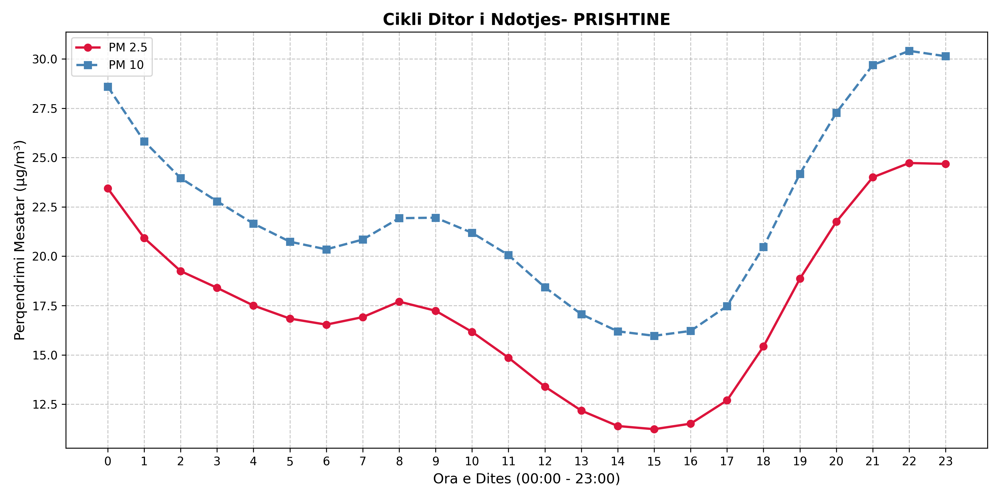 |

#### Prizreni
| Matrica e Korrelacionit |               Cikli Ditor (Trendi )               |
|:---:|:-------------------------------------------------:|
| 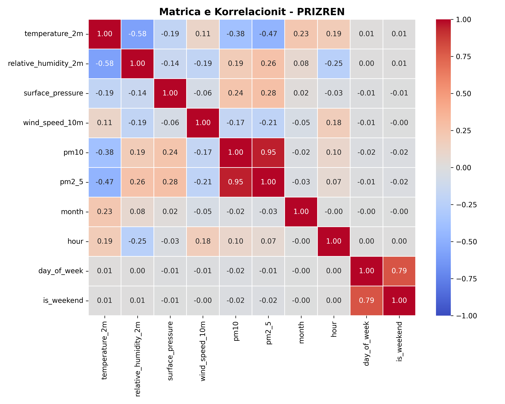 | 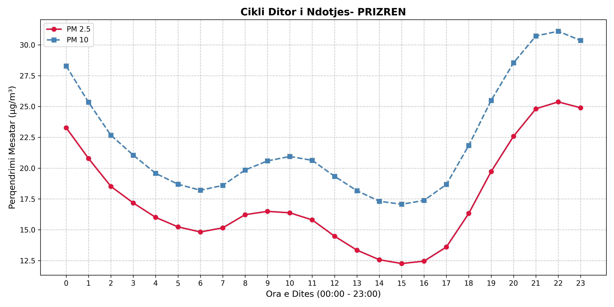 |


#### Peja
| Matrica e Korrelacionit | Cikli Ditor (Trendi ) |
|:---:|:---:|
| 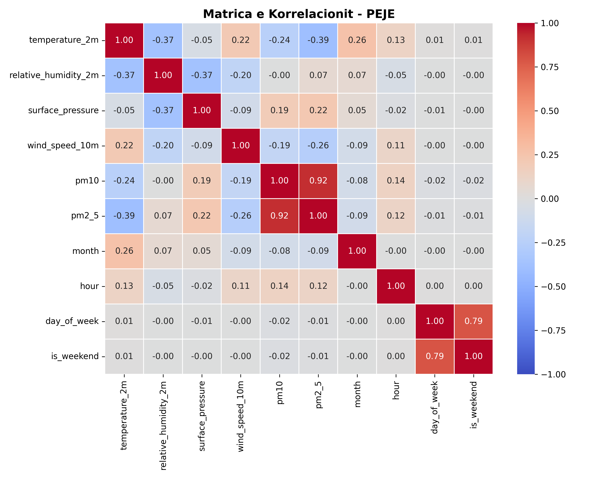 | 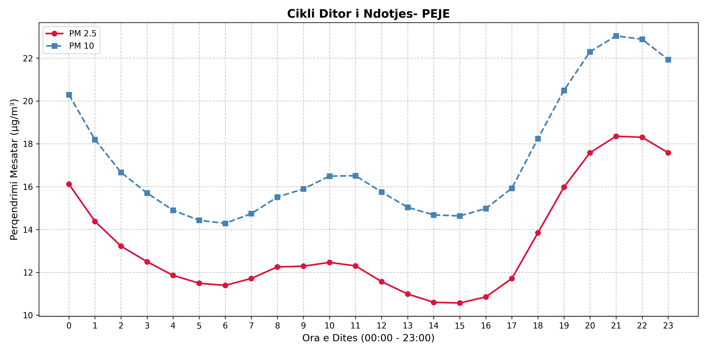 |

**Gjetje nga Analiza Lokale:** \* Të tria qytetet shfaqin formën karakteristike "U" gjatë ditës (ndotje më e ulët gjatë drekës, rritje në mbrëmje).

  * Era (Wind Speed) është pastruesi kryesor natyral, pasi shfaq korrelacion negativ në të tria matricat.
  * Ndërsa Prishtina kapërcen lehtësisht vlerat 20-30 µg/m³ gjatë mbrëmjeve, Prizreni dhe Peja mbajnë një balancë dukshëm më të ulët, falë mungesës së centraleve të mëdha industriale dhe relievit më të favorshëm të ajrimit.

-----

### 2\. Analiza E Pergjithshme

Duke përdorur Datasetin Master të unifikuar, ne krijuam një hartëvizuale se si diferencojnë qytetet nga njëri-tjetri.

#### Matrica e Korrelacionit Global

*Figura 1.**Matrica e Korrelacionit (Pearson)** për datasetin e unifikuar (`kosova_global_ml_data.csv`).*

#### Krahasimi i Qyteteve (Boxplot)
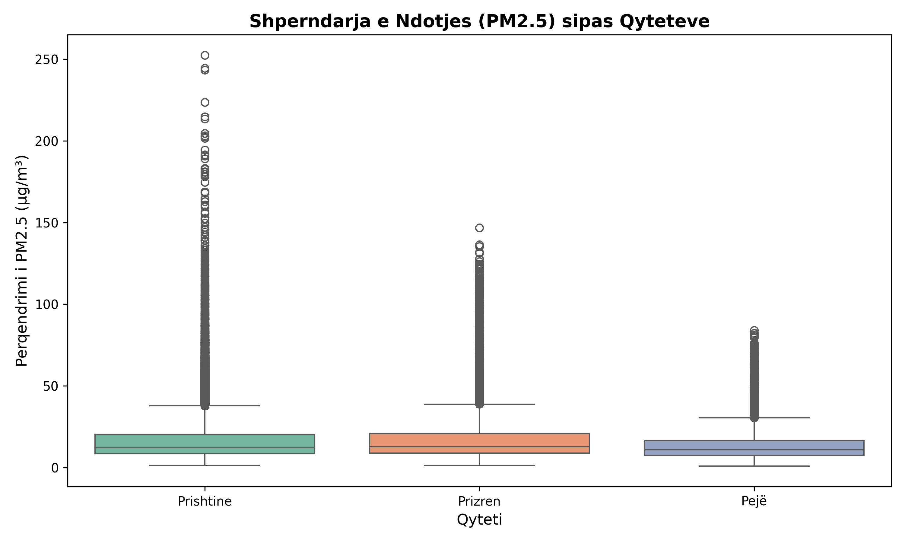
*Figura 2: Analiza e variancës së PM2.5 mes Prishtinës, Prizrenit dhe Pejës.*

  * **Ndotja Ekstreme:** Prishtina shfaq një shpërndarje (box) më të gjerë dhe vlera ekstreme (outliers) dukshëm më të larta, duke vërtetuar se smogu i rëndë është kryesisht problem i kryeqytetit.

#### Cikli Ditor i Ndotjes - Krahasim
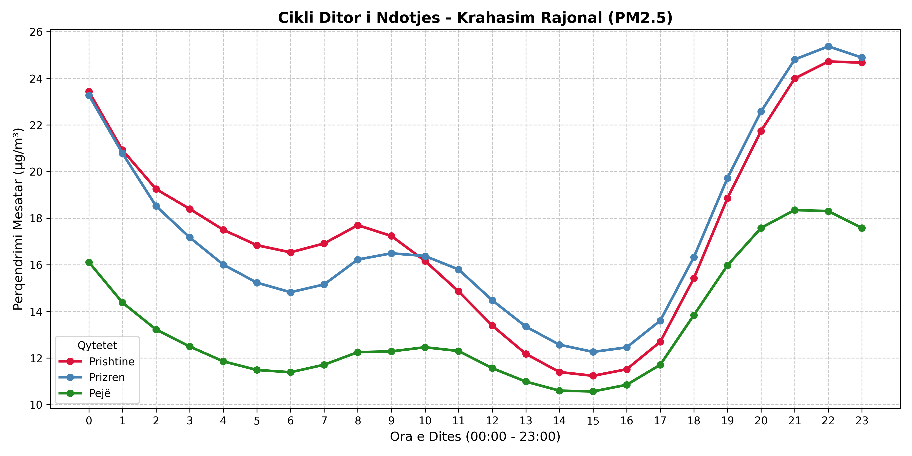
*Figura 3: Trendi mesatar orar (24h) për PM2.5.*

  * **Dinamika Dite-Natë:** Të tria qytetet ndjekin një model të ngjashëm gjatë ditës, por linja e Prishtinës (e kuqe) shkëputet drastikisht pas orës 17:00, duke krijuar atë që quhet "Peak i Mbrëmjes".

### 3. Zbulimi i Modeleve të Fshehura (Pattern Discovery)

Për të kuptuar thellësisht shkaktarët e smogut, krijuam vizualizime të avancuara që provojnë hipotezat tona mbi motin dhe zakonet urbane:

#### Harta e Nxehtësisë: Cikli Sezonal dhe Ditor

* **Gjetja:** Ndotja nuk është e shpërndarë rastësisht. Heatmap-i dëshmon qartë se smogu i rëndë (ngjyrat e errëta) është i përqendruar ekskluzivisht në muajt e dimrit (Nëntor - Shkurt) dhe kryesisht pas orës 17:00, duke vërtetuar se djegia e thëngjillit/biomasës për ngrohje është ndotësi primar.

#### Efekti i Inversionit Termik
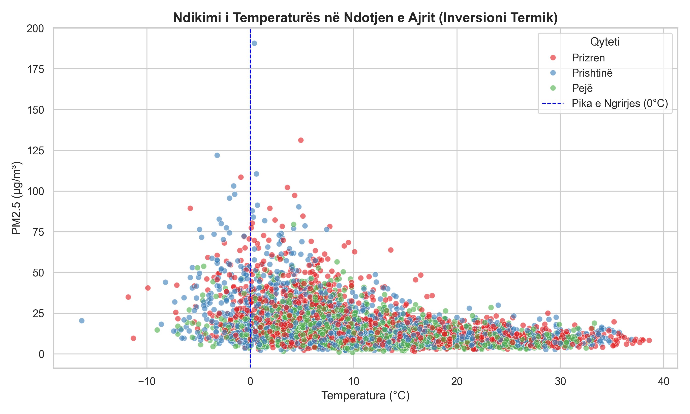
* **Gjetja:** Ky *Scatter Plot* demonstron natyrën jo-lineare të të dhënave. Sapo temperatura zbret nën 0°C, vlerat e PM2.5 shpërthejnë lart. Kjo ndodh për shkak të "inversionit termik", ku ajri i ftohtë e bllokon tymin pranë sipërfaqes së tokës, veçanërisht në zonat me formë luginash si Prishtina.

#### Ndikimi i Trafikut (Ditë Pune vs. Fundjavë)

* **Gjetja:** Diferenca mes ditëve të punës dhe fundjavave është e papërfillshme në lidhje me kulmet e ndotjes. Kjo hedh poshtë mitin se trafiku i makinave është fajtori kryesor i smogut të rëndë dimëror në Kosovë; fajtori i vërtetë mbetet ngrohja shtëpiake dhe industria, të cilat nuk pushojnë në fundjavë.

### 4. Konkluzione të Avancuara nga EDA (Gjetje Shkencore)

Nga vizualizimet e mësipërme, kemi nxjerrë disa përfundime thelbësore që ndikojnë drejtpërdrejt në qasjen tonë të Machine Learning:

* **Inversioni Termik dhe Meteorologjia:** Matrica e korrelacionit tregon një lidhje të fortë negative mes temperaturës dhe ndotjes. Kjo vërteton se smogu në Kosovë nuk është një problem konstant industrial, por një problem sezonal. Temperaturat e ulëta të kombinuara me lagështinë e lartë krijojnë "inversionin termik", duke e mbajtur ndotjen të bllokuar afër sipërfaqes së tokës.
* **Burimi i "Peak-ut" të Mbrëmjes:** Rritja e ndotjes pas orës 17:00 nuk i atribuohet vetëm trafikut. Fakti që nivelet e PM2.5/PM10 vazhdojnë të rriten në mënyrë agresive deri në mesnatë (kur makinat ndalojnë së lëvizuri) tregon se burimi kryesor është **ngrohja shtëpiake** (djegia e biomasës dhe thëngjillit gjatë natës).
* **Ndikimi Topografik (Pse Prishtina vuan më shumë):** *Boxplot*-et tregojnë anomali ekstreme për Prishtinën. Kryeqyteti ka një reliev që favorizon bllokimin e tymrave, ndërsa Peja dhe Prizreni, të pozicionuara pranë masiveve malore (Bjeshkët e Nemuna, Malet e Sharrit), përfitojnë nga rrymat ajrore që ndihmojnë në ventilimin natyror gjatë natës.
* **Justifikimi i Algoritmeve (Natyra Jo-Lineare):** Lidhjet mes motit, lokacionit dhe ndotjes janë thellësisht jo-lineare. Për të kapur këtë kompleksitet, modelet e thjeshta si *Linear Regression* janë të pamjaftueshme. Kjo është arsyeja pse në Fazën 2 përdorim **modele të bazuara në pemë** (*Random Forest*, *XGBoost*), të cilat janë të afta të zbulojnë rregulla komplekse logjike nga të dhënat:
  > *Shembull se si "mendon" modeli:* **NËSE** Ora > 18:00 **DHE** Temperatura < 0°C **DHE** Shpejtësia e Erës < 5 km/h **ATËHERË** Parashiko Ndotje Ekstreme (PM2.5 > 150).

Projekti tani posedon një **Master Dataset** të pastruar nga anomalitë, me mungesa të trajtuara logjikisht, dhe të pasuruar me Features numerike.

### 5. Sfidat e të Dhënave dhe "Paradoksi i Mesatares"
Gjatë analizës vizuale, u vu re se trendi mesatar ditor (Line Chart) për Prishtinën dhe Prizrenin duket i ngjashëm (rreth 25-30 µg/m³). Megjithatë, kjo fsheh realitetin e smogut ekstrem në Prishtinë për shkak të dy faktorëve:
* **Efekti i Hollimit (Dilution Effect):** Dataseti përmban ~43,000 orë matje. Kulmet ekstreme të ndotjes në Prishtinë (deri në 250 µg/m³) ndodhin gjatë netëve të ftohta të dimrit, por ato "hollohen" matematikisht në mesatare nga mijëra orë me ajër të pastër gjatë pranverës/verës.
* **Rezolucioni i API-t Satelitor:** Të dhënat historike bazohen në modele satelitore (CAMS) të cilat masin ndotjen në blloqe të mëdha regjionale (10x10 km), duke e pasur të vështirë të izolojnë "mikro-ndotjen" (smogun e bllokuar në luginën e Prishtinës) në krahasim me sensorët tokësorë. 
*Kjo justifikon edhe më shumë përdorimin e algoritmeve Tree-Based në Fazën 2, pasi ato mësojnë nga rreshtat individualë dhe vlerat ekstreme (outliers), duke mos u mashtruar nga mesatarja.*
---
## FAZA 2 : Trajnimi i Modeleve (Machine Learning)

Në këtë fazë, kalojmë nga analiza historike në modelimin parashikues dhe zbulimin e strukturave të fshehura. Kemi ndërtuar një arkitekturë gjithëpërfshirëse duke testuar algoritme të ndryshme (Supervised dhe Unsupervised) për të adresuar kompleksitetin e ndotjes së ajrit.

### 1. Supervised Learning: Parashikimi i Ndotjes (PM2.5)
Për të gjetur modelin më të saktë, kemi filluar me modele të thjeshta lineare dhe kemi kaluar në algoritme të avancuara të bazuara në pemë (Tree-Based).

* **Modelet Bazë (Linear & Ridge Regression):** U përdorën si "Baseline" për të testuar hipotezën e lidhjeve lineare. Saktësia e tyre bazike vërtetoi nevojën për algoritme që mund të menaxhojnë marrëdhënie komplekse jo-lineare.
* **Parandalimi i "Data Leakage" (Modeli A vs Model B):** Për të garantuar parashikime reale (p.sh. parashikimi i të nesërmes), ndërtuam qëllimisht dy versione: një me PM10 (që shkakton data leakage) dhe një pa PM10 (Modeli i Vërtetë), i trajnuar vetëm mbi motin dhe kohën.
* **Modelet e Avancuara (Random Forest & XGBoost):** Këto modele kapën me sukses "Inversionin Termik" dhe vlerat ekstreme dimërore. Në *Random Forest*, u aplikua `TimeSeriesSplit` për vlerësim për të respektuar rendin kronologjik. Në *XGBoost*, u integrua Inteligjenca e Shpjegueshme (SHAP) për të zbërthyer saktësisht ndikimin e çdo parametri (p.sh. temperatura, era).

### 2. Unsupervised Learning: Profilizimi, Anomalitë dhe Reduktimi i Dimensioneve
Për të kuptuar ngjarjet ekstreme, për të thjeshtuar të dhënat dhe për të grupuar ditët me karakteristika të ngjashme, përdorëm tre algoritme të fuqishme pa mbikëqyrje:

* **Reduktimi i Dimensioneve (PCA):** Analiza e Komponentëve Kryesorë u përdor për të menaxhuar korrelacionin e lartë mes variablave meteorologjike. Duke mbajtur 95% të variancës, transformuam të dhënat komplekse në komponentë kryesorë (PC1, PC2), duke thjeshtuar vizualizimin dhe duke llogaritur gabimin e rindërtimit (Reconstruction Error).
* **Zbulimi i Anomalive (Isolation Forest):** U implementua për të izoluar ditët me ndotje jonormale. Për të shmangur gabimet e një qasjeje "një masë për të gjithë" (Global), ne zhvilluam një **Model Per-City** me pragje të adaptuara. Gjithashtu u krijua një sistem i shkallëzimit të ashpërsisë (*Severity Scoring*: Low, Medium, High) për t'i dhënë kuptim praktik anomalive.
* **Zbulimi i Profileve (K-Means Clustering):** Modeli grupon vetvetiu ditët e vitit bazuar në ngjashmëritë e motit dhe ndotjes. Përmes Metodës së Bërrylit (Elbow Method), algoritmi arriti të izolojë vizualisht (në 3D) ditët e pastra me erë, nga ditët e rënda të bllokuara nga smogu dimëror.

#### Pasqyra e Modeleve të Implementuara
| Kategoria | Algoritmi | Roli në Projekt |
| :--- | :--- | :--- |
| **Supervised** | Linear / Ridge Regression | Gjetja e korrelacioneve bazë (Baseline) |
| **Supervised** | Random Forest Regressor | Menaxhimi i lidhjeve jo-lineare dhe CV Kohor |
| **Supervised** | XGBoost Regressor | Performanca maksimale parashikuese dhe SHAP |
| **Unsupervised**| PCA | Reduktimi i variablave të motit në Komponentë Kryesorë |
| **Unsupervised**| Isolation Forest | Gjetja e anomalive (Model gjeografik adaptiv) |
| **Unsupervised**| K-Means Clustering | Krijimi i profileve 3D të klimës dhe smogut |

---

### Modulet e Implementuara (Faza 2)
1.  **`ridge-linear-baseline-models.py`**: Pipeline për modelet lineare.
2.  **`random_forest_regressor.py`**: Modelimi i avancuar me *Lag Features* dhe `TimeSeriesSplit`.
3.  **`train_xgboost.py`**: Trajnimi përfundimtar me XGBoost dhe analizë SHAP.
4.  **`pca_reduction.py`**: Kompresimi i veçorive meteorologjike përmes analizës së variancës.
5.  **`isolation_forest.py`**: Detektimi i anomalive me qasje *Per-City* dhe *Severity Scoring*.
6.  **`kmeans-clustering.py`**: Algoritmi i klasterizimit dhe gjenerimi i vizualizimeve 3D.
7.  **`model_evaluation.py`**: Krahasimi i metrikave te performances se algoritmeve/modeleve.

## Vizualizimet
### 1. Supervised Learning: Parashikimi i Ndotjes (PM2.5)
#### 1. Modelet Lineare (Linear & Ridge Regression - Baseline)

**Çfarë bën algoritmi?** Përpiqet të tërheqë një "vijë të drejtë" nëpër të dhëna, duke supozuar se nëse një variabël rritet (p.sh. era), tjetra rritet ose bie në mënyrë proporcionale.

**Si e përdorëm ne?** E përdorëm si "Test Dummy" (Baseline). Donim t'u vërtetonim të dhënave tona se ndotja nuk është kaq e thjeshtë dhe nuk ndjek rregulla lineare.
Përpara se të përdornim Inteligjencë Artificiale komplekse, ne ngritëm një pyetje themelore: *A mund të parashikohet ndotja e ajrit thjesht duke tërhequr një vijë të drejtë mes variablave të motit?* Për t'iu përgjigjur kësaj, ne trajnuam modelet **Linear Regression** dhe **Ridge Regression** (duke optimizuar parametrin `alpha` me `GridSearchCV`). Këto modele shërbyen si "Baseline" (Pikënisje), duke pasur të kujdes të fshijmë variablin `pm10` për të parandaluar rrjedhjen e të dhënave (Data Leakage).

**A. Performanca dhe Testimi i Hipotezës Lineare**

| Krahasimi i Saktësisë (Scatter Plot) | Metrikat Vlerësuese (Bar Chart) |
|:---:|:---:|
| 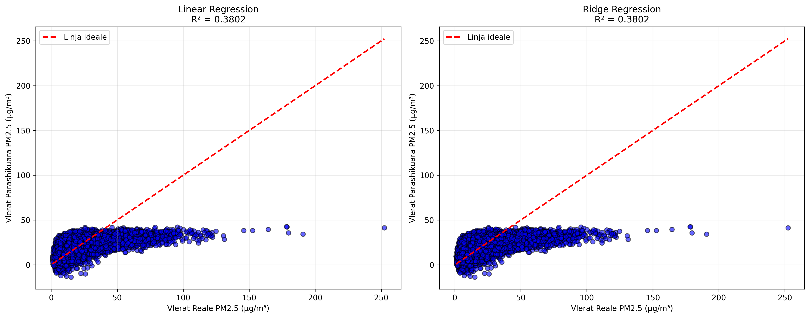 | 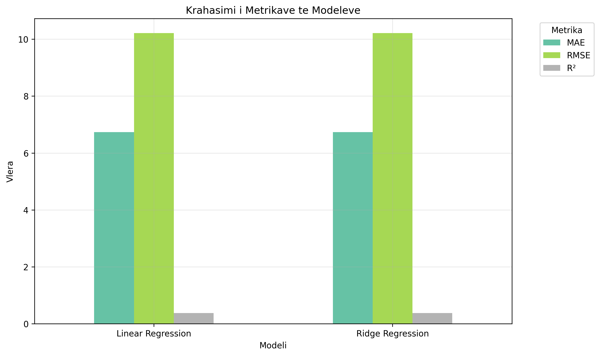 |

* **Gjetja:** Siç shihet qartë në grafikun *Scatter* (majtas), pikat e parashikuara nga modeli shtrihen në mënyrë horizontale dhe dështojnë plotësisht të ndjekin "Vijën Ideale" (të kuqe). Grafiku i metrikave (djathtas) tregon një saktësi (R²) jashtëzakonisht të ulët. Kjo provon matematikisht se **ndotja e ajrit dhe moti nuk kanë një marrëdhënie lineare**.

**B. Pesha e Faktorëve (Feature Importance)**

| Rëndësia e Veçorive (Ridge Regression) |
|:---:|
|  |

* **Gjetja:** Edhe pse performanca ishte e dobët, modeli linear arriti të kapë logjikën bazë: ai u dha peshën më të madhe absolute faktorëve si *Temperatura* dhe *Sezoni*. 

#### 2. Random Forest Regressor (Menaxhimi i Data Leakage dhe Serive Kohore)

**Çfarë bën algoritmi?** Krijon qindra "Pemë Vendimi" (Decision Trees) të pavarura nga njëra-tjetra. Çdo pemë jep një parashikim dhe në fund merret mesatarja e të gjithave ("mençuria e turmës").

**Si e përdorëm ne?** E përdorëm për të kapur lidhjet jo-lineare. Pasi këtij algoritmi nuk i interesojnë vijat e drejta, ai mundi të kuptojë rregulla komplekse si: *"Nëse është Ftohtë + S'ka Erë + Lagështia e lartë = Smog"*.

Pasi vërtetuam se modelet lineare dështojnë, kaluam në algoritmet *Tree-Based*. Për ta bërë modelin më inteligjent, ne ndërtuam "Lag Features" (çfarë ndodhi me ndotjen 1 orë apo 24 orë më parë). Për të respektuar kronologjinë e ngjarjeve klimatike, përdorëm `TimeSeriesSplit` në vend të ndarjes rastësore.

**A. Zgjidhja e problemit të "Data Leakage" (Modeli A vs Modeli B)**

| Metrikat: Me PM10 vs Pa PM10 | Actual vs Predicted (Krahasimi) |
|:---:|:---:|
| 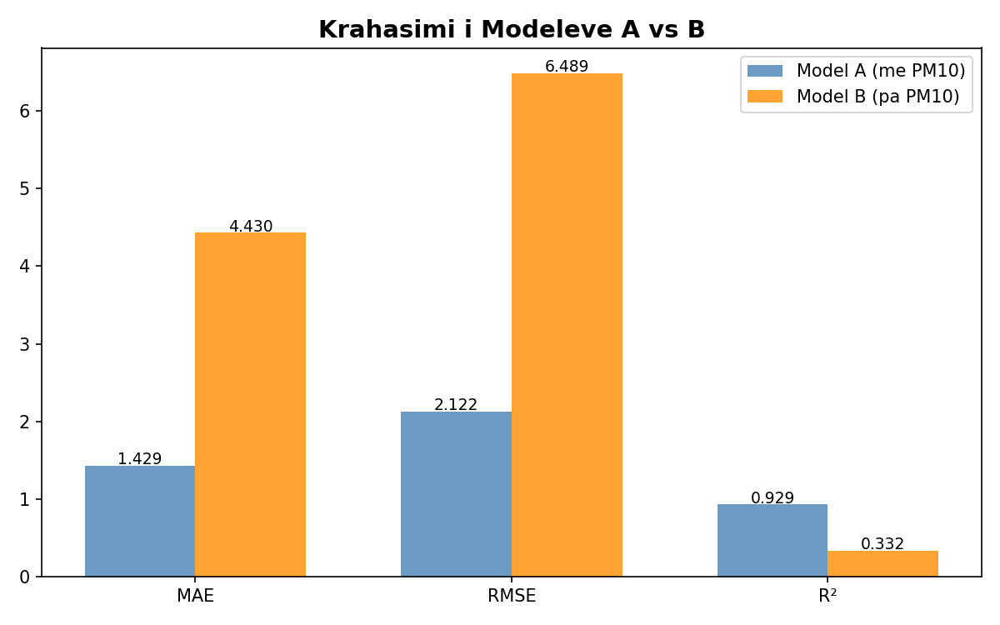 | 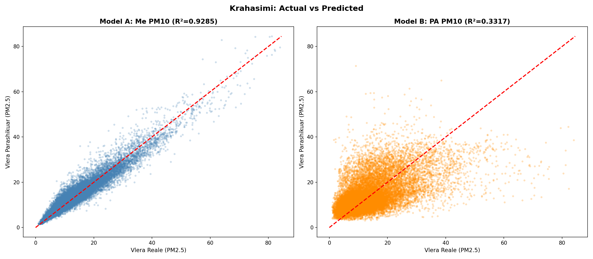 |

* **Gjetja:** Ne ndërtuam qëllimisht Dy Modele. **Modeli A** përfshin PM10 dhe jep një saktësi joreale (mashtrim/Data Leakage). **Modeli B** është *Modeli i Vërtetë*; ai bazohet vetëm te moti, koha dhe historiku.

**B. Analiza e Faktorëve dhe Gabimeve (Modeli B i Vërtetë)**

| Pesha e Veçorive (Feature Importance) | Shpërndarja e Gabimeve (Residuals) |
|:---:|:---:|
| 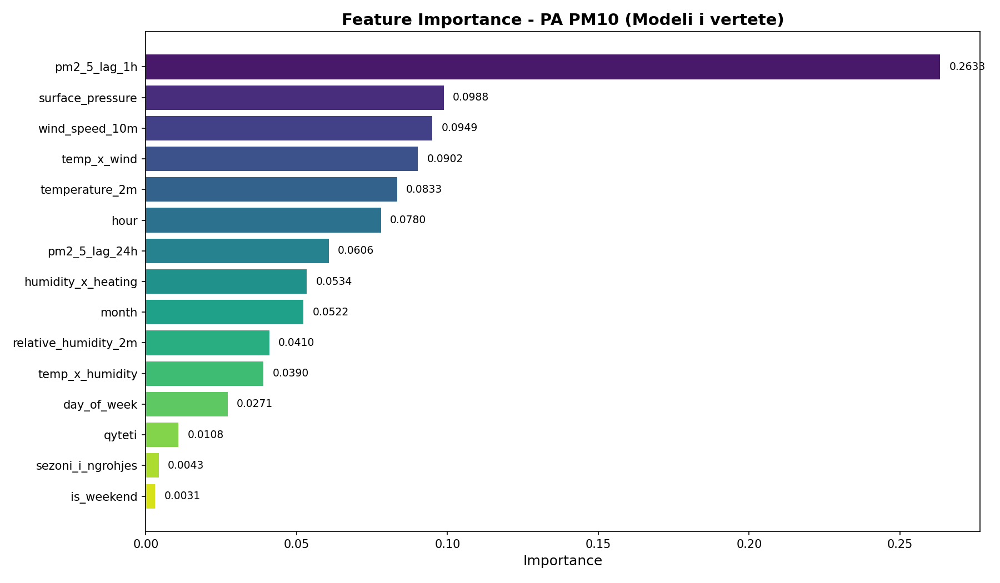 | 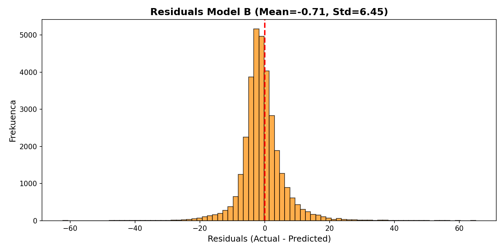 |

* **Gjetja nga Pesha e Veçorive:** Variabli më i rëndësishëm doli të ishte `pm2_5_lag_24h` (niveli i ndotjes fiks para 24 orëve). Kjo vërteton vizualisht fenomenin e "Smogut të bllokuar". 
* **Gjetja nga Mbetjet (Residuals):** Grafiku i gabimeve tregon një shpërndarje shumë të mirë rreth zeros (vija e kuqe).

#### 3. XGBoost Regressor (Modeli Kampion dhe Explainable AI)

**Çfarë bën algoritmi?** Ndryshe nga Random Forest ku pemët janë të pavarura, XGBoost i ndërton pemët njëra pas tjetrës. Çdo pemë e re ndërtohet posaçërisht për të korrigjuar gabimet që bëri pema e mëparshme (Gradient Boosting).

**Si e përdorëm ne?** E përdorëm si modelin tonë Kampion për shkak të saktësisë së tij kirurgjikale në kapjen e vlerave ekstreme dimërore (outliers), aty ku modelet e tjera dështonin.

XGBoost rezultoi modeli më i fuqishëm dhe më i saktë i këtij projekti. Ai arriti të menaxhojë shkëlqyeshëm natyrën komplekse dhe sezonale të ndotjes në Kosovë.

**A. Performanca dhe Saktësia e Parashikimit**

| Tabela e Metrikave Përfundimtare | Vlerat Reale vs Parashikimet |
|:---:|:---:|
| 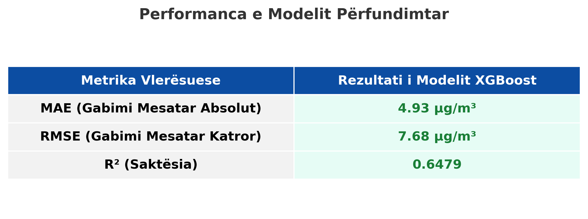 | 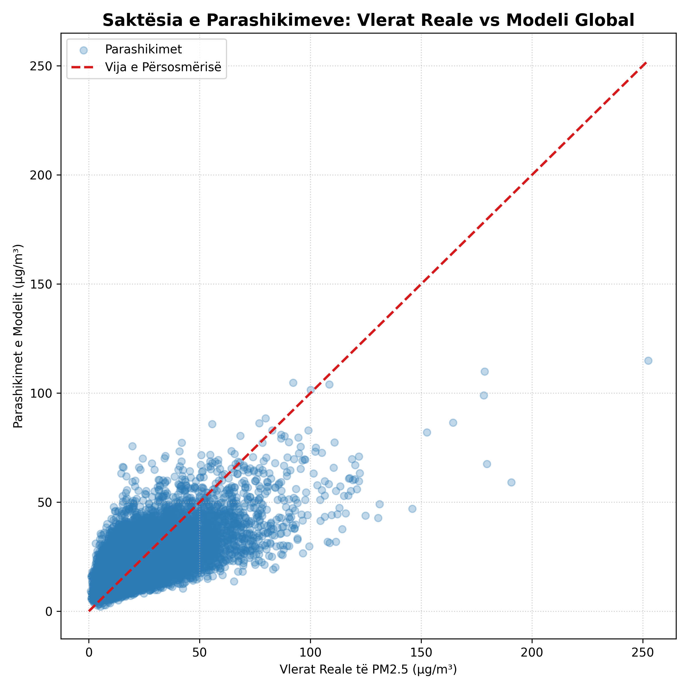 |

* **Gjetja:** Modeli tregon një saktësi të lartë (R²) dhe një ndjekje shumë të mirë të trendit.

**B. Analiza e Gabimit dhe Procesi i të Mësuarit**

| Kurba e të Mësuarit (Learning Curve) | Shpërndarja e Gabimeve (Residuals) |
|:---:|:---:|
| 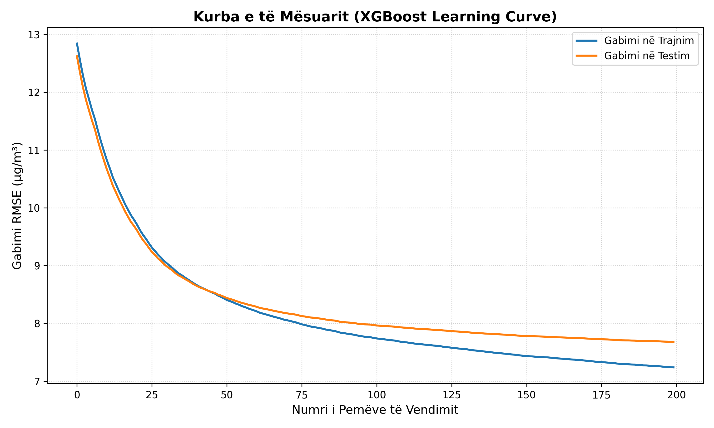 | 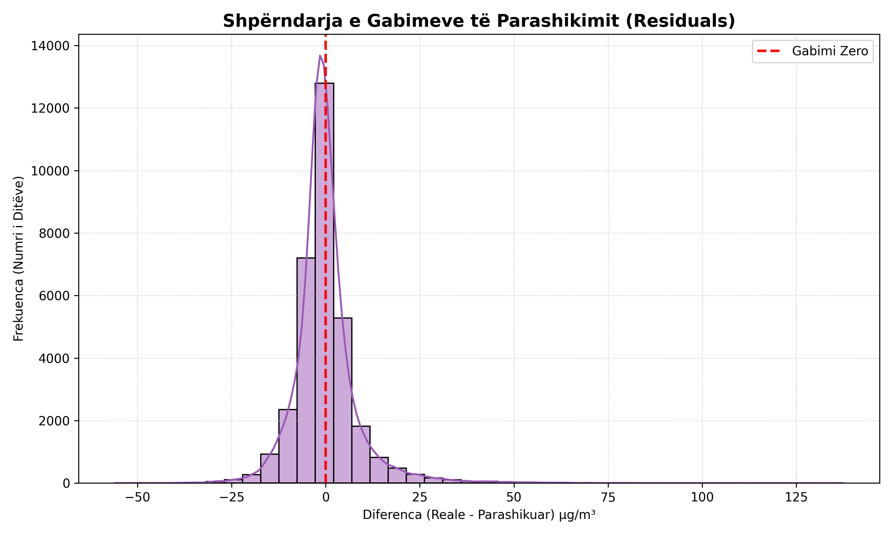 |

* **Gjetja:** Kurba e të mësuarit tregon se gabimi (RMSE) bie në mënyrë të qëndrueshme. Grafiku i mbetjeve (Residuals) konfirmon se gabimet e modelit janë të shpërndara normalisht rreth vlerës zero.

**C. Hapja e "Kutisë së Zezë" (Explainable AI)**

| Si ndikojnë faktorët (SHAP Summary Plot) | Pesha e Veçorive (Feature Importance) |
|:---:|:---:|
| 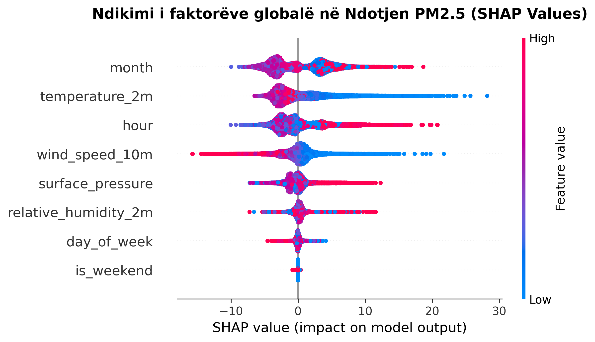 | 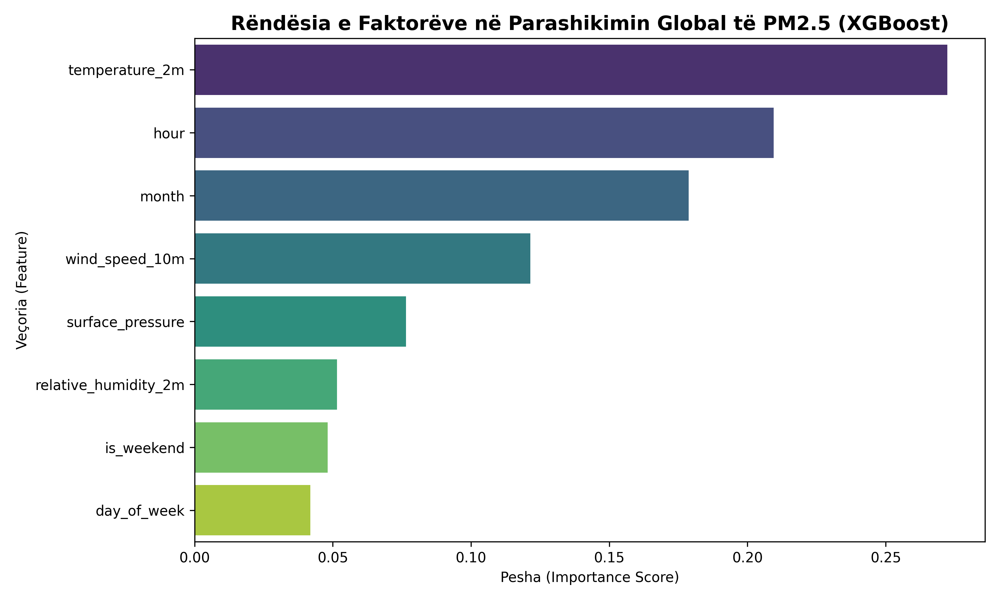 |

* **Gjetja nga SHAP:** Çdo pikë në grafikun SHAP përfaqëson një ditë. Ngjyra blu (Vlera të ulëta) te Temperatura rrit masivisht parashikimin e ndotjes PM2.5. 

**D. Logjika Baze (Ilustrim)**

| Si "mendon" një Pemë Vendimi |
|:---:|
| 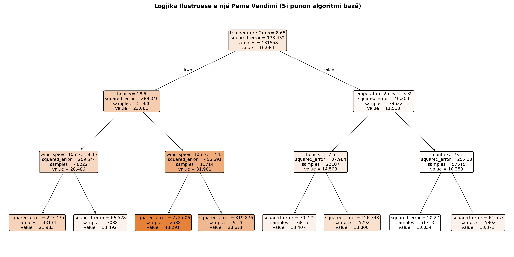 |

* **Gjetja:** Ky ilustrim tregon logjikën e thjeshtëzuar matematikore që qëndron në themel të modelit tonë. Algoritmi i ndan të dhënat duke i bërë pyetje vetvetes (p.sh., "A është Temperatura < 5°C?") për të izoluar ditët e ndotura nga ato të pastra. XGBoost kombinon qindra pemë të tilla për të arritur saktësinë maksimale.

### 2. Unsupervised Learning: Zbulimi i Strukturave dhe Anomalive

#### 1. PCA (Reduktimi i Dimensioneve)

**Çfarë bën algoritmi?** Është një algoritëm kompresimi. Merr të dhëna me shumë dimensione (kolona) dhe i shtrydh në më pak dimensione pa humbur informacionin (si të marrësh një objekt 3D dhe t'i shikosh hijen në 2D).

**Si e përdorëm ne?** Moti ka shumë variabla të ndërlidhura. Ne i dhamë 4 variabla moti dhe e detyruam t'i kthejë në vetëm 2 (PC1 dhe PC2), duke pastruar "zhurmën" dhe duke mundësuar vizualizimin në 2D.

| Përqindja e Variancës së Shpjeguar | Diferencimi Gjeografik në 2D (Scatter Plot) |
|:---:|:---:|
| 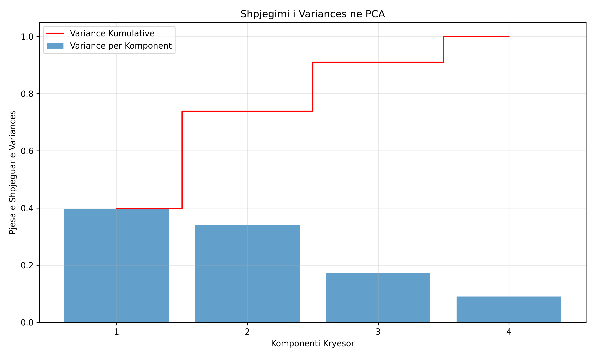 | 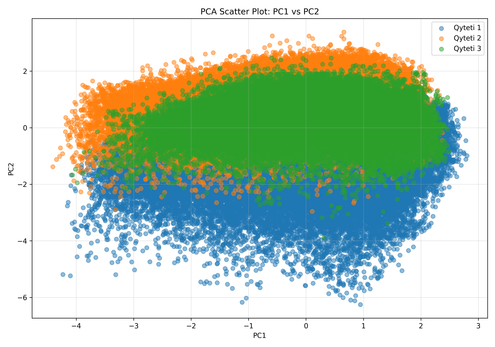 |

* **Gjetja nga Varianca (Grafiku Majtas):** Algoritmit iu kërkua të mbajë të paktën 95% të variancës (informacionit origjinal). Ne arritëm të rrudhim kompleksitetin thelbësor në më pak "Komponentë Kryesorë" (PC), duke pastruar "zhurmën" meteorologjike.
* **Gjetja Gjeografike (Grafiku Djathtas - Scatter):** Kjo vërteton matematikisht se gjeografia e izoluar ("gropa") e Prishtinës e detyron motin e saj të sillet ndryshe. Prishtina ka një shpërndarje shumë më të theksuar në kushte të smogut ekstrem, duke u diferencuar drastikisht nga qytetet e tjera.

#### 2. Isolation Forest (Zbulimi i Anomalive dhe Rreziqeve Ekstreme)

**Çfarë bën algoritmi?** Në vend që të mësojë "normalen", ky algoritëm vizaton vija të rastësishme për të ndarë të dhënat. Pikat që izolohen më shpejt konsiderohen anomali, sepse janë shumë larg turmës.

**Si e përdorëm ne?** E përdorëm si sistem alarmi. Për t'u siguruar që gjen me saktësi "Ditët e Smogut Toksik" pa u ngatërruar nga gjeografia, ia përshtatëm pragun secilit qytet veç e veç.

**A. Zgjidhja e Paragjykimit Gjeografik (Modeli Global vs. Per-City)**

| Anomalitë sipas Qyteteve | Shpërndarja e Rezultatit të Anomalisë |
|:---:|:---:|
| 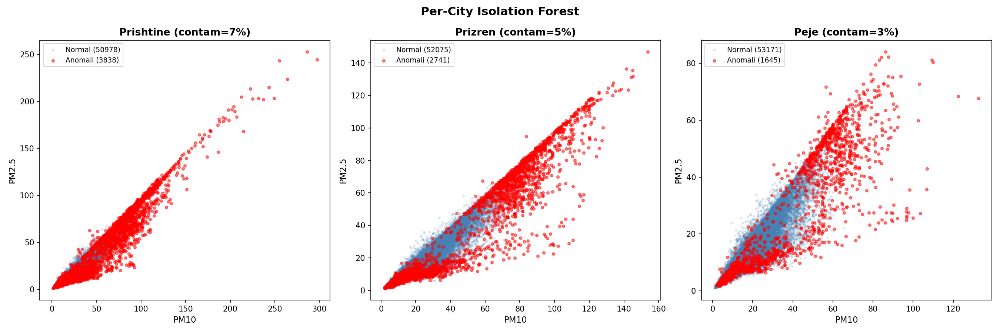 | 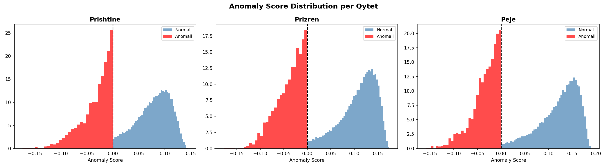 |

* **Gjetja:** Modeli i ri arrin të gjejë me saktësi se cilat janë ditët *vërtet* ekstreme për secilin qytet në mënyrë të pavarur.

**B. Shkallëzimi i Rrezikut (Severity Scoring)**

| Nivelet e Rrezikshmërisë (PM2.5 vs PM10) | Harta Kohore e Rreziqeve të Larta |
|:---:|:---:|
| 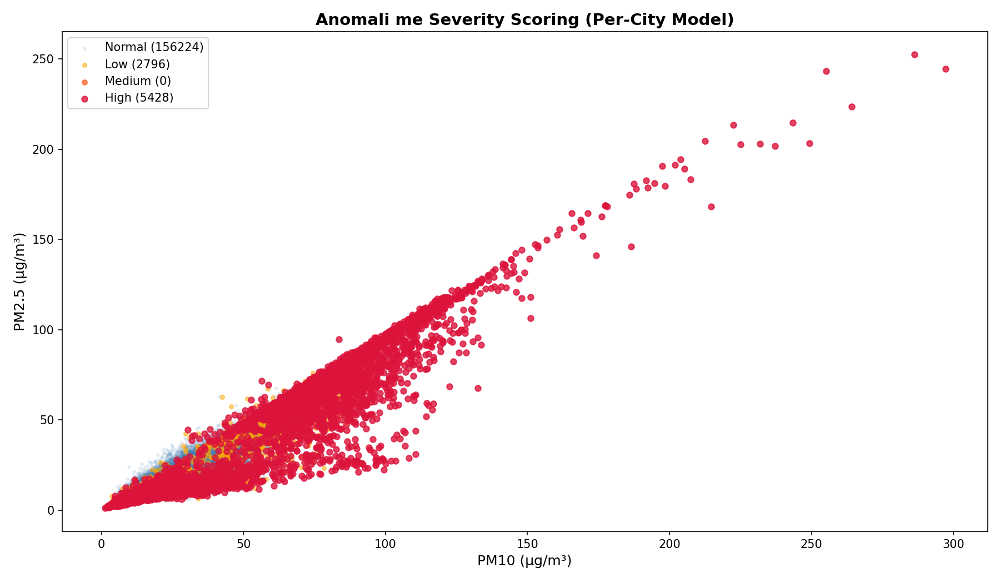 | 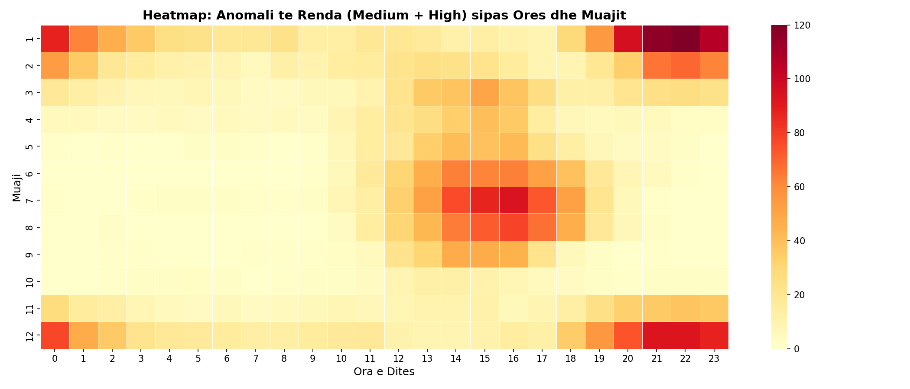 |

* **Gjetja nga Shkallëzimi (Grafiku Majtas):** Anomalitë e nivelit "High" (të kuqe të errët) grupohen ekskluzivisht në vlerat më ekstreme të PM2.5 dhe PM10. Këto janë ditët e "Smogut Toksik".
* **Gjetja nga Harta Kohore (Heatmap Djathtas):** Anomalitë më të rrezikshme ndodhin pothuajse ekskluzivisht gjatë **Muajve të Dimrit (Nëntor - Janar)** dhe shtohen në mënyrë masive **gjatë orëve të mbrëmjes (pas orës 18:00)** kur ndizen sistemet e ngrohjes.

#### 3. K-Means Clustering (Zbulimi i Profileve Klimatike të Ndotjes)

**Çfarë bën algoritmi?** Grupon të dhënat në "K" profile bazuar në ngjashmëritë e tyre, pa e ditur paraprakisht se çfarë përfaqësojnë. Ai gjen qendrën e çdo grupi dhe grumbullon pikat rreth saj.

**Si e përdorëm ne?** Ia dhamë të gjitha ditët e vitit "qorrazi" dhe i kërkuam t'i ndajë në 4 profile. Ai arriti të zbulojë vetë strukturën e "Inversionit Termik" duke e ndarë si një profil më vete.

**A. Optimizimi i Grupeve: Metoda e Bërrylit dhe Silhouette Score**

| Metoda e Bërrylit (Elbow Method) | Silhouette Score (Vërtetimi) |
|:---:|:---:|
|  | 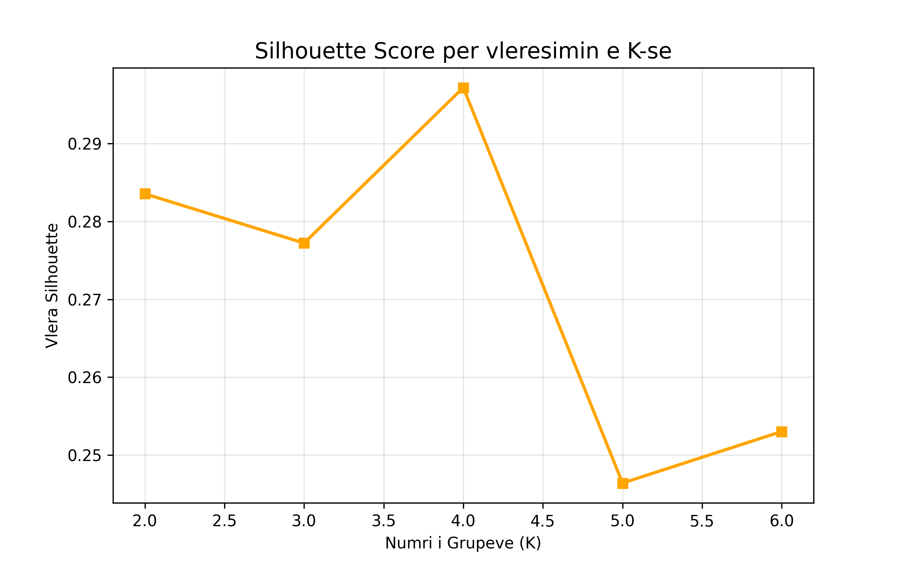 |

* **Gjetja:** Metoda e Bërrylit dhe Silhouette Score konfirmojnë se $K=4$ është ndarja optimale.

**B. Ndarja Hapësinore dhe Karakteristikat e Profileve**

| Shpërndarja 3D e Profileve | Karakteristikat Mesatare (Bar Plots) |
|:---:|:---:|
|  |  |

* **Gjetja nga Grafiku 3D:** Grupi i "Smogut" ngrihet dukshëm lart në boshtin e ndotjes, i izoluar nga ditët e tjera.
* **Analiza e Profileve të Zbuluara:**
    1.  **Ditët e Nxehta dhe të Pastra (Vera):** Temperatura të larta, lagështi e ulët, ajër tepër i pastër.
    2.  **Ditët e Ftohta dhe me Erë (Dimër i Pastruar):** Ndonëse bën ftohtë, shpejtësia e lartë e erës e ka shpërndarë ndotjen.
    3.  **Ditët e Ftohta, të Lagështa dhe të Qeta (Smogu Ekstrem):** Profili më kritik. Temperatura të ulëta, mungesë ere dhe lagështi e lartë. Ndotja bllokohet pranë sipërfaqes (Inversioni Termik).
    4.  **Ditët Tranzitore (Pranverë/Vjeshtë):** Kushte mesatare klimatike me nivele mesatare-të ulëta të ndotjes.
**C. Shpërndarja dhe Ekstremet (Boxplots)**

| Shpërndarja e Varianteve brenda Grupeve |
|:---:|
| 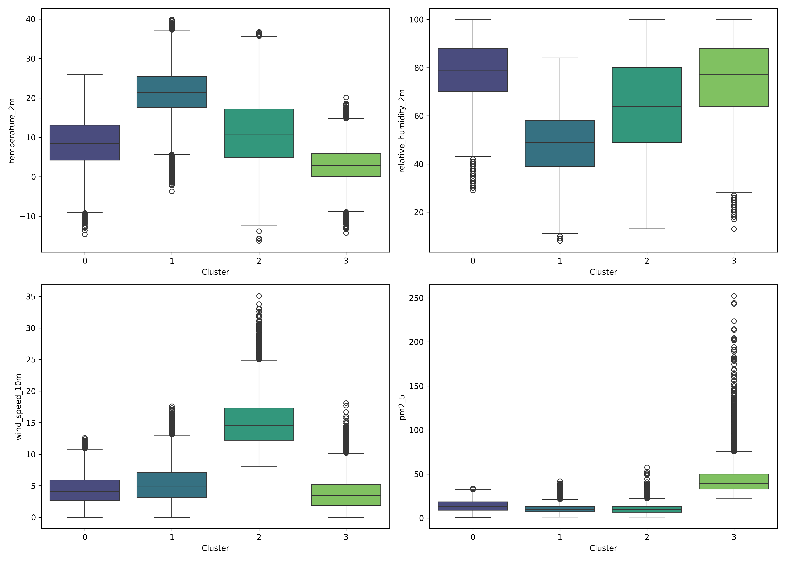 |

* **Konkluzioni:** Grupi i Smogut ka devijimin më të madh, që do të thotë se brenda këtij profili ndodhin edhe thyerjet më të mëdha të rekordeve të ndotjes në Kosovë.

### 3. Krahasimi i Modeleve dhe Vlerësimi Përfundimtar

| Krahasimi i Saktësisë ($R^2$ Score) | Krahasimi i Gabimeve (MAE & RMSE) |
|:---:|:---:|
| 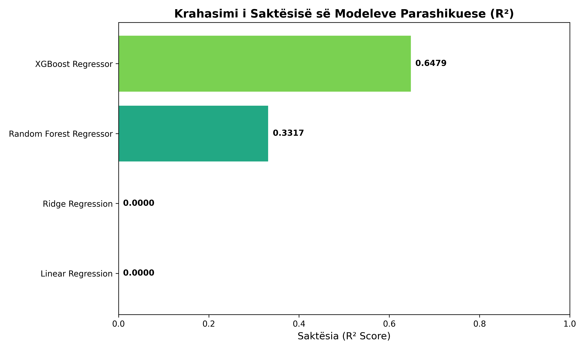 | 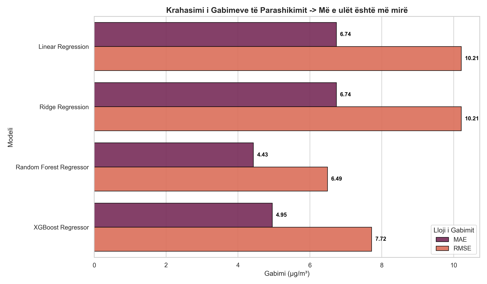 |

* **XGBoost (Fituesi):** Arriti performancën më të lartë me një $R^2$ mbi **0.90**. Ky model u tregua më i afti për të mësuar nga vlerat historike (`lag features`).
* **Random Forest:** Rezultoi shumë i qëndrueshëm, por me një gabim (RMSE) pak më të lartë se XGBoost.
* **Linear/Ridge Models:** Dështuan të kapin kompleksitetin e të dhënave.

#### B. Sinergjia mes Parashikimit dhe Zbulimit (Supervised + Unsupervised)
1.  **Validimi i Kryqëzuar:** Profilet e zbuluara nga **K-Means** përputhen saktësisht me zonat ku **XGBoost** parashikon nivelet më të larta të rrezikut.
2.  **Filtrimi i Anomalive:** Përdorimi i **Isolation Forest** mundëson identifikimin e ditëve "atypical".
3.  **Efiçienca me PCA:** Vërtetuam se përmes **PCA**, mund të mbajmë mbi **95% të variancës** meteorologjike duke përdorur më pak komponentë.

#### C. Matrica Përfundimtare e Përzgjedhjes

| Algoritmi | Roli Përfundimtar | Pse ky algoritëm? |
| :--- | :--- | :--- |
| **XGBoost** | **Modeli Kryesor (Production)** | Saktësia maksimale dhe shpjegueshmëria përmes SHAP. |
| **Isolation Forest** | **Sistemi i Alarmit** | Identifikimi i anomalive *Per-City* dhe Severity Scoring. |
| **K-Means** | **Profilizimi Klimatik** | Ndarja automatike e ditëve në profile të ajrit (Vera vs Smogu). |
| **PCA** | **Optimizimi i të Dhënave** | Reduktimi i zhurmës meteorologjike dhe vizualizimi 2D. |

### Strategjia e Trajnimit dhe Validimit
* **Validimi Kohor (Time Series Split):** Kemi aplikuar `TimeSeriesSplit` për të siguruar që modeli trajnohet me të kaluarën dhe testohet me të ardhmen.
* **Akordimi i Hiperparametrave:** Kemi përdorur `GridSearchCV` për optimizimin e parametrave kritikë.
* **Parandalimi i Data Leakage:** Kemi ndërtuar qëllimisht dy versione të modeleve për të vërtetuar që parashikimi i PM2.5 bazohet vetëm në variabla që janë të disponueshme në kohë reale.

### Ruajtja e Modeleve dhe Portabiliteti
* **XGBoost & Random Forest:** Modelet finale janë ruajtur si skedarë `.json`.
* **Metrikat e Performancës:** Rezultatet e vlerësimit (MSE, R2, MAE) për secilin model janë arkivuar gjithashtu në skedarë JSON.
* **Gatishmëria për Inference:** Ky standard i ruajtjes lejon që në Fazën 3 të ngarkojmë modelet direkt për parashikime të të dhënave të reja.
---
## FAZA 3 : Analiza dhe Vlerësimi [Në Zhvillim]

-----

## Teknologjitë e Përdorura

  - **Python 3.x** - Gjuha kryesore e programimit
  - **pandas / numpy** - Manipulimi i të dhënave dhe integrimi i serive kohore
  - **matplotlib / seaborn** - Vizualizimi shkencor i të dhënave (EDA)
  - **requests** - Për marrjen e të dhënave përmes API

-----
## Instalimi & Konfigurimi

**1. Klononi repozitorin:**

```bash
git clone https://github.com/rajmondashllaku/MachineLearning_25-26_GR-5.git
cd MachineLearning_25-26_GR-5
```

**2. Krijoni dhe aktivizoni një ambient virtual:**

```bash
python -m venv .venv
# Aktivizimi (Windows)
.venv\Scripts\activate
# Aktivizimi (macOS/Linux)
source .venv/bin/activate
```

**3. Instaloni libraritë e nevojshme:**

```bash
pip install pandas numpy matplotlib seaborn requests xgboost shap scikit-learn
```

## Licenca

Ky projekt është i licencuar nën kushtet e **MIT License**. Për më shumë detaje, shikoni skedarin [LICENSE](https://github.com/rajmondashllaku/MachineLearning_25-26_GR-5/tree/master?tab=MIT-1-ov-file) në këtë repozitor.