# Zhvillimi i një Modeli parashikues të smogut në Kosovë (Prishtinë, Prizren, Pejë)


<table>
  <tr>
    <td width="150" align="center" valign="center">
      
    </td>
    <td valign="top">
      <p><strong>Universiteti i Prishtinës</strong></p>
      <p>Fakulteti i Inxhinierisë Elektrike dhe Kompjuterike</p>
      <p>Inxhinieri Kompjuterike dhe Softuerike - Programi Master </p>
      <p><strong>Profesorët:</strong> Prof. Dr. Lule Ahmedi, PhD Mergim Hoti </p>
      <p><strong>Lënda:</strong> “Machine Learning”</p>
      <p><strong>Grupi 5:</strong></p>
      <ul>
        <li>Endrita Vllasaliu</li>
        <li>Fleta Mujaj</li>
        <li>Rajmondë Shllaku</li>
      </ul>
    </td>
  </tr>
</table>

---

## Përmbajtja

- [Pasqyra e Projektit](#pasqyra-e-projektit)
- [Struktura e Repozitorit](#struktura-e-repozitorit)
- [Përshkrimi i Datasetit](#përshkrimi-i-datasetit)
- [FAZA 1 : Përgatitja e modelit](#faza-1--përgatitja-e-modelit)
- [FAZA 2 : Trajnimi i Modeleve (Machine Learning)](#faza-2-trajnimi-i-modeleve)
- [FAZA 3 : Analiza dhe Evaluimi](#faza-3-analiza-dhe-evaluimi)
- [Teknologjitë e Përdorura](#teknologjitë-e-përdorura)
- [Instalimi & Konfigurimi](#instalimi--konfigurimi)
- [Profilet e kontribuesve](#profilet-e-kontribuesve)
---
## Pasqyra e Projektit

Ky repozitor implementon një tubacion (pipeline) gjithëpërfshirës të Machine Learning për parashikimin e **Cilësisë së Ajrit (nivelet e PM2.5 dhe PM10) në Kosovë**, me fokus në analizën krahasuese mes tri qyteteve kryesore: **Prishtinë, Prizren dhe Pejë**. 
Projekti demonstron një cikël të plotë jetësor (end-to-end) të shkencës së të dhënave, duke u shtrirë në tri faza kryesore:

1. **Faza 1 (Përgatitja e të Dhënave):** Mbledhja e të dhënave historike përmes API-ve për të tria qytetet, pastrimi inteligjent i anomalive (Metoda Hibride e bazuar në Njohuritë e Domenit), integrimi i serive kohore, inxhinieria e veçorive dhe krijimi i një **Dataseti Global** të unifikuar.
2. **Faza 2 (Trajnimi i Modelit):** Aplikimi i algoritmeve të Machine Learning (si Random Forest, XGBoost, ose Regression) për të gjetur lidhjet e fshehura mes kushteve meteorologjike, lokacionit gjeografik dhe ndotjes së ajrit.
3. **Faza 3 (Analiza dhe Vlerësimi):** Optimizimi i algoritmeve,testimi i saktësisë së modeleve, nxjerrja e metrikave dhe krijimi i raporteve vizuale për të kuptuar se cilët faktorë ndikojnë më shumë në smog-un sipas rajoneve.

### Qëllimet e Projektit

* **Ndërtimi i një Arkitekture Hibride (Supervised & Unsupervised):** Krijimi i një sistemi të aftë jo vetëm të parashikojë sasinë e ndotjes (PM2.5) bazuar në kushtet meteorologjike, por edhe të zbulojë automatikisht "profilet klimatike" të fshehura (si Inversioni Termik) për 6 vitet e fundit në Kosovë.
* **Paraprocesimi dhe Detektimi Inteligjent i Anomalive:** Aplikimi i teknikave të avancuara për të pastruar dështimet e sensorëve, duke u mbështetur në algoritme të dedikuara për të dalluar gabimet teknike nga vlerat reale të ndotjes ekstreme dimërore.
* **Inxhinieria e Veçorive (Feature Engineering):** Transformimi i të dhënave të papërpunuara në inpute inteligjente: nga kodimi i qyteteve dhe nxjerrja e cikleve kohore, tek krijimi i variablave specifike të domenit (si `sezoni_i_ngrohjes`) për të kapur "Efektin e Prishtinës".
* **Krahasimi dhe Shpjegueshmëria e Algoritmeve (Explainable AI):** Trajnimi dhe krahasimi i një spektri të gjerë modelesh (nga Modelet Lineare te Random Forest dhe XGBoost) për të gjetur ekuilibrin perfekt mes saktësisë së lartë dhe aftësisë për të shpjeguar *pse* po ndodh ndotja.
* **Gatishmëria për Prodhim (Inference):** Paketimi i modelit kampion dhe tubacionit të të dhënave (Scaler) në një format të transportueshëm, të gatshëm për t'u integruar në Fazën 3 për të bërë parashikime në kohë reale (Live).
---

## Struktura e Projektit

```text
MachineLearning_25-26_GR-5/
│
├── .idea/                           # Konfigurimet e ambientit të punës (PyCharm/VSCode)
├── Data_Gathering/                  
│   └── data_gathering.py            # Skripta për marrjen e të dhënave nga API (Open-Meteo & WAQI)
│
├── Datasetet/                       
│   ├── unprocessed_datasets/        # Të dhënat origjinale (CSV)
│   ├── processed_dataset/           # Të dhënat e bashkuara (raw merge)
│   ├── cleaned_dataset/             # Të dhënat pas trajtimit të vlerave null dhe outliers
│   └── ml_ready_dataset/            # Datasetet finale numerike
│       ├── prishtine_ml_data.csv
│       ├── prizren_ml_data.csv
│       ├── peje_ml_data.csv
│       └── kosova_global_ml_data.csv # DATASETI KRYESOR (Gjithëpërfshirës)
│
├── FAZA-1_Pergatitja_e_modelit/     
│   ├── data_assessment.py           # Analiza fillestare e kualitetit të të dhënave
│   ├── data_cleaning.py             # Pastrimi dhe trajtimi i anomalive
│   ├── data_integration.py          # Integrimi i API-ve të ndryshme
│   ├── data_merging.py              # Bashkimi i qyteteve në një dataset global
│   ├── eda_analysis.py              # Analiza Eksplorative (Korreleacionet, Trendet)
│   └── feature_engineering.py       # Krijimi i variablave të reja (Lag features, Sezoni)
│
├── FAZA-2_Trajnimi_i_modelit/       
│   ├── supervised/                  # Mësimi i mbikëqyrur (Parashikimi i PM2.5)
│   │   ├── train_xgboost_baseline.py
│   │   ├── random_forest_regressor.py
│   │   └── ridge-linear-baseline_models.py
│   │
│   ├── unsupervised/                # Mësimi i pambikëqyrur (Analiza e profileve)
│   │   ├── kmeans-clustering.py     # Grupimi i profileve të ndotjes (me Scaler ne JSON)
│   │   ├── isolation_forest.py      # Identifikimi i anomalive ekstreme
│   │   └── pca_reduction.py         # Reduktimi i dimensioneve për vizualizim
│
├── FAZA-3_Analiza_dhe_Evaluimi/     # Analiza përfundimtare dhe ritrajnimi i modeleve
│   ├── retrain_xgboost_regressor.py
│   ├── retrain_random_forest_regressor.py
│   ├── retrain_linear_ridge_regression.py
│   └── model_evaluation.py          # Skripta për krahasimin e performancës së modeleve
│
├── Modelet/                         # Skedarët JSON dhe te modeleve të trajnuara
│
├── images/                          # Grafikët e gjeneruar (EDA, Clusters, SHAP plots)
├── .gitattributes
├── .gitignore
├── LICENSE                          # MIT LICENSE
└── README.md                        # Dokumentimi kryesor i projektit
````

-----

## Përshkrimi i Datasetit

Projekti përdor burime të të dhënave që mbulojnë periudhën nga **2020 deri më sot**. Të dhënat e ndara fillimisht janë bashkuar në një skedar master: **`kosova_global_ml_data.csv`**.

### Atributet Kryesore (Dataseti Global)

| Atributi                   | Kolona | Tipi | Përshkrimi |
|----------------------------|--------|------|-------------|
| **Targeti (Ajri)**         | `pm2_5` | Float | Përqendrimi i grimcave \< 2.5 µm (µg/m³) |
| **Cilesia e Ajrit (Ajri)** | `pm10` | Float | Përqendrimi i grimcave \< 10 µm (µg/m³) |
| **Meteorologjike**         | `temperature_2m` | Float | Temperatura e ajrit në 2 metra lartësi (°C) |
| **Meteorologjike**         | `relative_humidity_2m`| Float | Lagështia relative (%) |
| **Meteorologjike**         | `wind_speed_10m` | Float | Shpejtësia e erës në 10 metra lartësi (km/h) |
| **Kohore (E derivuar)**    | `month` | Integer | Muaji i vitit (1-12) për të kapur sezonalitetin |
| **Kohore (E derivuar)**    | `hour` | Integer | Ora e ditës (0-23) për të kapur ciklet e trafikut |
| **Domeni (E derivuar)**    | `sezoni_i_ngrohjes` | Integer | Indikator i smogut (1=Dimër në Prishtinë, 0=Tjera) |
| **Gjeografike**            | `qyteti` | Integer | Kodi i lokacionit (**1**=Prishtinë, **2**=Prizren, **3**=Pejë) |

-----

## Modulet

### FAZA 1 : Përgatitja e modelit

Kjo fazë zbaton një rrjedhë të fuqishme të paraprocesimit të të dhënave përmes disa skriptave kryesore:

0. **`data_gathering.py`** (Mbledhja e te Dhenave)

      * **Çfarë bën:** Ky skript automatizon mbledhjen e të dhënave historike të papërpunuara (raw) për cilësinë e ajrit dhe kushtet meteorologjike për qytetet kryesore të Kosovës (Prishtinë, Pejë, Prizren), duke filluar nga viti 2020 e deri në ditën aktuale të ekzekutimit.
      * **Logjika:** * **Konfigurimi Gjeo-Hapësinor dhe Kohor**: Skripta përdor një strukturë fjalori (`CITIES`) për të ruajtur koordinatat e sakta (gjerësi/gjatësi gjeografike) të qyteteve të synuara. Periudha e tërheqjes së të dhënave është dinamike, duke u gjeneruar automatikisht deri në datën e sotme (`datetime.today()`), gjë që e bën modelin të lehtë për t'u përditësuar në të ardhmen. 
         * **Integrimi me API (Open-Meteo)**: Kryen kërkesa të veçanta (HTTP GET requests) në dy endpoint-e të ndryshme: 
            1. *Air Quality API* për marrjen e ndotësve ororë (PM10 dhe PM2.5). 
            2. *Historical Weather Archive API* për të dhënat klimatike orore (temperatura, lagështia relative, presioni atmosferik dhe shpejtësia e erës).
         * **Strukturimi dhe Eksportimi Fillestar**: Menaxhon automatikisht krijimin e direktorive nëse nuk ekzistojnë (`os.makedirs`). Të dhënat JSON të kthyera nga API kthehen menjëherë në `pandas DataFrame`. Më pas, bëhet një standardizim fillestar i emërtimit (ndryshimi i kolonës "time" në "date") dhe eksportimi i tyre në formatin `.csv` pa humbur asnjë rresht, duke i bërë gati për skriptën e integrimit.
         * **Trajtimi i Gabimee (Error Handling)**: Përdor blloqe `try-except` për çdo thirrje API. Kjo garanton që nëse ka një ndërprerje rrjeti ose API kthen një përgjigje të papritur për njërin qytet, skripta nuk "thyhet" (crash), por printon gabimin dhe vazhdon me qytetin ose setin tjetër të të dhënave.
      
1.  **`data_integration.py`** (Integrimi i te Dhenave)

      * **Çfarë bën:** Lexon datasetet e papërpunuara të motit dhe cilësisë së ajrit për secilin qytet dhe i bashkon ato në një skedar analitik të vetëm.
      * **Logjika:**  
         * **Sinkronizimi Kohor**: Për të garantuar përputhjen e saktë mes API-ve të ndryshme, skripta konverton formatet e datave, rrumbullakos kohën në orën më të afërt (round('h')) dhe standardizon zonat kohore. 
         * **Pivotimi i të Dhënave**: Shumë burime të ajrit (si OpenAQ) vijnë në format të gjatë (parametrat janë rreshta). Skripta filtron vlerat e korruptuara si -999.0, fshin matjet e dyfishta për të njëjtën orë, dhe përdor funksionin pivot për t'i kthyer ndotësit (PM2.5, PM10) në kolona të rregullta. Nëse detekton format satelitor, e përshtat automatikisht pa pivot. 
         * Në fund, kryhet bashkimi inner në kolonën time, duke ruajtur vetëm rreshtat ku plotësohen të dyja kushtet (moti dhe ajri).


2.  **`data_cleaning.py`** (Pastrimi i te Dhenave)

      * **Çfarë bën:** Së pari, siguron që çdo vlerë tekstuale e gabuar (si 'None') të konvertohet në NaN dhe fshin plotësisht rreshtat që kanë vlera të munguara. Më pas, bën një skanim statistikor për të detektuar anomali (Outliers) në çdo qytet.
      * **Logjika "Hands Off" (Mos-ndërhyrje):** Për të zbuluar vlerat jashtë normales, skripta përdor metodën e rreptë statistikore IQR (Interquartile Range). Megjithatë, ajo vetëm i raporton (numëron) këto vlera dhe nuk i fshin. Kjo është një zgjedhje inxhinierike e qëllimshme: fshirja e rreshtave me PM2.5 ose PM10 shumë të lartë do të "fshinte" ditët me smog ekstrem gjatë dimrit në Kosovë, duke e lënë modelin të verbër ndaj kulmeve të vërteta të ndotjes.

3.  **`feature_engineering.py` (Inxhinieria e Veçorive)**

    * **Çfarë bën:** Merr të dhënat e pastruara dhe i shndërron ato në formate thjesht numerike, të gatshme për t'u ushqyer në modelet e Machine Learning.
    * **Logjika:** 
         
      * **Ekstraktimi Kohor:** Nga kolona e datës (time), nxjerr kolonat month (për sezonalitetin), hour (për ciklet e ditës/natës) dhe day_of_week. 
      * **Njohuritë e Domenit (Domain Knowledge)**: Shton kolonën is_weekend (1 për fundjavë, 0 për ditë pune) për të kapur ndryshimet në fluksin e trafikut të makinave. Gjithashtu, zbaton një rregull specifik gjeografik: shton kolonën sezoni_i_ngrohjes (muajt e ftohtë 10-3) vetëm për qytetin e Prishtinës, pasi aty ndikimi i djegies së thëngjillit është më agresiv. 
      * **Gati për ML:** Në fund, skripta fshin përfundimisht kolonën tekstuale/datetime time, duke lënë pas vetëm atribute numerike (int dhe float) që kërkohen nga algoritme si Random Forest dhe XGBoost.
4.  **`data_merging.py` (Krijimi i Datasetit Global)**

    * **Çfarë bën:** Merr datasetet e gatshme të të tria qyteteve dhe i shton njëra mbi tjetrën (bashkim vertikal) për të krijuar një *Master Dataset* (`kosova_global_ml_data.csv`).
    * **Logjika:** Shton kolonën e re `qyteti` (Kodet 1, 2, 3) për t'i mundësuar modelit të dallojë lokacionin. Gjithashtu, i jep vlerën `0` sezonit të ngrohjes për Prizrenin dhe Pejën, duke e lënë vlerën `1` vetëm për Prishtinën, për të kapur "Efektin e bllokimit të tymit" tipik të kryeqytetit.
5.  **`data_assessment.py` (Vlerësimi dhe Sigurimi i Cilësisë)**

    * **Çfarë bën:** Kryen një "Sanity Check" (kontroll të cilësisë) mbi datasetin master `kosova_global_ml_data.csv` para se të fillojë procesi i trajnimit.
    * **Logjika:** Verifikon nëse dimensionet janë të sakta, konfirmon eliminimin e vlerave `Null`, dhe garanton që të gjitha tiparet janë në format numerik (të gatshme për algoritmet). Gjeneron një raport përmbledhës për shpërndarjen e matjeve sipas qyteteve, balancimin e "sezonit të ngrohjes" dhe ruan formatin e vlerave ekstreme (outliers) për ndotësit kryesorë.
6. **`eda_analysis.py` (Analiza dhe Vizualizimi)**

      * **Çfarë bën:** Skripta finale automatike që lexon datasetet dhe gjeneron një set grafikësh shkencorë për të analizuar sjelljen e të dhënave, duke i ruajtur ato në folderin `images/`.

-----

## Analiza Vizuale (EDA)

Përmes skriptës `eda_analysis.py`, ne analizuam sjelljen e ndotësve si në nivel lokal (qytet) ashtu edhe atë rajonal.

### 1. Analiza Lokale

Këtu vëzhgojmë korrelacionin (lidhjen mes motit dhe ndotjes) si dhe trendin mesatar të ndotjes gjatë një dite (00:00 - 23:00) për çdo qytet.

#### Prishtina
| Matrica e Korrelacionit |                 Cikli Ditor (Trendi )                 |
|:---:|:-----------------------------------------------------:|
| 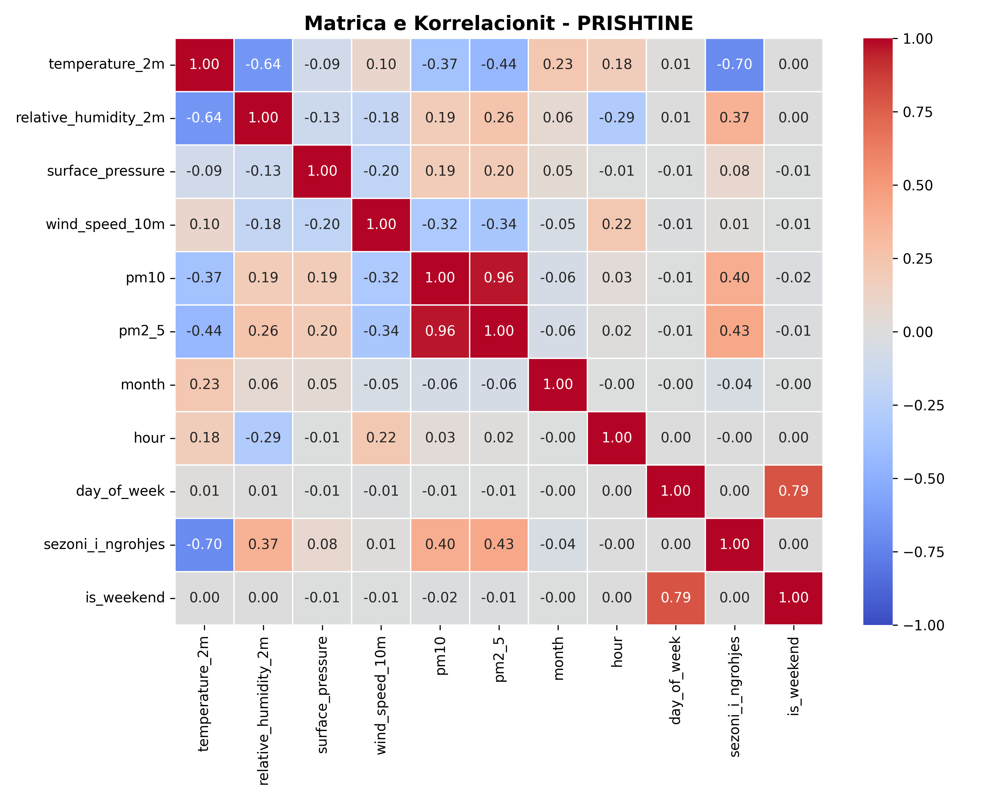 |  |

#### Prizreni
| Matrica e Korrelacionit |               Cikli Ditor (Trendi )               |
|:---:|:-------------------------------------------------:|
|  |  |


#### Peja
| Matrica e Korrelacionit | Cikli Ditor (Trendi ) |
|:---:|:---:|
|  |  |

**Gjetje nga Analiza Lokale:** \* Të tria qytetet shfaqin formën karakteristike "U" gjatë ditës (ndotje më e ulët gjatë drekës, rritje në mbrëmje).

  * Era (Wind Speed) është pastruesi kryesor natyral, pasi shfaq korrelacion negativ në të tria matricat.
  * Ndërsa Prishtina kapërcen lehtësisht vlerat 20-30 µg/m³ gjatë mbrëmjeve, Prizreni dhe Peja mbajnë një balancë dukshëm më të ulët, falë mungesës së centraleve të mëdha industriale dhe relievit më të favorshëm të ajrimit.

-----

### 2\. Analiza E Pergjithshme

Duke përdorur Datasetin Master të unifikuar, ne krijuam një hartëvizuale se si diferencojnë qytetet nga njëri-tjetri.

#### Matrica e Korrelacionit Global
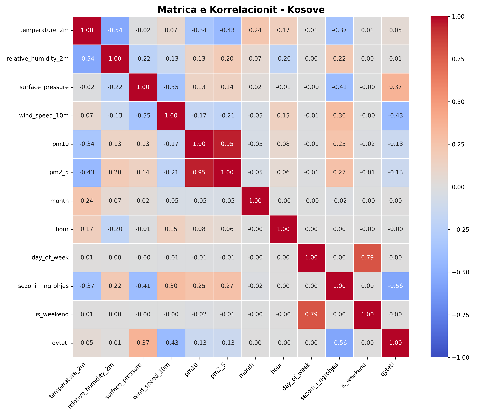
*Figura 1.**Matrica e Korrelacionit (Pearson)** për datasetin e unifikuar (`kosova_global_ml_data.csv`).*

#### Krahasimi i Qyteteve (Boxplot)

*Figura 2: Analiza e variancës së PM2.5 mes Prishtinës, Prizrenit dhe Pejës.*

  * **Ndotja Ekstreme:** Prishtina shfaq një shpërndarje (box) më të gjerë dhe vlera ekstreme (outliers) dukshëm më të larta, duke vërtetuar se smogu i rëndë është kryesisht problem i kryeqytetit.

#### Cikli Ditor i Ndotjes - Krahasim

*Figura 3: Trendi mesatar orar (24h) për PM2.5.*

  * **Dinamika Dite-Natë:** Të tria qytetet ndjekin një model të ngjashëm gjatë ditës, por linja e Prishtinës (e kuqe) shkëputet drastikisht pas orës 17:00, duke krijuar atë që quhet "Peak i Mbrëmjes".

### 3. Zbulimi i Modeleve të Fshehura (Pattern Discovery)

Për të kuptuar thellësisht shkaktarët e smogut, krijuam vizualizime të avancuara që provojnë hipotezat tona mbi motin dhe zakonet urbane:

#### Harta e Nxehtësisë: Cikli Sezonal dhe Ditor
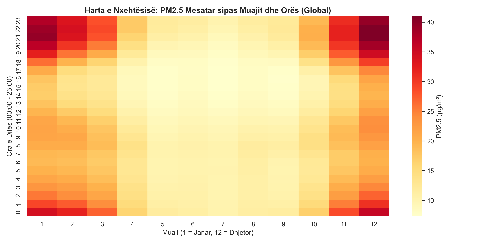
* **Gjetja:** Ndotja nuk është e shpërndarë rastësisht. Heatmap-i dëshmon qartë se smogu i rëndë (ngjyrat e errëta) është i përqendruar ekskluzivisht në muajt e dimrit (Nëntor - Shkurt) dhe kryesisht pas orës 17:00, duke vërtetuar se djegia e thëngjillit/biomasës për ngrohje është ndotësi primar.

#### Efekti i Inversionit Termik

* **Gjetja:** Ky *Scatter Plot* demonstron natyrën jo-lineare të të dhënave. Sapo temperatura zbret nën 0°C, vlerat e PM2.5 shpërthejnë lart. Kjo ndodh për shkak të "inversionit termik", ku ajri i ftohtë e bllokon tymin pranë sipërfaqes së tokës, veçanërisht në zonat me formë luginash si Prishtina.

#### Ndikimi i Trafikut (Ditë Pune vs. Fundjavë)
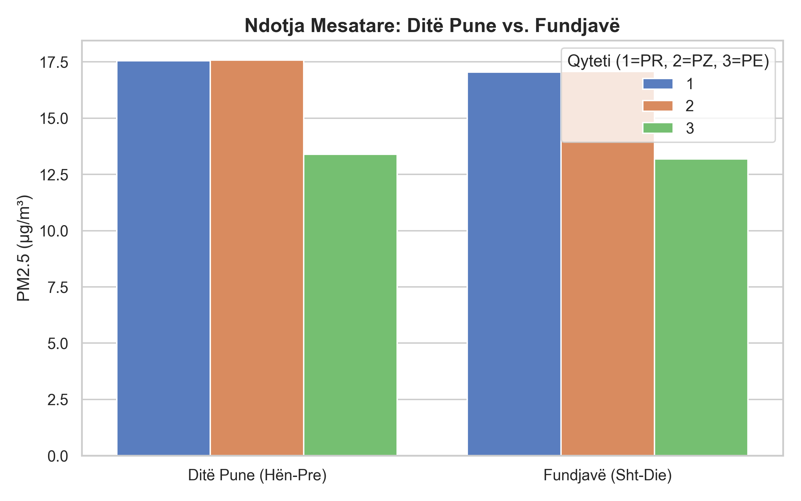
* **Gjetja:** Diferenca mes ditëve të punës dhe fundjavave është e papërfillshme në lidhje me kulmet e ndotjes. Kjo hedh poshtë mitin se trafiku i makinave është fajtori kryesor i smogut të rëndë dimëror në Kosovë; fajtori i vërtetë mbetet ngrohja shtëpiake dhe industria, të cilat nuk pushojnë në fundjavë.

### 4. Konkluzione të Avancuara nga EDA (Gjetje Shkencore)

Nga vizualizimet e mësipërme, kemi nxjerrë disa përfundime thelbësore që ndikojnë drejtpërdrejt në qasjen tonë të Machine Learning:

* **Inversioni Termik dhe Meteorologjia:** Matrica e korrelacionit tregon një lidhje të fortë negative mes temperaturës dhe ndotjes. Kjo vërteton se smogu në Kosovë nuk është një problem konstant industrial, por një problem sezonal. Temperaturat e ulëta të kombinuara me lagështinë e lartë krijojnë "inversionin termik", duke e mbajtur ndotjen të bllokuar afër sipërfaqes së tokës.
* **Burimi i "Peak-ut" të Mbrëmjes:** Rritja e ndotjes pas orës 17:00 nuk i atribuohet vetëm trafikut. Fakti që nivelet e PM2.5/PM10 vazhdojnë të rriten në mënyrë agresive deri në mesnatë (kur makinat ndalojnë së lëvizuri) tregon se burimi kryesor është **ngrohja shtëpiake** (djegia e biomasës dhe thëngjillit gjatë natës).
* **Ndikimi Topografik (Pse Prishtina vuan më shumë):** *Boxplot*-et tregojnë anomali ekstreme për Prishtinën. Kryeqyteti ka një reliev që favorizon bllokimin e tymrave, ndërsa Peja dhe Prizreni, të pozicionuara pranë masiveve malore (Bjeshkët e Nemuna, Malet e Sharrit), përfitojnë nga rrymat ajrore që ndihmojnë në ventilimin natyror gjatë natës.
* **Justifikimi i Algoritmeve (Natyra Jo-Lineare):** Lidhjet mes motit, lokacionit dhe ndotjes janë thellësisht jo-lineare. Për të kapur këtë kompleksitet, modelet e thjeshta si *Linear Regression* janë të pamjaftueshme. Kjo është arsyeja pse në Fazën 2 përdorim **modele të bazuara në pemë** (*Random Forest*, *XGBoost*), të cilat janë të afta të zbulojnë rregulla komplekse logjike nga të dhënat:
  > *Shembull se si "mendon" modeli:* **NËSE** Ora > 18:00 **DHE** Temperatura < 0°C **DHE** Shpejtësia e Erës < 5 km/h **ATËHERË** Parashiko Ndotje Ekstreme (PM2.5 > 150).

Projekti tani posedon një **Master Dataset** të pastruar nga anomalitë, me mungesa të trajtuara logjikisht, dhe të pasuruar me Features numerike.

### 5. Sfidat e të Dhënave dhe "Paradoksi i Mesatares"
Gjatë analizës vizuale, u vu re se trendi mesatar ditor (Line Chart) për Prishtinën dhe Prizrenin duket i ngjashëm (rreth 25-30 µg/m³). Megjithatë, kjo fsheh realitetin e smogut ekstrem në Prishtinë për shkak të dy faktorëve:
* **Efekti i Hollimit (Dilution Effect):** Dataseti përmban ~43,000 orë matje. Kulmet ekstreme të ndotjes në Prishtinë (deri në 250 µg/m³) ndodhin gjatë netëve të ftohta të dimrit, por ato "hollohen" matematikisht në mesatare nga mijëra orë me ajër të pastër gjatë pranverës/verës.
* **Rezolucioni i API-t Satelitor:** Të dhënat historike bazohen në modele satelitore (CAMS) të cilat masin ndotjen në blloqe të mëdha regjionale (10x10 km), duke e pasur të vështirë të izolojnë "mikro-ndotjen" (smogun e bllokuar në luginën e Prishtinës) në krahasim me sensorët tokësorë. 
*Kjo justifikon edhe më shumë përdorimin e algoritmeve Tree-Based në Fazën 2, pasi ato mësojnë nga rreshtat individualë dhe vlerat ekstreme (outliers), duke mos u mashtruar nga mesatarja.*
---

## Faza 2: Trajnimi i Modeleve

Faza 2 është faza ku trajnohen modelet kryesore supervised dhe unsupervised. Skriptat gjenden në:

```text
FAZA-2_Trajnimi_i_modelit/
├── supervised/
│   ├── ridge-linear-baseline_models.py
│   ├── random_forest_regressor.py
│   └── train_xgboost_baseline.py
├── unsupervised/
│   ├── pca_reduction.py
│   ├── isolation_forest.py
│   └── kmeans-clustering.py

```

### Algoritmet e Fazës 2

| Kategoria | Algoritmi | Skripta | Qëllimi |
| :--- | :--- | :--- | :--- |
| **Supervised** | Linear Regression | `ridge-linear-baseline_models.py` | Baseline fillestar për PM2.5 |
| **Supervised** | Ridge Regression | `ridge-linear-baseline_models.py` | Baseline i rregullarizuar |
| **Supervised** | Random Forest Regressor | `random_forest_regressor.py` | Model jo-linear me Feature Importance |
| **Supervised** | XGBoost Regressor | `train_xgboost_baseline.py` | Model tree-based me SHAP dhe performancë të lartë |
| **Unsupervised** | PCA | `pca_reduction.py` | Reduktim dimensionesh meteorologjike |
| **Unsupervised** | Isolation Forest | `isolation_forest.py` | Zbulim i anomalive të smogut |
| **Unsupervised** | K-Means Clustering | `kmeans-clustering.py` | Grupim i ditëve në profile ndotjeje |

### Artefaktet e Gjeneruara

Faza 2 ruan metrikat dhe përmbledhjet në `Modelet/`, ndërsa figurat në `images/` dhe `images/faza_2/`.

| Lloji | Shembuj të output-eve |
| :--- | :--- |
| Modele/metrika supervised | `linear_regression.json`, `ridge_regression.json`, `random_forest_regressor.json`, `xgboost_regressor.json` |
| Raporte krahasuese | `supervised_comparison_table.csv`, `unsupervised_summary_report.txt` |
| Figura supervised | `ridge-linear-model_metrics_comparison.png`, `faza2_rf_model_comparison.png`, `xgboost_metrics_table.png` |
| Figura unsupervised | `pca_explained_variance.png`, `if_anomalies_severity.png`, `kmeans_clusters_3d2.png` |

### Vizualizimet Kryesore të Fazës 2

| Linear/Ridge | Random Forest | XGBoost |
| :---: | :---: | :---: |
|  | 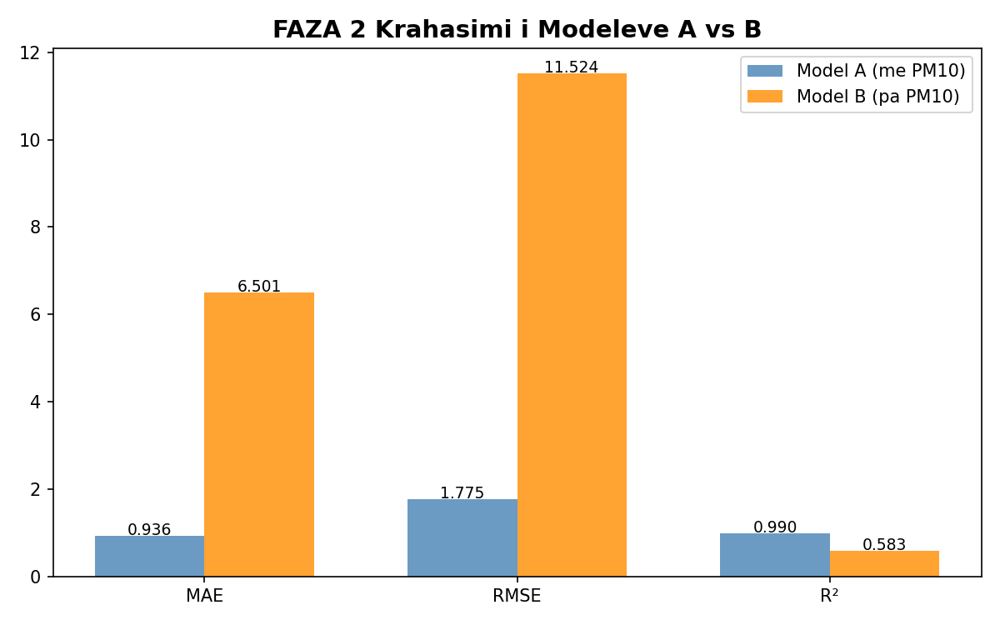 | 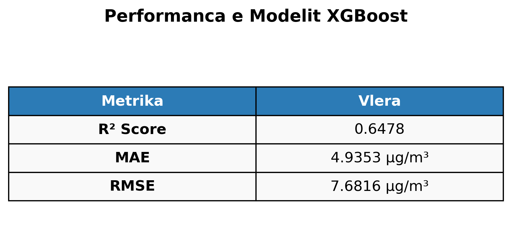 |
| 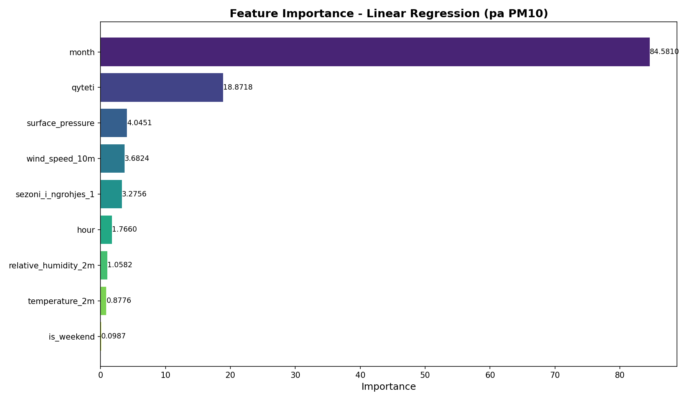 | 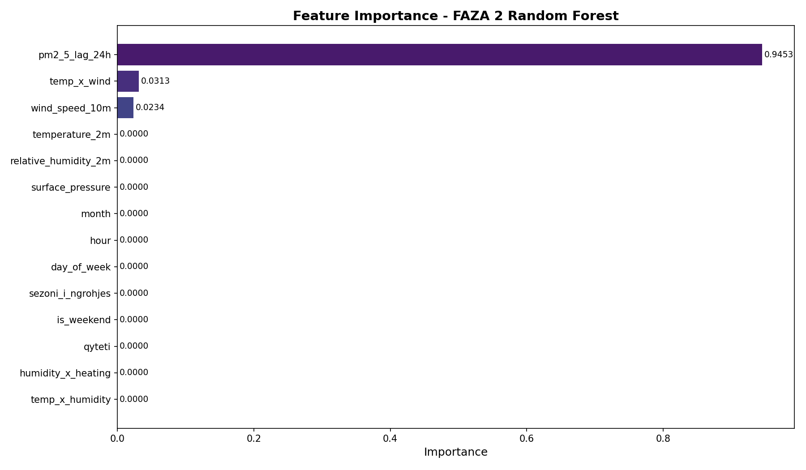 | 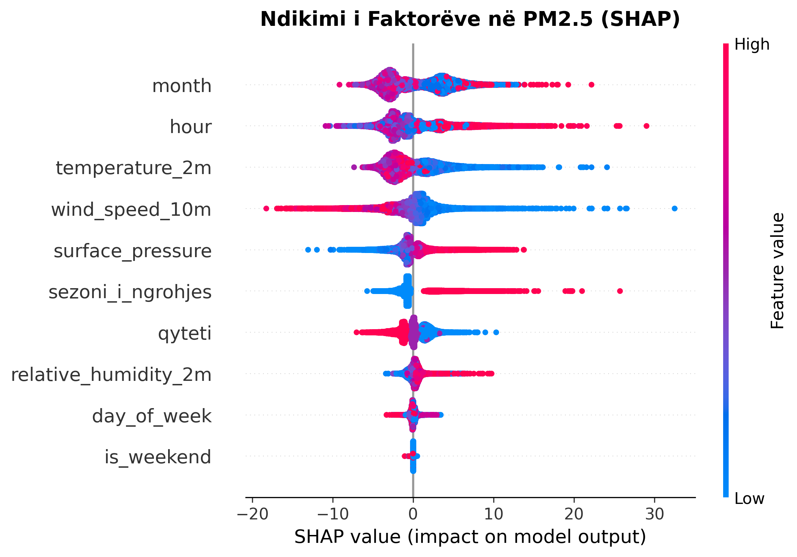 |

**Komentet për vizualizimet supervised:**

- **Linear/Ridge Metrics:** Krahason metrikat kryesore të baseline-it linear dhe tregon se këto modele shërbejnë si pikë reference fillestare.
- **Random Forest Comparison:** Paraqet ndryshimin mes varianteve të Random Forest dhe ndihmon në identifikimin e ndikimit të data leakage.
- **XGBoost Metrics:** Përmbledh performancën e XGBoost dhe tregon pse ky model trajtohet si kandidati më i fortë.
- **Linear Feature Importance:** Shfaq peshën e koeficientëve të modelit linear, duke treguar cilat variabla ndikojnë më shumë në një model të thjeshtë.
- **Random Forest Feature Importance:** Tregon rëndësinë e veçorive në modelin tree-based dhe e bën më të qartë ndikimin e variablave kohore.
- **XGBoost SHAP:** Shpjegon ndikimin individual të faktorëve në parashikim dhe ndihmon në interpretimin e modelit më kompleks.

| PCA | Isolation Forest | K-Means |
| :---: | :---: | :---: |
|  |  |  |
|  |  |  |

**Komentet për vizualizimet unsupervised:**

- **PCA Explained Variance:** Tregon sa informacion ruhet nga komponentët kryesorë dhe justifikon reduktimin e dimensioneve.
- **Isolation Forest Severity:** Paraqet anomalitë sipas ashpërsisë dhe ndihmon në dallimin e rasteve me ndotje ekstreme.
- **K-Means Elbow:** Ndihmon në zgjedhjen e numrit të përshtatshëm të klasterëve.
- **PCA Scatter:** Vizualizon shpërndarjen e qyteteve në hapësirën e komponentëve kryesorë.
- **Isolation Forest Heatmap:** Tregon periudhat kohore ku anomalitë e rënda janë më të përqendruara.
- **K-Means 3D:** Paraqet ndarjen hapësinore të profileve të ndotjes dhe motit.

**Përmbledhje:**  Faza 2 përfaqëson trajnimin fillestar (baseline) të modeleve. Në këtë etapë ndërtohet baza teknike, krijohen artefaktet e para dhe prodhohen figurat analitike, të cilat shërbejnë si pikënisje për optimizimin dhe interpretimin e thelluar që realizohet në Fazën 3.

---

## Faza 3: Analiza dhe Evaluimi

Faza e tretë e projektit përfaqëson fazën e interpretimit të thelluar dhe vlerësimit kritik të performancës së modeleve. Për të pasur një pasqyrë gjithëpërfshirëse të parashikimit të smogut në Kosovë, analizat janë strukturuar në tri shtylla kryesore metodologjike bazuar në natyrën e algoritmeve të aplikuara:

### 1. Analiza e Fuqisë Parashikuese dhe Klasterizimi (High-Performance & Unsupervised)
Kjo shtyllë metodologjike fokusohet në maksimizimin e saktësisë së parashikimit dhe zbulimin e strukturave të fshehura brenda të dhënave:

* **XGBoost Regressor (Advanced):** Vlerësimi i modelit kampion që integron *Temporal Split* dhe *Lag Features*. Analizohet aftësia e modelit për të kapur dinamikat komplekse kohore, duke arritur një saktësi prej **$R^2 \approx 0.84$**. Ky model shërben si referenca kryesore për parashikimet me saktësi të lartë në kohë reale.
* **K-Means Clustering:** Përdorimi i mësimit të pambikëqyrur për identifikimin e "profileve të ndotjes". Analizohen karakteristikat meteorologjike (temperatura, era, lagështia) që krijojnë grupe specifike të smogut, duke bërë të mundur dallimin taksonomik mes ditëve me inversion termik dhe ditëve me ventilim natyror.

### 2. Analiza e Pemëve të Vendimit dhe Detektimi i Anomalive (Non-Linear & Robustness)
Kjo analizë shqyrton qëndrueshmërinë e modeleve jo-lineare dhe identifikimin e rasteve që devijojnë nga norma:

* **Random Forest Regressor:** Fokusimi te *Feature Importance* për të kuptuar peshën e variablave pa rrezikun e *data leakage*. Analizohet se si pemët e vendimit interpretojnë ndikimin e faktorëve kohorë (ora, muaji) dhe atyre specifikë të domenit (sezoni i ngrohjes).
* **Isolation Forest:** Aplikimi i algoritmeve të specializuara për detektimin e anomalive. Analizohen vlerat ekstreme të PM2.5 që nuk shpjegohen dot vetëm nga kushtet meteorologjike, duke ndihmuar në izolimin e episodeve të ndotjes artificiale ose dështimeve teknike të sensorëve.

### 3. Analiza e Bazamentit dhe Thjeshtimi i Modeleve (Baselines & Interpretability)
Kjo shtyllë shërben për të krijuar pikën e referencës (baseline) dhe për të vlerësuar ekuilibrin mes kompleksitetit të algoritmit dhe interpretueshmërisë së rezultatit:

* **Linear & Ridge Regression:** Vlerësimi i modeleve lineare për të matur shkallën e lidhjes së drejtpërdrejtë mes variablave meteorologjike dhe ndotjes. Kjo analizë shërben për të justifikuar nevojën për përdorimin e algoritmeve më komplekse *tree-based*.
* **Optimizimi dhe Thjeshtimi:** Analiza e rëndësisë së veçorive me qëllim reduktimin e dimensioneve. Shqyrtohet nëse modeli mund të ruajë performancë të kënaqshme me një numër më të vogël variablash, duke e bërë sistemin më efikas për implementim në pajisje me burime të kufizuara (Live Inference).

---

### Përmbledhja e Metrikave dhe Vizualizimi i Vlerësimit

Gjatë kësaj faze, të gjitha modelet krahasohen në mënyrë sistematike përmes metrikave standarde të regresionit:

1.  **Gabimi Mesatar Absolut (MAE):** Matja e saktësisë mesatare në njësi reale ($µg/m^3$).
2.  **R-Squared ($R^2$):** Përqindja e variancës së ndotjes që shpjegohet me sukses nga modeli.
3.  **Interpretueshmëria SHAP:** Përdorimi i vlerave SHAP për të vizualizuar kontributin pozitiv ose negativ të secilit faktor (erë, temperaturë, lagështi) në parashikimin final të nivelit të smogut.
Në këtë version të përditësuar janë përfshirë edhe skriptat e reja:

| Skripta | Përshkrimi                                                                                    |
| :--- |:----------------------------------------------------------------------------------------------|
| `retrain_xgboost_regressor.py` | Ritrajnim i XGBoost me temporal split, lag features, rolling average, SHAP dhe learning curve |
| `retrain_random_forest_regressor.py` | Ritrajnim i Random Forest Model B pa data leakage dhe gjenerim i metrikave/feature importance |
| `retrain_linear_ridge_regression.py` | Ritrajnim për Linear/Ridge me feature engineering të avancuar dhe figura të reja              |
|  `model_evaluation.py` | Krahasimi i rezultateve te modeleve në raporte dhe grafe finale                               |

---

## 1. Analiza e Fuqisë Parashikuese dhe Klasterizimi (High-Performance & Unsupervised)
### Supervised: XGBoost Regressor

**XGBoost Regressor** është modeli kryesor dhe më i fuqishëm për parashikimin e ndotjes. Versioni i përditësuar përdor:

- `pm2_5_rolling_6h_avg`
- `pm2_5_lag_24h`
- `temp_x_wind`
- `humidity_x_heating`
- `temp_x_humidity`
- ndarje kronologjike **80/20 temporal split**
- `StandardScaler`
- interpretim përmes **SHAP**

Nga `Modelet/xgboost_global_metrics.json`:

| Modeli | R² | MAE | RMSE |
| :--- | ---: | ---: | ---: |
| **XGBoost Regressor - final** | **0.8413** | **2.0813** | **3.1967** |
| XGBoost Regressor - baseline | 0.6478 | 4.9353 | 7.6816 |

**Interpretim:** XGBoost ka rezultatin më të mirë final. Përfshirja e lag features dhe rolling average e rrit shumë aftësinë e modelit për të kapur vazhdimësinë kohore të ndotjes.

Vizualizimet e XGBoost:

| Metrikat | Actual vs Predicted |
| :---: | :---: |
|  |  |

**Komentet:**

- **Metrikat:** Tabela përmbledh R², MAE dhe RMSE për modelin final XGBoost; vlerat tregojnë performancë të lartë dhe gabim të ulët.
- **Actual vs Predicted:** Pikat afër vijës ideale tregojnë se parashikimet ndjekin mirë vlerat reale të PM2.5.

| Learning Curve | Residuals |
| :---: | :---: |
|  |  |

**Komentet:**

- **Learning Curve:** Tregon si bie gabimi gjatë trajnimit; stabilizimi i kurbës tregon se modeli ka mësuar strukturën kryesore të të dhënave.
- **Residuals:** Shpërndarja e gabimeve rreth zeros tregon se modeli nuk ka devijim të madh sistematik.

| Feature Importance | SHAP Summary |
| :---: | :---: |
|  |  |

**Komentet:**

- **Feature Importance:** Identifikon veçoritë që përdoren më shumë nga XGBoost për ndarjet vendimmarrëse.
- **SHAP Summary:** Jep interpretim më të detajuar duke treguar jo vetëm rëndësinë, por edhe drejtimin e ndikimit të secilës veçori.

### Unsupervised: K-Means Clustering

**K-Means Clustering** grupon ditët në profile ndotjeje dhe moti. Sipas `Modelet/unsupervised_summary_report.txt`, modeli përdor **4 klasterë**.

| Grupi | Temperatura | Lagështia | Era | PM2.5 | Interpretim |
| :---: | ---: | ---: | ---: | ---: | :--- |
| 0 | 8.60 | 77.95 | 4.36 | 13.98 | Ditë të freskëta me ndotje të moderuar |
| 1 | 21.32 | 48.21 | 5.27 | 10.54 | Ditë të ngrohta dhe më të pastra |
| 2 | 11.25 | 63.64 | 15.17 | 10.58 | Ditë me erë ku ndotja shpërndahet |
| 3 | 3.00 | 74.35 | 3.80 | 44.34 | Profil kritik: ditë të ftohta, të qeta dhe me smog |

**Interpretim:** Klasteri 3 është profili më problematik: temperaturë e ulët, erë e dobët dhe PM2.5 shumë i lartë.

Vizualizimet e K-Means:

| Elbow Method | Silhouette Score |
| :---: | :---: |
|  |  |

**Komentet:**

- **Elbow Method:** Ndihmon në identifikimin e numrit optimal të klasterëve duke parë pikën ku përmirësimi fillon të ngadalësohet.
- **Silhouette Score:** Vlerëson sa mirë janë ndarë klasterët; sa më i lartë score-i, aq më të dallueshme janë grupet.

| Klasterët 3D | Profilet Mesatare |
| :---: | :---: |
|  |  |

**Komentet:**

- **Klasterët 3D:** Tregon ndarjen e profileve në hapësirë shumëdimensionale dhe e bën më të dukshme ndarjen mes ditëve të pastra dhe atyre me smog.
- **Profilet Mesatare:** Përmbledh karakteristikat mesatare të secilit klaster dhe ndihmon në emërtimin praktik të profileve.

| Boxplots | Pairplot |
| :---: | :---: |
|  | 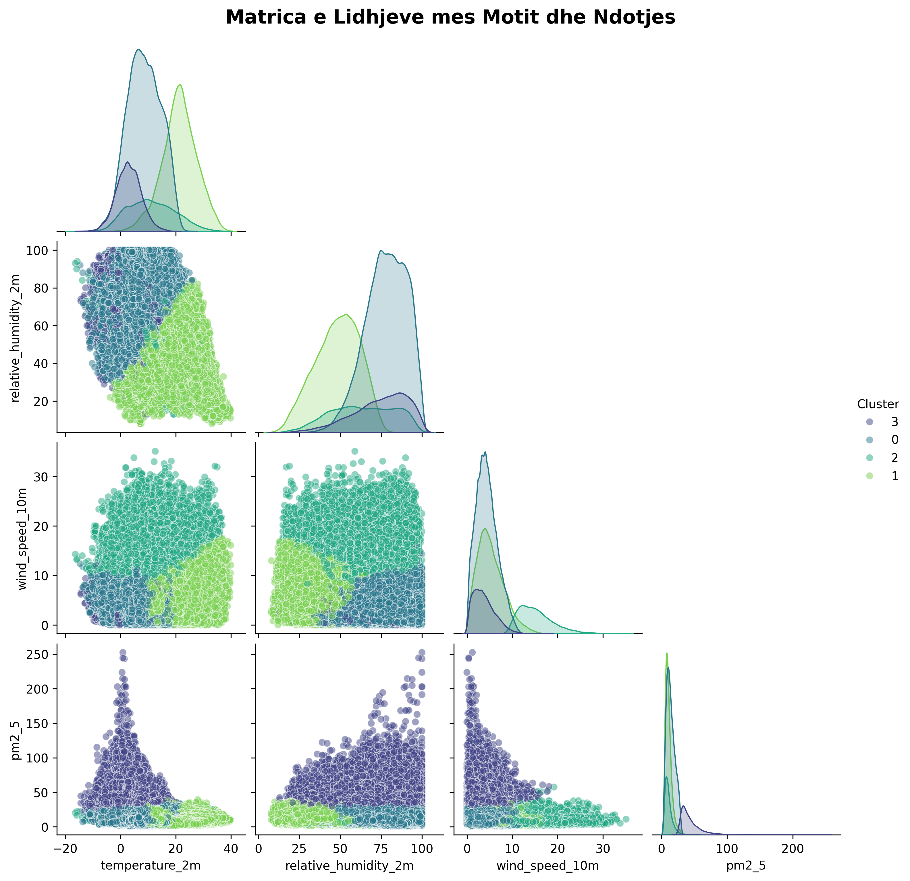 |

**Komentet:**

- **Boxplots:** Tregojnë shpërndarjen dhe vlerat ekstreme të variablave brenda secilit klaster.
- **Pairplot:** Paraqet marrëdhëniet dyshe mes variablave dhe ndihmon në identifikimin e kombinimeve që ndajnë më mirë klasterët.

---

## 2. Analiza e Pemëve të Vendimit dhe Detektimi i Anomalive (Non-Linear & Robustness)

### Supervised: Random Forest Regressor

**Random Forest Regressor** përdoret për të analizuar marrëdhëniet jo-lineare dhe për të nxjerrë **Feature Importance**. Versioni final, `Model B`, shmang data leakage duke mos përdorur `PM10` dhe `pm2_5_lag_1h`.

Nga `Modelet/faza3_random_forest_regressor.json`:

| Modeli | R² | MAE | RMSE | Shënim |
| :--- | ---: | ---: | ---: | :--- |
| Random Forest Regressor - variant i hershëm | 0.5834 | 6.5014 | 11.5239 | Pa rolling 6h |
| **Random Forest Regressor - Model B** | **0.8396** | **4.1398** | **7.1510** | Pa data leakage |

Feature Importance kryesore:

| Veçoria | Rëndësia |
| :--- | ---: |
| `pm2_5_rolling_6h` | 0.8893 |
| `hour` | 0.1010 |
| `temperature_2m` | 0.0034 |
| `qyteti` | 0.0020 |
| `temp_x_wind` | 0.0020 |

**Interpretim:** Random Forest tregon se ndotja e orëve të fundit është faktori më i rëndësishëm për parashikimin e PM2.5.

Vizualizimet e Random Forest:

| Metrikat e Model B | Actual vs Predicted |
| :---: | :---: |
| 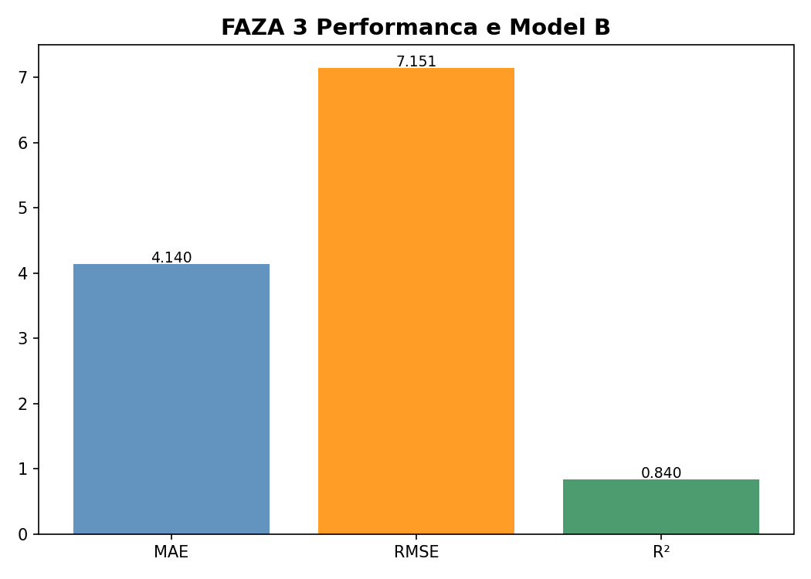 | 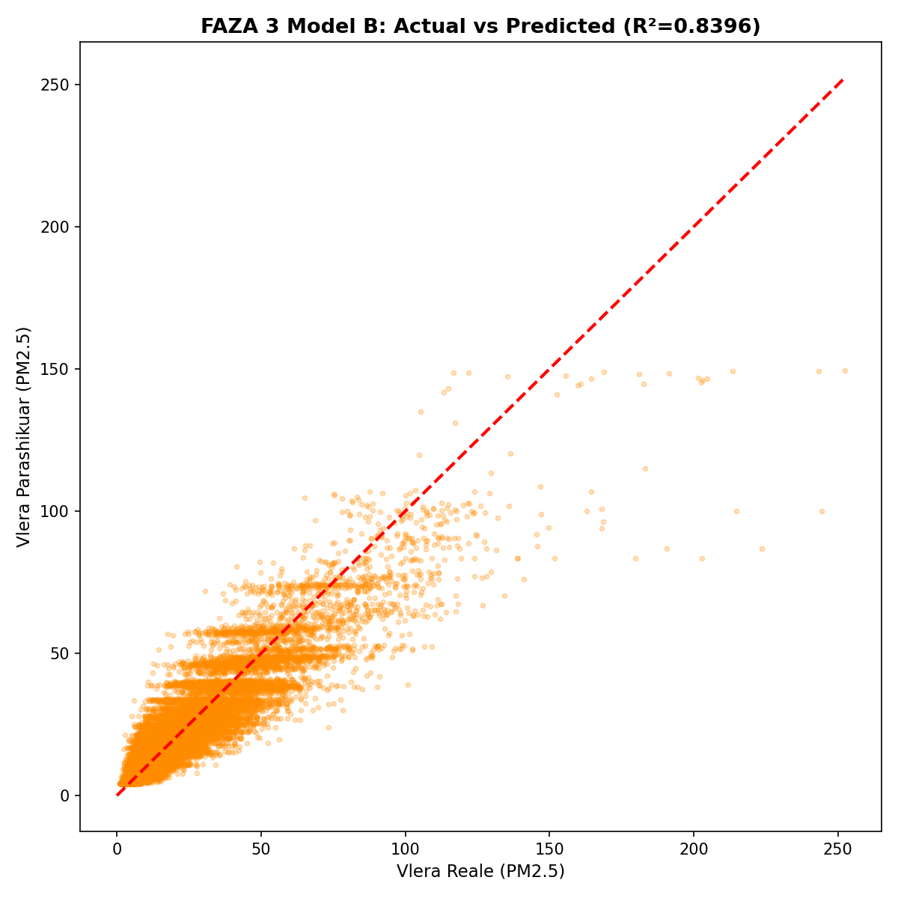 |

**Komentet:**

- **Metrikat e Model B:** Përmbledhin performancën e versionit pa data leakage dhe e bëjnë krahasimin me modelet e tjera më të qartë.
- **Actual vs Predicted:** Tregon aftësinë e Random Forest për të ndjekur trendin real të PM2.5, edhe pse gabimet mbeten më të larta se te XGBoost.

| Feature Importance | Residuals |
| :---: | :---: |
| 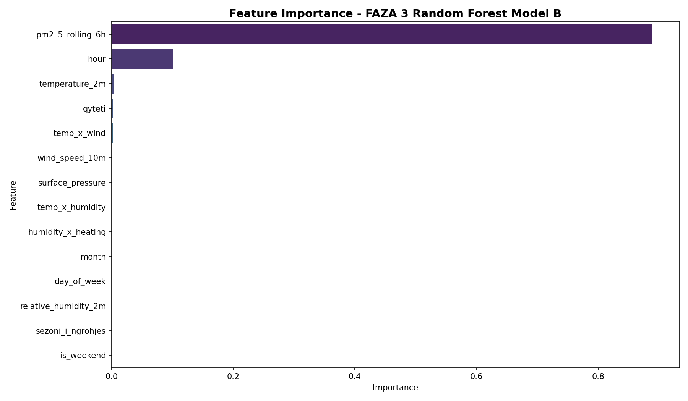 | 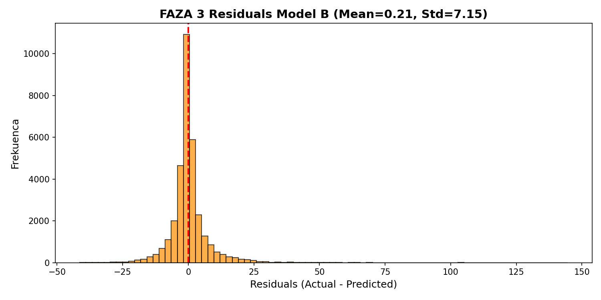 |

**Komentet:**

- **Feature Importance:** Tregon se `pm2_5_rolling_6h` dominon parashikimin, duke konfirmuar rëndësinë e historisë së afërt të ndotjes.
- **Residuals:** Shpërndarja e gabimeve tregon ku modeli nënvlerëson ose mbivlerëson rastet me ndotje më të lartë.

### Unsupervised: Isolation Forest

**Isolation Forest** zbulon automatikisht rastet kur smogu del jashtë normales. Sipas `Modelet/unsupervised_summary_report.txt`:

| Përmbledhja | Vlera |
| :--- | ---: |
| Anomali totale | 8224 |
| Përqindja e dataset-it | 5.0% |
| Raste normale | 156224 |
| Anomali Low | 2796 |
| Anomali High | 5428 |
| PM2.5 mesatare për raste normale | 15.0 µg/m³ |
| PM2.5 mesatare për anomali Low | 27.1 µg/m³ |
| PM2.5 mesatare për anomali High | 40.0 µg/m³ |

**Interpretim:** Pjesa më e madhe e anomalive klasifikohet si **High**, prandaj Isolation Forest është shumë i dobishëm për zbulimin e episodeve ekstreme të smogut.

Vizualizimet e Isolation Forest:

| Anomalitë sipas Qyteteve | Score Distribution |
| :---: | :---: |
|  |  |

**Komentet:**

- **Anomalitë sipas Qyteteve:** Tregon dallimet gjeografike në numrin e rasteve normale dhe anormale.
- **Score Distribution:** Paraqet shpërndarjen e pikëve të anomalive dhe ndihmon në kuptimin e pragjeve të modelit.

| Severity | Heatmap |
| :---: | :---: |
|  |  |

**Komentet:**

- **Severity:** Tregon se cilat anomali janë më të rënda sipas nivelit të PM2.5 dhe PM10.
- **Heatmap:** Identifikon muajt dhe orët kur rastet e rënda të ndotjes janë më të shpeshta.

| Krahasimi Mujor |
| :---: |
|  |

**Koment:**

- **Krahasimi Mujor:** Krahason qasjen globale me qasjen per-city dhe tregon pse pragjet lokale janë më të përshtatshme për qytete të ndryshme.

---

## 3. Analiza e Bazamentit dhe Thjeshtimi i Modeleve (Baselines & Interpretability)

### Supervised: Linear / Ridge Regression

**Linear Regression** dhe **Ridge Regression** janë baseline-i i projektit. Ato provojnë se modelet lineare nuk mjaftojnë për të shpjeguar plotësisht ndotjen, por janë të domosdoshme për krahasim shkencor.

Nga raportet aktuale:

| Modeli | R² | MAE | RMSE | Burimi                         |
| :--- | ---: | ---: | ---: |:-------------------------------|
| Linear Regression - Faza 2 | 0.3802 | 6.7161 | 10.1904 | `linear_regression.json`       |
| Ridge Regression - Faza 2 | 0.3802 | 6.7161 | 10.1904 | `ridge_regression.json`        |
| **Linear Regression - Faza 3** | **0.4765** | **5.7024** | **9.4601** | `faza3_linear_regression.json` |
| Ridge Regression - Faza 3 | 0.4765 | 5.7024 | 9.4601 | `faza3_ridge_regression.json`  |

**Interpretim:** Ritrajnimi i Fazës 3 e përmirëson baseline-in linear, por performanca mbetet dukshëm më e ulët se XGBoost dhe Random Forest. Kjo e forcon përfundimin se të dhënat kanë natyrë jo-lineare.

Vizualizimet e reja për Linear/Ridge:

| Actual vs Predicted | Residuals |
| :---: | :---: |
| 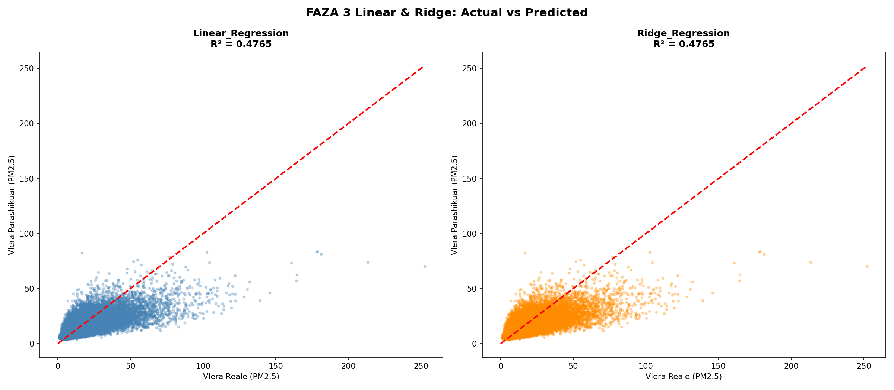 | 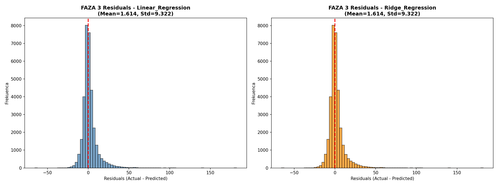 |

**Komentet:**

- **Actual vs Predicted:** Tregon se Linear dhe Ridge ndjekin trendin e përgjithshëm, por kanë shpërndarje më të madhe të gabimeve se modelet tree-based.
- **Residuals:** Shfaq gabimet e baseline-it; shpërndarja më e gjerë tregon kufizimin e modeleve lineare në të dhëna jo-lineare.

| Krahasimi Linear vs Ridge | Feature Importance - Linear |
| :---: | :---: |
| 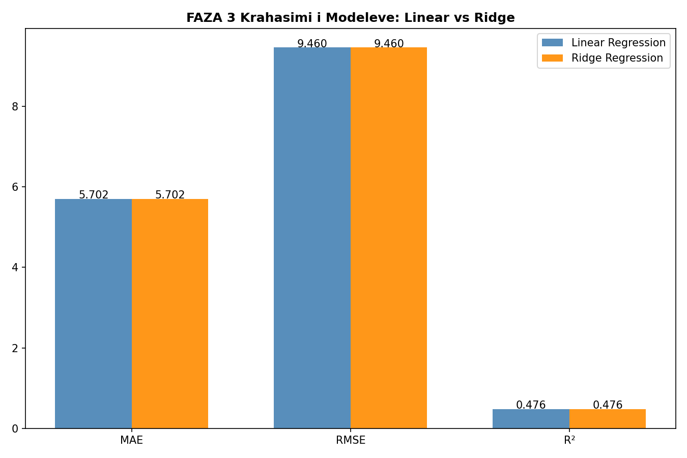 |  |

**Komentet:**

- **Krahasimi Linear vs Ridge:** Tregon se të dy modelet kanë performancë pothuajse identike, sepse rregullarizimi i Ridge nuk ndryshon shumë strukturën lineare.
- **Feature Importance - Linear:** Paraqet koeficientët më të rëndësishëm të modelit linear dhe tregon ndikimin e variablave meteorologjike/kohore në baseline.

| Feature Importance - Ridge |
| :---: |
| 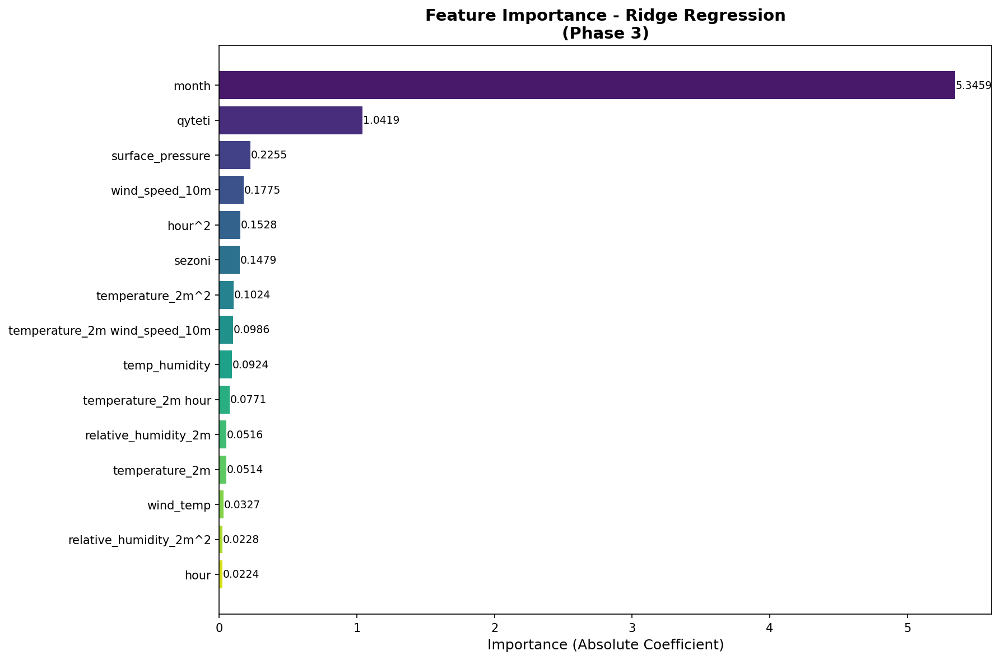 |

**Koment:**

- **Feature Importance - Ridge:** Tregon koeficientët pas rregullarizimit; krahasimi me Linear Regression ndihmon të shihet sa stabilizohet modeli nga Ridge.

### Unsupervised: PCA - Principal Component Analysis

**PCA** përdoret për reduktimin e dimensioneve meteorologjike. Sipas `Modelet/unsupervised_summary_report.txt`:

| Përmbledhja | Vlera |
| :--- | ---: |
| Komponentët e mbajtur | 4 |
| Varianca totale e shpjeguar | 100.00% |

**Interpretim:** PCA arrin të ruajë informacionin kryesor të variablave meteorologjike dhe ndihmon në thjeshtimin e analizës.

Vizualizimet e PCA:

| Varianca e Shpjeguar | PCA Scatter |
| :---: | :---: |
|  |  |

**Komentet:**

- **Varianca e Shpjeguar:** Tregon se sa informacion ruhet nga komponentët kryesorë dhe vërteton që reduktimi dimensional nuk humb shumë informacion.
- **PCA Scatter:** Paraqet të dhënat në dy komponentët kryesorë dhe ndihmon në dallimin vizual të strukturave sipas qyteteve.

---

## Evaluimi Final

Skripta `model_evaluation.py` bashkon rezultatet nga `Modelet/` dhe prodhon:

- `supervised_comparison_table.csv`
- `unsupervised_summary_report.txt`
- `eval_r2_comparison5.png`
- `faza3_eval_error_comparison5.png`

### Përmbledhja e Modeleve Supervised

Nga `Modelet/supervised_comparison_table.csv`:

| Modeli | R² | MAE | RMSE |
| :--- | ---: | ---: | ---: |
| Linear Regression - Faza 2 | 0.3802 | 6.7161 | 10.1904 |
| Ridge Regression - Faza 2 | 0.3802 | 6.7161 | 10.1904 |
| Linear Regression - Faza 3 | 0.4765 | 5.7024 | 9.4601 |
| Random Forest Regressor - variant i hershëm | 0.5834 | 6.5014 | 11.5239 |
| XGBoost Regressor - baseline | 0.6478 | 4.9353 | 7.6816 |
| Random Forest Regressor - Model B | 0.8396 | 4.1398 | 7.1510 |
| **XGBoost Regressor - final** | **0.8413** | **2.0813** | **3.1967** |

Vizualizimet finale:

| Krahasimi i R² | Krahasimi i Gabimeve |
| :---: | :---: |
| 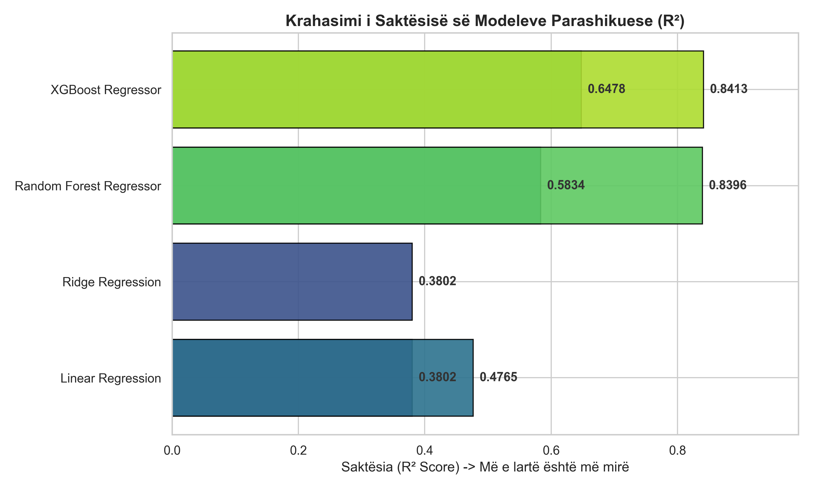 | 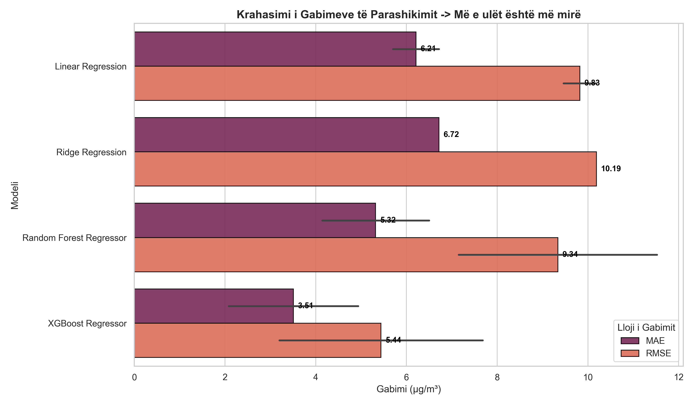 |

**Komentet:**

- **Krahasimi i R²:** Rendit modelet sipas aftësisë për të shpjeguar variacionin e PM2.5; XGBoost dhe Random Forest dalin dukshëm më lart se baseline-i linear.
- **Krahasimi i Gabimeve:** Krahason MAE dhe RMSE, duke treguar se XGBoost ka gabimet më të ulëta dhe stabilitetin më të mirë prediktiv.

---

## Përfundim
Faza e tretë ka shërbyer si ura lidhëse midis trajnimit teknik dhe interpretimit shkencor të fenomenit të smogut në Kosovë. Më poshtë janë pikat kyçe të nxjerra nga vlerësimi i modeleve:

### 1. Superioriteti i Modeleve Jo-Lineare
Analiza krahasuese vërtetoi se ndotja e ajrit në Kosovë është një fenomen kompleks që nuk mund të shpjegohet plotësisht përmes lidhjeve të thjeshta lineare.
* **XGBoost** dhe **Random Forest** arritën performancë superiore (**$R^2 \approx 0.84$**), duke treguar se algoritmet e bazuara në pemë janë rruga e duhur për të kapur ndërveprimet dinamike mes motit dhe emetimeve.
* Modele **Linear/Ridge**, edhe pse u optimizuan, mbetën në nivelin e një *baseline-i* (referencë), duke vërtetuar se marrëdhënia mes variablave si temperatura dhe PM2.5 është thellësisht jo-lineare.

### 2. Fuqia e "Memorjes Kohore" (Lag Features)
Një nga zbulimet më kritike të kësaj faze ishte ndikimi i historisë së afërt të ndotjes në saktësinë e parashikimit.
* Përfshirja e **Lag Features** (ndotja para 6 dhe 24 orëve) rriti saktësinë e modelit nga **64% në 84%**.
* Kjo vërteton se ndotja në qytetet tona ka një "inerci" të lartë: nëse ajri është i ndotur tani, ai ka prirje të qëndrojë i tillë për orët në vijim, përveç nëse ndodh një ndryshim drastik i shpejtësisë së erës.

### 3. Identifikimi i "Skenarit Kritik" të Smogut
Përmes klasterizimit (**K-Means**) dhe detektimit të anomalive (**Isolation Forest**), kemi izoluar profilin e saktë kur ndodh smogu ekstrem:
* **Kombinimi "vdekjeprurës":** Temperaturë e ulët (< 3°C), shpejtësi e ulët e erës (< 4 km/h) dhe lagështi e lartë.
* Ky profil (Klasteri 3) shpjegon shkencërisht fenomenin e **inversionit termik** (sidomos në Prishtinë), ku ajri i ftohtë e bllokon tymin pranë sipërfaqes si pasojë e mungesës së ventilimit natyror.

### 4. Shpjegueshmëria dhe Transparenca (XAI)
Përdorimi i **SHAP Values** bëri që modeli të mos jetë më një "black box".
* Kemi vërtetuar se **Sezoni i Ngrohjes** dhe **Ora e Ditës** janë faktorë dominues, duke konfirmuar hipotezën se djegia e lëndëve fosile për ngrohje shtëpiake është shkaktari kryesor i smogut në mbrëmje.
* **Era** doli të jetë faktori i vetëm "pastrues" me ndikim të menjëhershëm në uljen e niveleve të grimcave PM2.5.

### 5. Thjeshtimi i të Dhënave (PCA)
Përmes **PCA**, vërtetuam se mund të reduktojmë kompleksitetin e të dhënave meteorologjike duke ruajtur pjesën dërrmuese të variancës. Kjo e bën modelin më efikas dhe më të shpejtë për t'u integruar në sisteme parashikimi në kohë reale pa sakrifikuar saktësinë.

---

## Vlera Praktike e Rezultateve
Në fund, ky projekt dëshmon se suksesi i parashikimit të cilësisë së ajrit varet nga balanca mes **Inxhinierisë së Veçorive (Feature Engineering)** dhe fuqisë llogaritëse të algoritmeve të avancuara. Sistemi i zhvilluar është tashmë i gatshëm për:
1.  **Paralajmërim të hershëm:** Parashikimi i kulmeve të ndotjes deri në 24 orë përpara.
2.  **Vendimmarrje Institucionale:** Të dhënat vërtetojnë se politikat duhet të fokusohen te ngrohja shtëpiake gjatë netëve të dimrit.

## Teknologjitë e Përdorura

  - **Python 3.x** - Gjuha kryesore e programimit
  - **pandas / numpy** - Manipulimi i të dhënave dhe integrimi i serive kohore
  - **matplotlib / seaborn** - Vizualizimi shkencor i të dhënave (EDA)
  - **requests** - Për marrjen e të dhënave përmes API

-----
## Instalimi & Konfigurimi

**1. Klononi repozitorin:**

```bash
git clone https://github.com/rajmondashllaku/MachineLearning_25-26_GR-5.git
cd MachineLearning_25-26_GR-5
```

**2. Krijoni dhe aktivizoni një ambient virtual:**

```bash
python -m venv .venv
# Aktivizimi (Windows)
.venv\Scripts\activate
# Aktivizimi (macOS/Linux)
source .venv/bin/activate
```

**3. Instaloni libraritë e nevojshme:**

```bash
pip install pandas numpy matplotlib seaborn requests xgboost shap scikit-learn
```

### Udhëzuesi i Ekzekutimit

Pasi të keni përfunduar instalimin e librarive, ndiqni këtë radhë ekzekutimi për të riprodhuar tubacionin e plotë të të dhënave dhe modeleve. Sigurohuni që terminali juaj ndodhet në dosjen kryesore të projektit (`MachineLearning_25-26_GR-5`).

#### Hapi 1: Mbledhja e të Dhënave (Data Gathering)
Ky skript tërheq të dhënat e papërpunuara për motin dhe cilësinë e ajrit nga API-të dhe i ruan ato në dosjen `Datasetet`.
```bash
cd Data_Gathering
python data_gathering.py
cd ..
```

#### Hapi 2: Paraprocesimi dhe Integrimi (Faza 1)
Në këtë fazë, të dhënat pastrohen, bashkohen dhe bëhen gati për modelim. Ekzekutoni skriptat sipas kësaj radhe logjike:
```bash
cd FAZA-1_Pergatitja_e_modelit

# 1. Integrimi i API-ve të motit dhe ajrit
python data_integration.py

# 2. Pastrimi i vlerave null dhe anomalive
python data_cleaning.py

# 3. Krijimi i variablave të reja (Lag features, Sezoni)
python feature_engineering.py

# 4. Krijimi i Datasetit Global përfundimtar
python data_merging.py

# 5. Gjenerimi i grafikëve eksplorues (EDA)
python eda_analysis.py

cd ..
```

#### Hapi 3: Trajnimi i Modeleve (Faza 2)
Me datasetin e pastruar, mund të trajnoni modelet. Modelet finale dhe metrikat e tyre do të ruhen automatikisht në format `.json`.

**Për modelet parashikuese (Supervised):**
```bash
cd FAZA-2_Trajnimi_i_modelit/supervised
python ridge-linear-baseline_models.py
python random_forest_regressor.py
python train_xgboost_baseline.py
cd ../..
```

**Për analizën e grupeve dhe anomalive (Unsupervised):**
```bash
cd FAZA-2_Trajnimi_i_modelit/unsupervised
python pca_reduction.py
python isolation_forest.py
python kmeans-clustering.py
cd ../..
```

#### Hapi 4: Ritrajnimi dhe Analiza Finale (Faza 3)
Këto skripta përdoren për analizën finale, ritrajnimin e modeleve kryesore dhe gjenerimin e figurave të Fazës 3.

```bash
cd FAZA-3_Analiza_dhe_Evaluimi
python retrain_xgboost_regressor.py
python retrain_random_forest_regressor.py
python retrain_linear_ridge_regression.py
cd ..
```
**Vlerësimi dhe krahasimi i modeleve:**
```bash
cd FAZA-3_Analiza_dhe_Evaluimi
python model_evaluation.py
cd ..
```
## Licenca

Ky projekt është i licencuar nën kushtet e **MIT License**. Për më shumë detaje, shikoni skedarin [LICENSE](https://github.com/rajmondashllaku/MachineLearning_25-26_GR-5/tree/master?tab=MIT-1-ov-file) në këtë repozitor.

## Profilet e kontribuesve

Ky projekt është zhvilluar bashkërisht nga ekipi i mëposhtëm:

<table>
  <tr>
    <td align="center">
      <a href="https://github.com/rajmondashllaku">
        <br />
        <sub><b>Rajmondë Shllaku</b></sub>
      </a>
    </td>
    <td align="center">
      <a href="https://github.com/endritavllasaliu16">
        <br />
        <sub><b>Endrita Vllasaliu</b></sub>
      </a>
    </td>
    <td align="center">
      <a href="https://github.com/fletamujaj">
        <br />
        <sub><b>Fleta Mujaj</b></sub>
      </a>
    </td>
  </tr>
</table>
