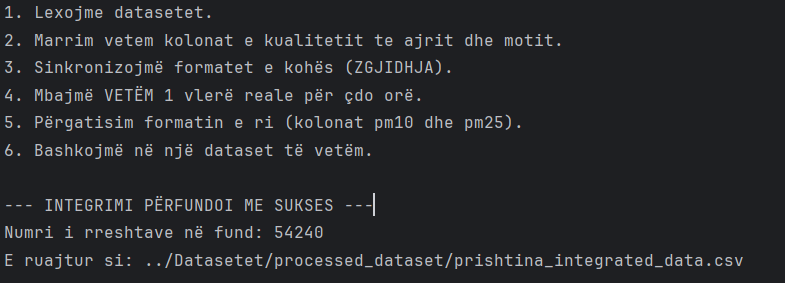
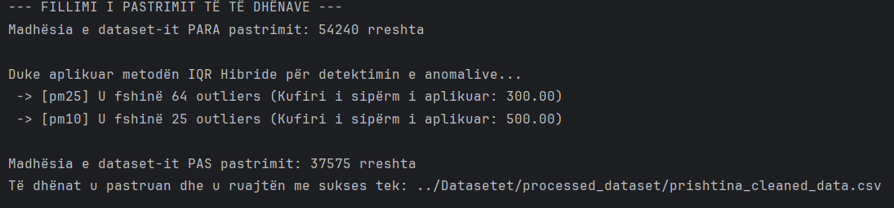
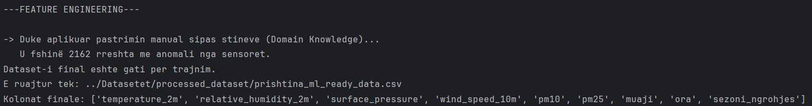
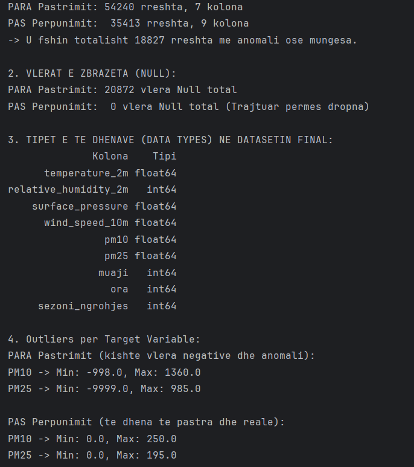
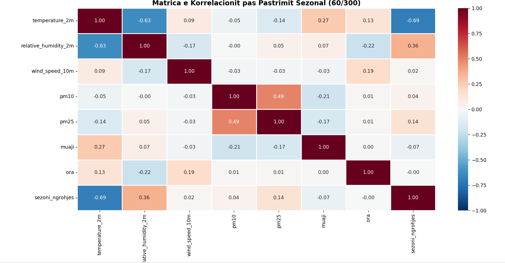
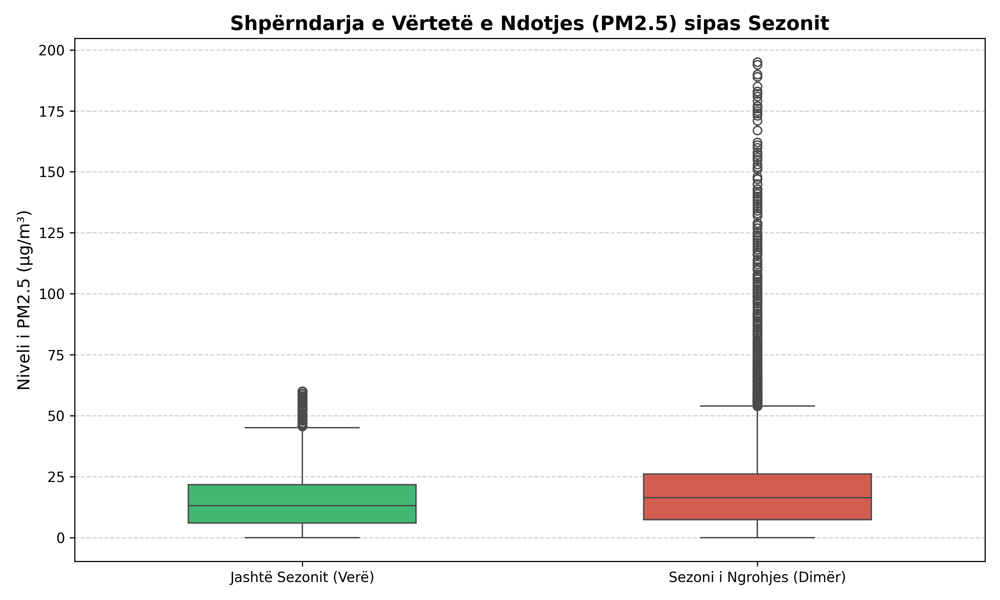
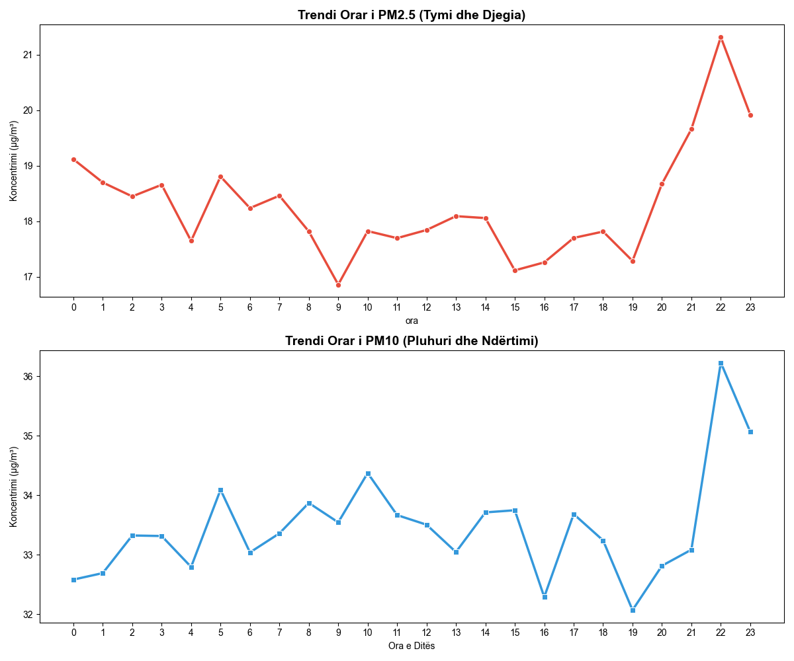

<table>
  <tr>
    <td width="150" align="center" valign="center">
      
    </td>
    <td valign="top">
      <p><strong>Universiteti i Prishtinës</strong></p>
      <p>Fakulteti i Inxhinierisë Elektrike dhe Kompjuterike</p>
      <p>Inxhinieri Kompjuterike dhe Softuerike - Programi Master </p>
      <p><strong>Profesorët:</strong> Prof. Dr. Lule Ahmedi, PhD Mergim Hoti </p>
      <p><strong>Lënda:</strong> “Machine Learning”</p>
      <p><strong>Grupi 5:</strong></p>
      <ul>
        <li>Endrita Vllasaliu</li>
        <li>Fleta Mujaj</li>
        <li>Rajmondë Shllaku</li>
      </ul>
    </td>
  </tr>
</table>

---

## Përmbajtja

- [Pasqyra e Projektit](#-pasqyra-e-projektit)
- [Struktura e Repozitorit](#-struktura-e-repozitorit)
- [Përshkrimi i Datasetit](#-përshkrimi-i-datasetit)
- [Modulet e Implementuara](#-modulet-e-implementuara)
- [Teknologjitë e Përdorura](#-teknologjitë-e-përdorura)
- [Instalimi & Konfigurimi](#-instalimi--konfigurimi)

---
## Pasqyra e Projektit

Ky repozitor implementon një tubacion (pipeline) gjithëpërfshirës të Machine Learning për parashikimin e **Cilësisë së Ajrit (nivelet e PM2.5 dhe PM10) në Prishtinë, Kosovë**. 
Projekti demonstron një cikël të plotë jetësor (end-to-end) të shkencës së të dhënave, duke u shtrirë në tri faza kryesore:

1. **Faza 1 (Përgatitja e të Dhënave):** Mbledhja e të dhënave historike përmes API-ve, pastrimi inteligjent i anomalive (Metoda Hibride e bazuar në Njohuritë e Domenit), integrimi i serive kohore dhe inxhinieria e veçorive (Feature Engineering).
2. **Faza 2 (Trajnimi i Modelit):** Aplikimi dhe optimizimi i algoritmeve të Machine Learning (si Random Forest, XGBoost, ose Regression) për të gjetur lidhjet e fshehura mes kushteve meteorologjike dhe ndotjes së ajrit.
3. **Faza 3 (Analiza dhe Vlerësimi):** Testimi i saktësisë së modeleve, nxjerrja e metrikave dhe krijimi i raporteve vizuale për të kuptuar se cilët faktorë ndikojnë më shumë në smog-un e qytetit.

### Qëllimet e Projektit
- **Ndërtimi i një Modeli Parashikues:** Krijimi i një algoritmi të aftë të parashikojë nivelet e PM2.5 dhe PM10 bazuar në të dhënat e motit (temperatura, era, lagështia) si dhe te dhenat e kualitetit te ajrit per 6 vitet e fundit.
- **Paraprocesimi Inovativ:** Aplikimi i teknikave të avancuara të pastrimit për të menaxhuar dështimet harduerike të sensorëve, duke ruajtur në të njëjtën kohë vlerat reale të ndotjes ekstreme gjatë dimrit në Prishtinë.
- **Inxhinieria e Veçorive:** Transformimi i serive kohore në inpute të kuptueshme për ML (nxjerrja e muajit, orës, stinës) për të kapur ciklet ditore dhe sezonale.
- **Krahasimi i Algoritmeve:** Trajnimi i disa modeleve të ndryshme të Machine Learning dhe përzgjedhja e atij me performancën më të lartë dhe gabimin më të vogël.
---

## Struktura e Repozitorit

Ky repozitor është i strukturuar në faza të dallueshme për të mbajtur një rrjedhë pune të pastër, profesionale dhe të riprodhueshme të Machine Learning.

```text
MachineLearning_25-26_GR-5/
│
├── Data_Gathering/                  # Skriptat e automatizuara për marrjen e të dhënave
│   ├── prishtina_air_quality_data.py
│   └── prishtina_weather_data.py
│
├── Datasetet/                       # Hapësira qendrore e ruajtjes së të dhënave
│   ├── unprocessed_datasets/        # Të dhënat e papërpunuara direkte nga burimet
│   │   ├── prishtina_air_quality.csv
│   │   └── prishtina_weather_raw_2020_now.csv
│   └── processed_dataset/           # Rezultatet hap pas hapi të pastrimit
│       ├── prishtina_integrated_data.csv
│       ├── prishtina_cleaned_data.csv
│       └── prishtina_ml_ready_data.csv
│
├── FAZA-1_Pergatitja_e_modelit/     # Faza kryesore e Paraprocesimit
│   ├── data_integration.py          # Bashkimi dhe integrimi i serive kohore
│   ├── data_assessment.py           # Vlerësimi fillestar dhe perfundimtar i cilësisë së të dhënave
│   ├── data_cleaning.py             # Pastrimi (Metoda Hibride e bazuar në Domen)
│   └── feature_engineering.py       # Ekstraktimi i veçorive kohore
│
├── FAZA-2_Trajnimi_i_modelit/       # [Në zhvillim] Trajnimi i Modeleve (RF, XGBoost, etj.)
│
├── FAZA-3_Analiza_dhe_Evaluimi/     # [Në zhvillim] Vlerësimi i modeleve (RMSE, R2, Vizualizime)
│
├── images/                          # Imazhet per Dokumentim
├── .gitattributes
├── LICENSE                          # MIT LICENSE
├── ReadMe.md                        # Dokumentimi i projektit
└── .gitignore                       # Rregullat e ignorimit për Git
````

-----

## Përshkrimi i Datasetit

Projekti përdor dy burime kryesore të të dhënave që mbulojnë periudhën nga **2020 deri më sot**, duke rezultuar në një dataset me granularitet të lartë orar.

### Atributet Kryesore

| Atributi                | Kolona | Tipi | Përshkrimi |
|-------------------------|--------|------|-------------|
| **Kohore (Origjinale)** | `time` | DateTime | Vula kohore orare e regjistrimit (Hiqet në datasetin final) |
| **Targeti (Ajri)**      | `pm25` | Float | Përqendrimi i grimcave \< 2.5 µm (µg/m³) |
| **Targeti (Ajri)**      | `pm10` | Float | Përqendrimi i grimcave \< 10 µm (µg/m³) |
| **Meteorologjike**      | `temperature_2m` | Float | Temperatura e ajrit në 2 metra lartësi (°C) |
| **Meteorologjike**      | `relative_humidity_2m`| Float | Lagështia relative (%) |
| **Meteorologjike**      | `wind_speed_10m` | Float | Shpejtësia e erës në 10 metra lartësi (km/h) |
| **Kohore (E derivuar)** | `muaji` | Integer | Muaji i vitit (1-12) për të kapur sezonalitetin vjetor |
| **Kohore (E derivuar)** | `ora` | Integer | Ora e ditës (0-23) për të kapur ciklet ditore të trafikut |
| **Domeni (E derivuar)** | `sezoni_ngrohjes` | Integer | Indikator i smogut dimëror (1 = Tetor-Mars, 0 = Prill-Shtator) |
-----
## Modulet e Implementuara
## FAZA 1 : Pergatitja e modelit

Kjo fazë zbaton një rrjedhë të fuqishme të paraprocesimit të të dhënave, duke adresuar sfidat unike të serive kohore mjedisore.

| **Hapi** | **Faza**                  | **Përshkrimi** | **Veprimet Kryesore**                                                                                                                             | **Moduli**                                                                              |
|----------|---------------------------|----------------|---------------------------------------------------------------------------------------------------------------------------------------------------|-----------------------------------------------------------------------------------------|
| **1**    | **Mbledhja e të Dhënave** | Marrja e të dhënave historike | - Kërkesa API për Motin (Open-Meteo) <br> - Kërkesa API për Ajrin (OpenAQ)                                                                        | `Data_Gathering/prishtina_air_quality.py` , `Data_Gathering/prishtina_weather_data.py`  |
| **2**    | **Integrimi**             | Bashkimi i burimeve të të dhënave | - Bashkim `inner` në kolonën `time` <br> - Lidhja e vulave kohore orare                                                                           | `data_integration.py`                                                                   |
| **3**    | **Vlerësimi (Assessment)** | Kontrolli diagnostikues | - Llogaritja e vlerave që mungojnë (Null) <br> - Identifikimi i madhësisë dhe memories <br> - Gjendja para dhe pas procesimit                     | `data_assessment.py`                                                                    |
| **4**    | **Pastrimi**              | Menaxhimi i anomalive dhe gabimeve | - Fshirja e targeteve `NaN` <br> - Fshirja e gabimeve fizike negative <br> - Aplikimi i **Limiteve Hibride Mjedisore** (Max: PM2.5=300, PM10=500) | `data_cleaning.py`                                                                      |
| **5** | **Krijimi i Veçorive**     | Krijimi i inputeve parashikuese | - Konvertimi i `time` në Datetime <br> - Ekstraktimi i Muajit (sezonaliteti) dhe Orës (ciklet ditore) <br> - Krijimi i veçorisë së domenit `sezoni_ngrohjes` | `feature_engineering.py` |

### Logjika e Moduleve

#### 1\. Mbledhja e te Dhenave ('Data_Gathering(`prishtina_air_quality.py` | `prishtina_weather_data.py`))
*  **Funksionaliteti:** Automatizimi i procesit të shkarkimit të të dhënave historike nga burime të besueshme të jashtme (API).
*  **Logjika:** Përdor librarinë requests për të tërhequr të dhënat meteorologjike (si temperatura dhe era) nga **Open-Meteo** API dhe matjet e ndotjes (PM2.5, PM10) nga **OpenAQ** API. Të dhënat e marra ruhen në formatin CSV brenda dosjes `unprocessed_datasets`, duke na siguruar një pikënisje statike, të papërpunuar dhe të gatshme për t'u integruar.

#### 2\. Integrimi i të Dhënave (`data_integration.py`)

  * **Funksionaliteti:** Bashkon datasetet e ndara të motit dhe cilësisë së ajrit në një dataframe të vetëm analitik.
  * **Logjika:** Përdor `pandas.merge()` me një bashkim `inner` në kolonën `time`, duke u siguruar që të mbahen vetëm orët që përmbajnë si kushtet meteorologjike ashtu edhe matjet e ndotjes.

#### 3\. Pastrimi i te Dhenave (`data_cleaning.py`)

  * **Funksionaliteti:** Adreson "Problemin e Ekstrapolimit" të zakonshëm në Machine Learning Mjedisor.
  * **Logjika:** Zbulimi standard statistikor i anomalive (si metoda e rreptë IQR) dështon në të dhënat e ajrit të Prishtinës duke fshirë gabimisht ditët e vërteta me ndotje të lartë në dimër. Ky modul implementon një qasje hibride: Përcakton kufijtë maksimalë bazuar në realitetin fizik atmosferik (`pm25 <= 300`, `pm10 <= 500`), duke fshirë kështu vetëm keqfunksionimet absurde të sensorëve, ndërkohë që detyron modelin ML të mësojë moshën dhe modelet e smogut të rëndë dimëror.

#### 4. Krijimi i Veçorive (`feature_engineering.py`)

  * **Funksionaliteti:** Pasuron datasetin me veçori ciklike kohore dhe njohuri nga domeni (Domain Knowledge), kritike për algoritmet ML.
  * **Logjika:** Modelet e Machine Learning nuk mund të kuptojnë në mënyrë native një string me datë dhe kohë. Kjo skriptë e ndan vulën kohore në kolona numerike `Month` (Muaji) dhe `Hour` (Ora), duke i lejuar modelit të njohë ciklet e ndotjes. Gjithashtu, prezanton një veçori inovative binare `sezoni_ngrohjes` (1 = Tetor-Mars, 0 = Prill-Shtator), për t'i dhënë algoritmit një "shkurtore" logjike drejt kuptimit të smogut ekstrem dimëror në Prishtinë të shkaktuar nga djegia e thëngjillit.

**Ekzekutoni Pipeline te Faza-1:**
Navigoni në dosjen kryesore të projektit dhe ekzekutoni skriptat një nga një për të riprodhuar datasetin përfundimtar `prishtina_ml_ready_data.csv`:

```bash
python FAZA-1_Pergatitja_e_modelit/data_integration.py
python FAZA-1_Pergatitja_e_modelit/data_cleaning.py
python FAZA-1_Pergatitja_e_modelit/feature_engineering.py
python FAZA-1_Pergatitja_e_modelit/data_assessment.py 

# Ekzekutimi i data_assessment.py eshte opsional 
# Nuk ben ndryshime mirepo jep info per ndryshimet e bera ne te dhena
```
### Rezultatet e Ekzekutimit (Console Output)

**1. Integrimi i të dhënave (`data_integration.py`):**


**2. Pastrimi i te dhenave (`data_cleaning.py`):**


**3. Krijimi i veçorive (`feature_engineering.py`):**


**4. Vlerësimi përfundimtar (`data_assessment.py`):**


### Analiza Vizuale e Datasetit (EDA)
#### 1. Matrica e Korrelacionit

_Figura 1.**Matrica e Korrelacionit (Pearson)** për datasetin tonë (`prishtina_ml_ready_data.csv`)._
<br>Ky vizualizim tregon lidhjet lineare mes kushteve meteorologjike, veçorive të derivuara kohore dhe nivelit të ndotjes (PM2.5 dhe PM10) në Prishtinë.

Nga ky grafik nxjerrim disa përfundime kritike që udhëheqin zgjedhjen e algoritmeve për Fazën 2:
* **Lidhja PM2.5 & PM10:** Ekziston një korrelacion i lartë pozitiv (**0.49**), që vërteton se të dy ndotësit lëvizin paralelisht, kryesisht si pasojë e djegies së lëndëve fosile dhe aktivitetit urban.
* **Era si Faktor Pastrues:** Shpejtësia e erës tregon korrelacion negativ me ndotjen, duke konfirmuar rolin e saj kritik në shpërndarjen e smogut në Prishtinë.
* **Zbulimi i Jolinearitetit:** Variablat kohore si `ora` dhe `muaji` shfaqin korrelacion afër **0.00**. Kjo nuk tregon mungesë influence, por dëshmon se ndotja ka natyrë **ciklike (jolineare)**. 
    > **Implikimi për ML:** Ky fakt justifikon përdorimin e modeleve të bazuara në pemë (si *Random Forest* ose *XGBoost*) në vend të regresionit linear, pasi këto modele janë të shkëlqyera në kapjen e cikleve komplekse.
#### 2. Shpërndarja Sezonale (Box Plot)

*Figura 2: Analiza e variancës së PM2.5 mes sezonit të ngrohjes dhe verës.*

* **Vërtetimi i Pastrimit:** Pas aplikimit të kufijve manualë (**Verë < 60, Dimër < 300**), vërehet një dataset i pastër. Kemi eliminuar me sukses "zhurmën" teknike të sensorëve gjatë muajve të nxehtë.
* **Diferenca Dimër-Verë:** Sezoni i ngrohjes shfaq një mesatare dhe variancë dukshëm më të lartë. Ky vizualizim konfirmon se "sinjali" i ndotjes dimërore është ruajtur, duke e orientuar modelin drejt parashikimeve më të sakta në periudhat kritike.

---

#### 3. Cikli Ditor i Ndotjes (Line Charts)

*Figura 3: Trendi mesatar orar (24h) për PM2.5 dhe PM10.*

* **Peak-u i Mbrëmjes (PM2.5):** Vërehet një rritje dramatike pas orës **18:00**, që përkon me ndezjen masive të ngrohjes shtëpiake. Mesatarja e PM2.5 pas pastrimit stabilizohet rreth vlerës **21 µg/m³**, por me luhatje të forta orare.
* **Aktiviteti i Ditës (PM10):** PM10 shfaq pika kulminante më herët gjatë ditës (ora 08:00 - 16:00), gjë që lidhet me pluhurin nga trafiku dhe aktivitetet ndërtimore në qytet.
* **Forma "U":** Trajektorja e këtyre grafiqeve është prova përfundimtare e natyrës ciklike të ndotjes, duke kërkuar veçori (features) të forta orare për trajnimin e modelit.

---

### Konkluzione
Gjetjet nga EDA (mesatarja 21 µg/m³, korrelacioni i përmirësuar me sezonin dhe ciklet e qarta orare) na lejojnë të kalojmë me siguri në trajnimin e modelit. 

**Objektivi:** Minimizimi i gabimit parashikues (**MAE**) duke shfrytëzuar ndërveprimin mes temperaturës së ulët dhe sezonit të ngrohjes.

-----
## FAZA 2 : Trajnimi i Modelit [Në Zhvillim]


## FAZA 3 : Analiza dhe Vlerësimi [Në Zhvillim]


## Teknologjitë e Përdorura

### Teknologjitë Kryesore

  - **Python 3.x** - Gjuha kryesore e programimit
  - **pandas** - Libraria bazë për manipulimin e të dhënave, integrimin e serive kohore dhe analizën
  - **Requests** - Për marrjen e të dhënave përmes API

-----

## Instalimi & Konfigurimi

### Parakushtet

  - Python 3.8 ose më i lartë
  - Menaxheri i paketave `pip`

### Ekzekutimi

**1. Klononi repozitorin:**

```bash
 git clone https://github.com/rajmondashllaku/MachineLearning_25-26_GR-5.git
 cd MachineLearning_25-26_GR-5
```

**2. Krijoni dhe aktivizoni një ambient virtual:**

```bash
python -m venv .venv
# Aktivizimi (Windows)
.venv\Scripts\activate
# Aktivizimi (macOS/Linux)
source .venv/bin/activate
```

**3. Instaloni libraritë e nevojshme:**

```bash
pip install pandas requests
```

## Licenca

Ky projekt është i licencuar nën kushtet e **MIT License**. Për më shumë detaje, shikoni skedarin [LICENSE](LICENSE) në këtë repozitor.
